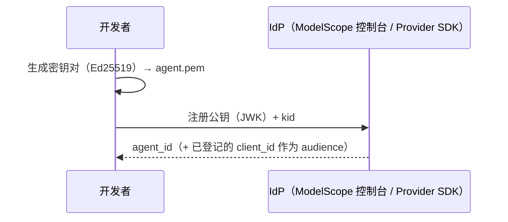
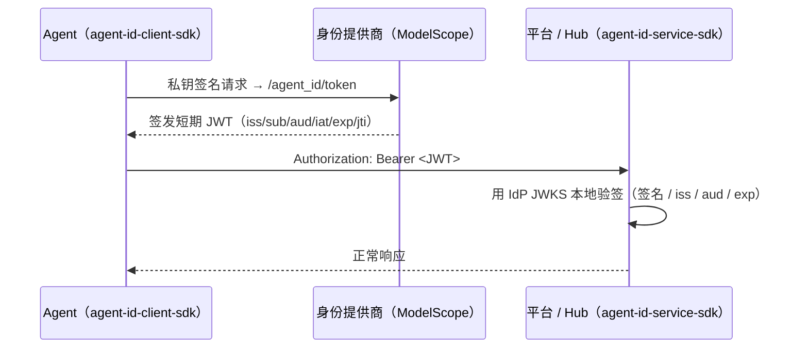

# AgentID

**给 AI Agent 一张全网通用的身份证。**

AgentID 是 OIDC 的衍生身份框架，为 AI Agent 提供跨平台的身份认证、活动追踪和信任体系。协议是开放的——任何人都能实现自己的 IdP；**[ModelScope](https://www.modelscope.cn) 是事实标准实现**，本仓库的 SDK 默认面向它构建与验证。就像 OIDC 让"用 Google 登录"成为标准，AgentID 要让 Agent 身份成为基础设施。

## 核心概念

| 实体 | 角色 | 类比 |
|------|------|------|
| **主体 (Principal)** | Agent 背后的责任人——个人开发者或组织 | Google 账号持有人 |
| **Agent** | 自主运行的 AI 程序，持有密钥对 | 需要登录的应用 |
| **身份提供商 (IdP)** | 验证主体身份、签发 Agent JWT（事实标准：ModelScope） | Google（作为 OIDC 提供方） |
| **平台 (Hub)** | Agent 访问的服务，验证 JWT | Spotify、Notion 等依赖方 |

- **Agent ID** 全局唯一：`agent_id:<提供商>:<唯一标识>`（ModelScope 示例：`agent_id:modelscope:agent_5jpbi6pzrpf3`）。
- **Hub 身份** 是 IdP 签发的 `client_id`，也就是 Agent 换取 JWT 时的 `aud`（ModelScope 示例：`hub_748233`）。

## 核心流程

**第一步：创建 Agent 身份（一次性）** — 本地生成 Ed25519 密钥对，公钥（JWK）注册到 IdP，私钥（`agent.pem`）**永不离开本地**。ModelScope 上有两种方式：

- **控制台**（推荐）：Agent Identity → 身份管理，按提示用 `openssl` 生成 `agent.pem`、提交公钥，拿到 `agent_id` + `kid`。
- **Provider SDK**（脚本化 / 批量）：`agent_id_client_sdk.providers.ModelScopeProvider`（需 ModelScope AccessToken），用于自动化的 fleet 注册。



**第二步：Agent 认证（运行时，自动）** — Agent 用私钥签名 `{agent_id}|{kid}|{audience}|{timestamp}`，向 IdP 换取短期 JWT；Hub 用 IdP 的 JWKS 本地验签。SDK 自动完成换取、缓存与刷新。



## 项目结构

| 模块 | 说明 | PyPI |
|------|------|------|
| **agent-id-client-sdk** | Agent 端 SDK（换取 / 附带 JWT、身份管理、`providers/` 控制面） | `pip install agent-id-client-sdk` |
| **agent-id-service-sdk** | Hub 端验证库（验签 ModelScope JWT） | `pip install agent-id-service-sdk` |
| **ref-idp** | ModelScope IdP 的**本地镜像**（FastAPI + SQLite；路径 / 签名 / claim 与 ModelScope 对齐，供离线开发与测试） | — |
| **agent-id-cli** | 参考 CLI——**已停更**（面向旧版原生 IdP，详见其 [README](agent-id-cli/README.md)；ModelScope 版重写待办） | `pip install agent-id-cli` |

> 面向 ModelScope 集成只需两个库：**Agent 侧 `agent-id-client-sdk`** 与 **Hub 侧 `agent-id-service-sdk`**。`ref-idp` 是它们的离线测试替身。

## 快速体验（本地 · 离线）

用 `ref-idp` 作为 ModelScope 的本地镜像，跑通整条链路，无需网络 / AccessToken：

```bash
# 安装
pip install -e ref-idp/ agent-id-client-sdk/ agent-id-service-sdk/

# 启动本地 IdP（ModelScope 镜像）于 :8000
cd ref-idp && uvicorn ref_idp.main:app --port 8000
```

仓库根目录的 `make` 封装了 demo-hub + demo-agent 的本地闭环（默认指向本地 `ref-idp`）：

```bash
make hub          # 启动 demo-hub（:8001），用 agent-id-service-sdk 验签
make agent demo   # demo-agent 用私钥换 JWT 访问 hub
```

接入**真实 ModelScope** 的完整步骤见：

- Agent 侧 → [`docs/agentid-client-sdk.md`](docs/agentid-client-sdk.md)
- Hub 侧 → [`docs/agentid-service-sdk.md`](docs/agentid-service-sdk.md) · [`docs/hub-integration.md`](docs/hub-integration.md)
- 与 ModelScope 协议对齐的细节 → [`docs/modelscope-alignment.md`](docs/modelscope-alignment.md)

## 联邦制：协议开放，ModelScope 是事实标准

协议是开放的——任何人都能按下表实现自己的 IdP；ModelScope 是当前的事实标准实现。Hub 看 JWT 里的 `iss`，去对应域名拿 JWKS 验签——跟浏览器验 HTTPS 证书一个道理。

| 端点（ModelScope 形态，base `…/openapi/v1`） | 用途 |
|------|------|
| `/agent_id/.well-known/agentid-configuration` | 服务发现 |
| `/agent_id/.well-known/agentid-jwks` | IdP 公钥（JWKS） |
| `/agent_id/token` | 私钥签名换 JWT |
| `/agent_ids` | 注册 Agent（控制面，需 AccessToken） |
| `/hub_apps` | 注册 Hub → 取 `client_id`（= JWT 的 `aud`） |

> 活动上报（`activity`）与审批（approvals）为二期能力，ModelScope IdP 暂未暴露，当前不在集成范围内。

- [协议规格（中文）](design/2026-03-25-agentid.zh.md) · [Protocol Spec (English)](design/2026-03-25-agentid.en.md)
- [IdP 实现指南](design/2026-03-31-idp-implementation-guide.zh.md)
- [Hub Integration Guide](docs/hub-integration.md) — practical guide for services adopting the protocol

## 相关工作

- [Microsoft Entra Agent ID](https://learn.microsoft.com/en-us/entra/agent-id/) — 微软的企业 Agent 身份方案。锁定 M365 生态，非开放标准。
- [Ping Identity for AI](https://www.pingidentity.com/en/solution/agentic-ai-identity.html) — 基于 OAuth 2.0 Token Exchange，重治理和 MCP 集成，身份归平台所有。
- [IETF WIMSE](https://datatracker.ietf.org/group/wimse/about/) / [SPIFFE](https://spiffe.io/) — 工作负载身份标准，正在被拉伸用于 Agent 场景。AgentID Layer 0 可插拔兼容。
- [OAuth 2.0](https://oauth.net/2/) / [OIDC](https://openid.net/connect/) — AgentID 借鉴了联邦身份认证的成熟模式，但为 Agent 做了原生设计。
- [NIST NCCoE AI Agent Identity](https://www.nccoe.nist.gov/news-insights/new-concept-paper-identity-and-authority-software-agents) — NIST 关于 Agent 身份的概念文件。

## 状态

**ModelScope 对齐版 SDK 已发布**：`agent-id-service-sdk`、`agent-id-client-sdk`（`pip install`）。Layer 0（身份 + 验签）已落地并面向 ModelScope 验证；活动上报与审批为二期能力。
