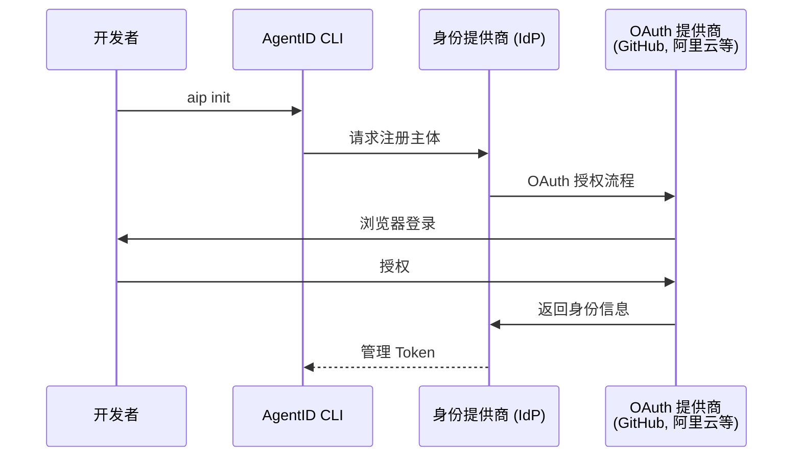
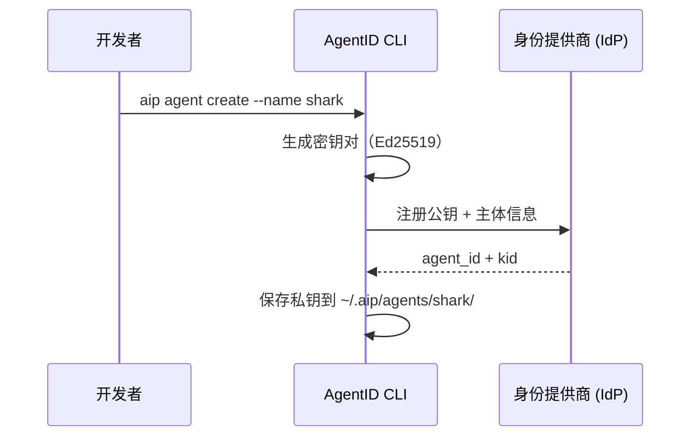
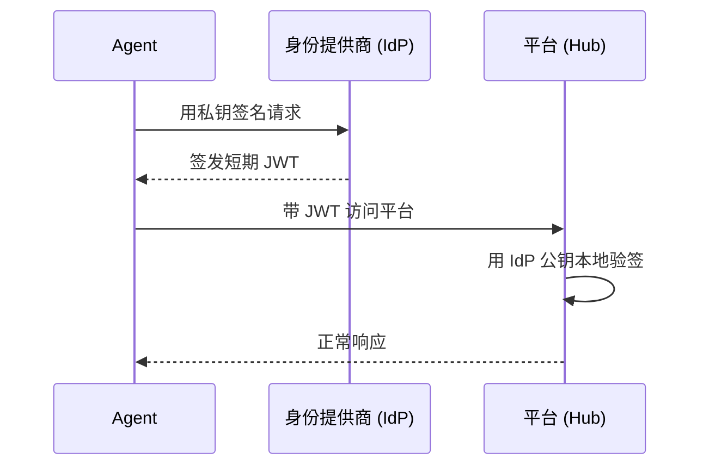

# AgentID

**给 AI Agent 一张全网通用的身份证。**

AgentID 是 OIDC 的衍生身份框架，为 AI Agent 提供跨平台的身份认证、活动追踪和信任体系。任何人都能实现——就像 OIDC 让"用 Google 登录"成为标准，AgentID 要让 Agent 身份成为基础设施。

## 核心概念

| 实体 | 角色 | 类比 |
|------|------|------|
| **主体 (Principal)** | Agent 背后的责任人——个人开发者或组织 | Google 账号持有人 |
| **Agent** | 自主运行的 AI 程序，持有密钥对 | 需要登录的应用 |
| **身份提供商 (IdP)** | 验证主体身份、签发 Agent JWT | Google（作为 OIDC 提供方） |
| **平台 (Hub)** | Agent 访问的服务，验证 JWT | Spotify、Notion 等依赖方 |

每个 Agent 有全局唯一 ID：`aip:<提供商域名>:<唯一标识>`（例：`aip:qwenpaw.ai:agent_7x8k2m`）

## 核心流程

**第一步：主体认证（一次性）** — 开发者通过 OAuth（GitHub 等）向 IdP 证明身份，建立问责锚点。



**第二步：创建 Agent（一次性）** — 本地生成密钥对（Ed25519），公钥注册到 IdP，私钥永远不离开本地。



**第三步：Agent 认证（运行时，自动）** — Agent 用私钥换短期 JWT，平台本地验签。



## 项目结构

| 模块 | 说明 | PyPI |
|------|------|------|
| **aip-identity-sdk** | Agent 端 SDK（运行时认证 + 身份管理） | `pip install aip-identity-sdk` |
| **aip-identity-verify** | Hub 端验证库（验签 JWT） | `pip install aip-identity-verify` |
| **aip-identity-cli** | 参考 CLI 工具 | `pip install aip-identity-cli` |
| **ref-idp** | 参考 IdP 实现（FastAPI + SQLite） | — |

## 快速体验

```bash
# 安装
pip install -e ref-idp/ aip-identity-cli/ aip-identity-sdk/ aip-identity-verify/

# 启动 IdP
cd ref-idp && uvicorn ref_idp.main:app --port 8000

# 注册身份、创建 Agent（--dev 跳过 OAuth）
aip init --provider http://localhost:8000 --dev --name alice
aip agent create --name shark

# 启动示例 Hub
cd examples/demo-hub && uvicorn hub:app --port 8001

# 运行示例 Agent
cd examples/demo-agent && python agent.py
```

仓库根目录还提供了 `make` 快捷方式，封装了上述启动命令并支持在 `local`/`pre`/`prod`
之间切换 IdP（共享同一 `IDP=` 选择器，确保 hub 与 agent 配对一致）：

```bash
make hub                              # local IdP（默认）
make hub IDP=pre                      # 指向 pre.agent-id.live

make agent whoami                     # 快速验证身份
make agent demo                       # 跑完整脚本
make agent trade BTC/USD 1000 buy IDP=pre
```

`local`/`pre`/`prod` 各自的 IdP URL 与身份在 `examples/demo-hub/hub.py`
（`IDP_PROFILES`）与 `examples/demo-agent/agent.py`（`IDENTITY_PROFILES`）中维护，
均通过 `AIP_IDP` 环境变量选择。


## 联邦制：谁都能开 IdP

任何人都能运行 IdP，只要实现以下标准端点：

| 端点 | 用途 |
|------|------|
| `/.well-known/aip-configuration` | 服务发现 |
| `/.well-known/aip-jwks` | IdP 公钥（JWKS） |
| `/aip/agents` | 注册 Agent |
| `/aip/token` | 私钥签名换 JWT |
| `/aip/activity` | 活动记录 |

平台看 JWT 里的 `iss` 字段，去对应域名拿公钥验签——跟浏览器验 HTTPS 证书一个道理。

- [协议规格（中文）](design/2026-03-25-agent-identity-protocol.zh.md)
- [Protocol Spec (English)](design/2026-03-25-agent-identity-protocol.en.md)
- [IdP 实现指南](design/2026-03-31-idp-implementation-guide.zh.md)


## 相关工作

- [Microsoft Entra Agent ID](https://learn.microsoft.com/en-us/entra/agent-id/) — 微软的企业 Agent 身份方案。锁定 M365 生态，非开放标准。
- [Ping Identity for AI](https://www.pingidentity.com/en/solution/agentic-ai-identity.html) — 基于 OAuth 2.0 Token Exchange，重治理和 MCP 集成，身份归平台所有。
- [IETF WIMSE](https://datatracker.ietf.org/group/wimse/about/) / [SPIFFE](https://spiffe.io/) — 工作负载身份标准，正在被拉伸用于 Agent 场景。AgentID Layer 0 可插拔兼容。
- [OAuth 2.0](https://oauth.net/2/) / [OIDC](https://openid.net/connect/) — AgentID 借鉴了联邦身份认证的成熟模式，但为 Agent 做了原生设计。
- [NIST NCCoE AI Agent Identity](https://www.nccoe.nist.gov/news-insights/new-concept-paper-identity-and-authority-software-agents) — NIST 关于 Agent 身份的概念文件。

## 状态

**Draft** — Layer 0 参考实现已完成，征求反馈。
