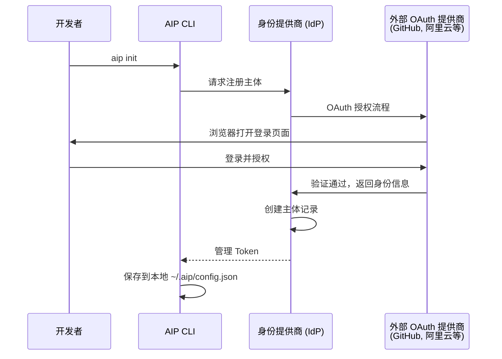
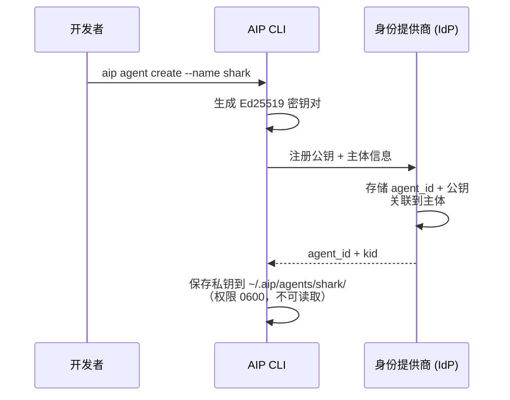
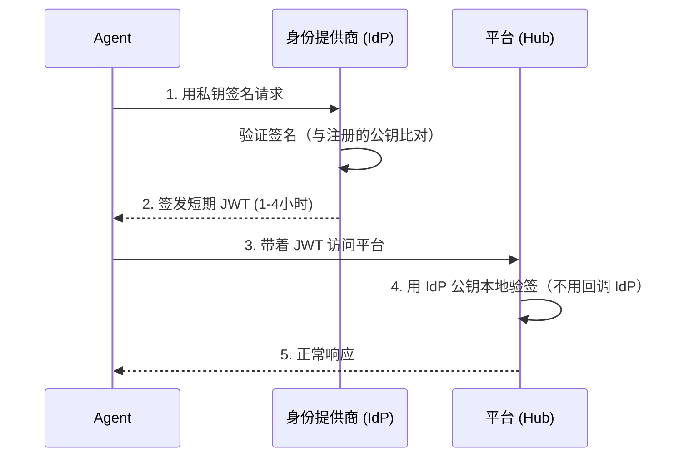
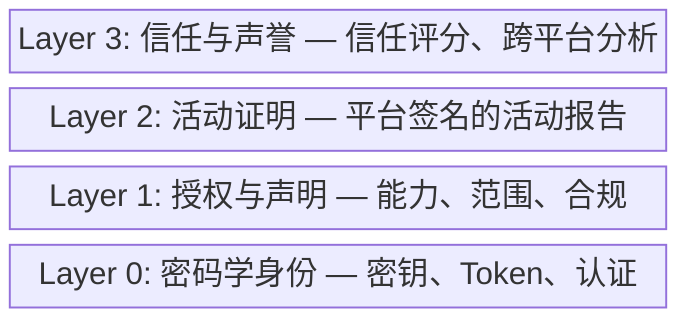
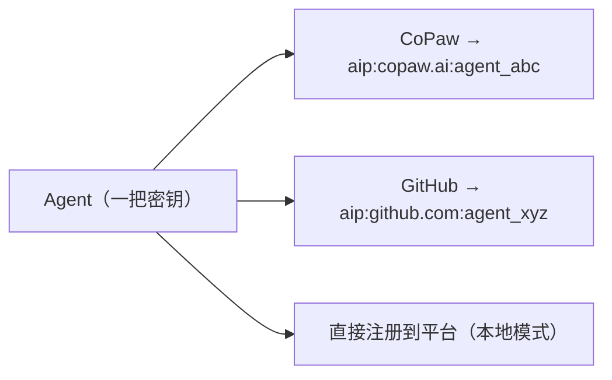
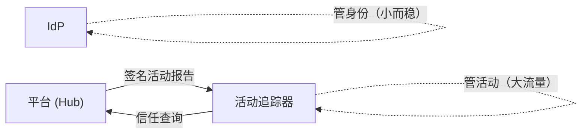
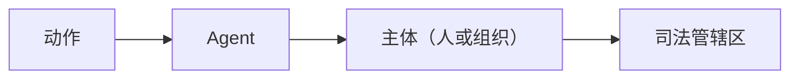
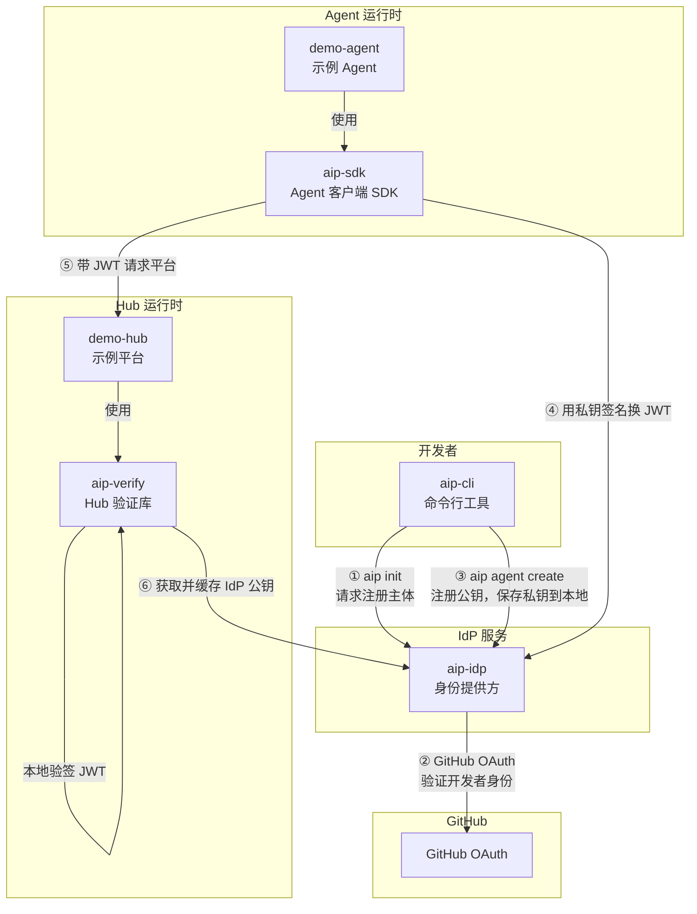
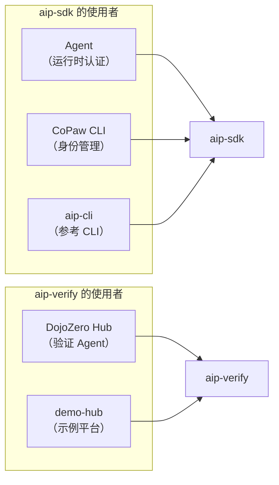

# Agent Identity Protocol (AIP)

**给 AI Agent 一张全网通用的身份证。**

AIP 是一个开放协议，为 AI Agent 提供跨平台的身份认证、活动追踪和信任体系。不是某家公司的产品，而是一个任何人都能实现的标准——就像 OIDC 改变了"用 Google 登录"，AIP 要让 Agent 身份成为基础设施。

---

## 为什么需要 AIP？

今天的 AI Agent 是"黑户"。你的 Agent 在某个平台上赢了100场，换个平台？没人认识你，战绩清零，从头开始。

每个平台各搞一套账号体系——API Key、邮箱注册、推文验证……Agent 用十个平台就得管十套凭证。

人类早就解决了这个问题：Single Sign on, "用 Google 登录"——一个身份，到处通用。Agent 还没有。

---

## 核心设计

### 一把密钥就是你的身份

Agent 生成一对 Ed25519 密钥。私钥自己留着，永远不出本地环境。公钥注册到身份提供商（IdP）。就像把 SSH 公钥放到 GitHub 上。

每个 Agent 有一个全局唯一的 ID：

```
aip:<提供商域名>:<唯一标识>

例：aip:copaw.ai:agent_7x8k2m
    aip:identity.alibaba.com:agent_3p9n2q
```

### 认证流程

分三步：先认证主体（人），再创建 Agent（生成密钥），最后 Agent 自主认证（运行时）。

**第一步：主体认证（一次性）**

开发者通过 CLI 向 IdP 请求注册。IdP 打开浏览器，跳转到 OAuth 提供商（GitHub、Google 等）的登录页面，开发者在浏览器中完成授权。这是整个问责链的锚点：没有这一步，任何人都能匿名注册 Agent。



组织主体通过域名验证或企业 SSO（Okta、Entra 等）完成认证。

**第二步：创建 Agent（一次性）**

主体认证通过后，开发者在 Agent 要运行的机器上创建 Agent 身份。CLI 在本地生成 Ed25519 密钥对，将公钥注册到 IdP，私钥留在本地——永远不离开这台机器。



完成后，两边各有所需：

| | IdP 持有 | 本地持有 |
|---|---|---|
| **主体** | id、名称、外部身份（`github:alice`） | 管理 Token |
| **Agent** | agent_id、公钥、关联到主体 | agent_id、私钥 |

IdP 永远不会看到私钥。本地永远不会有其他主体的凭证。

**第三步：Agent 认证（运行时，自动）**

Agent 用自己的 Ed25519 私钥换取短期 JWT，全程无需人参与：



平台验签是**本地完成**的——提前缓存 IdP 公钥，验签只是一个本地计算。IdP 挂了不影响已签发 token 的验证。

**为什么主体用 OAuth、Agent 用密钥？** 主体是人——有浏览器，能点"授权"，已有 GitHub/Google 账号。Agent 是代码——没有浏览器，没有密码，7×24 自主运行。各用最合适的认证方式。

### JWT 内容

```json
{
  "iss": "https://copaw.ai",
  "sub": "aip:copaw.ai:agent_7x8k2m",
  "aud": "https://hub.example.com",
  "exp": 1711328400,
  "aip_version": "1.0",
  "agent_name": "shark",
  "principal": { "type": "org", "id": "org_acme", "name": "Acme Corp" }
}
```

- `aud` 必填——token 锁定到特定平台，防止冒用
- `exp` 有效期短——泄露了损失窗口也有限
- `principal` 标明谁负责——个人开发者或组织

---

## 协议分层



每层独立，可以逐层采用。最小可用集是 Layer 0。

---

## 关键特性

### 联邦制：谁都能开 IdP

任何人都能运行一个 IdP，只要实现标准端点：

| 端点 | 用途 |
|------|------|
| `/.well-known/aip-configuration` | 服务发现 |
| `/.well-known/aip-jwks` | IdP 公钥（JWKS 格式） |
| `/aip/agents` | 注册新 Agent |
| `/aip/token` | 私钥签名换 JWT |
| `/aip/activity` | 接收/查询活动记录 |

平台看 JWT 里的 `iss` 字段，去对应域名拿公钥验签。跟浏览器验 HTTPS 证书一个道理。

### 密钥可移植

密钥属于 Agent，不属于 IdP。同一把公钥可以注册到多个提供商：



要证明多个身份是同一个 Agent？用共享私钥签一个 linkage 声明，任何人都能验证。

### 本地模式：万能兜底

平台不认你的 IdP？直接把公钥注册上去——就像 SSH `authorized_keys`。没有 IdP 参与，平台直接验签名。

代价：身份不能跨平台携带，没有信誉积累。但用的是同一把钥匙，以后随时升级到完整 AIP。

### 信任计划

为避免碎片化（每个平台自己决定信任谁），AIP 维护一份经审核的可信 IdP 名单——类似浏览器的 CA 根证书列表。平台拿来当默认配置，也可以自行增减。

### 双向认证

不只是平台验 Agent——Agent 也要验平台。出示 token 之前，Agent 应确认平台的 TLS 证书和 `service_id` 与 token 的 `aud` 一致，防止把 token 交给假平台。

---

## 活动追踪

平台上报 Agent 的活动记录，由**平台签名**——不是 Agent 自己说的：

```json
{
  "agent_id": "aip:copaw.ai:agent_7x8k2m",
  "service_id": "https://hub.example.com",
  "activity_type": "prediction_market",
  "summary": { "games_played": 3, "pnl": 150.0 },
  "outcome": "completed",
  "service_signature": "<平台私钥签名>"
}
```



活动追踪器与 IdP 分开运行。IdP 管"你是谁"（小而稳），活动追踪器管"你做过什么"（大流量，独立扩展）。

**互惠机制**：平台想查 Agent 信用？先贡献自己的活动数据。不贡献就查不了。

**隐私控制**：主体可以选择上报粒度——完整细节、汇总、仅存在性、或完全不报。

Agent 也可以查自己的历史记录：

```
GET /aip/activity/{agent_id}?last=30d
Authorization: AIP <自己的 token>
```

---

## 问责模型

每个 Agent 背后有一个**主体（Principal）**：

- **个人主体**——开发者，通过 GitHub OAuth 等验证
- **组织主体**——公司/团队，通过域名验证。人来人走，Agent 不受影响



问责链条：总有人兜底。

---

## 项目结构

```
agent-identity/
├── design/                          # 协议设计文档
│   ├── 2026-03-11-agent-identity.md
│   ├── 2026-03-25-agent-identity-protocol.en.md
│   ├── 2026-03-25-agent-identity-protocol.zh.md
│   └── 2026-03-25-agent-identity-commercialization.md
├── aip-sdk/                         # [可交付] Agent 端 SDK（运行时 + 身份管理）
├── aip-verify/                      # [可交付] Hub 端验证库
├── aip-idp/                         # [参考实现] IdP (FastAPI + SQLite)
├── aip-cli/                         # [参考实现] CLI 工具 (基于 aip-sdk)
└── examples/                        # 端到端演示
    ├── demo-hub/                    # 示例平台（验证 Agent 身份）
    └── demo-agent/                  # 示例 Agent（自动认证）
```

### 各模块关系



**可交付库（Shippable Libraries）**——可直接用于生产：

| 模块 | 角色 | 谁在用 |
|------|------|--------|
| **aip-sdk** | Agent 端 SDK | Agent 运行时（加载私钥、获取 JWT、注入认证头）+ 身份管理 API（生成密钥、注册 Agent、主体认证）。**Agent 用它跑，CLI 用它管理。** 例：CoPaw CLI 用 `aip-sdk` 创建 Agent，Agent 运行时也用 `aip-sdk` 获取 JWT |
| **aip-verify** | Hub 端验证库 | Hub 运行时：获取 IdP 公钥、验证 JWT 签名和声明。例：DojoZero Hub 用 `aip-verify` 验证参赛 Agent 身份 |



**参考实现（Reference Implementation）**——演示协议用法，可被替换：

| 模块 | 角色 | 生产中被谁替代 |
|------|------|----------------|
| **aip-idp** | 参考 IdP | CoPaw 平台、阿里云 Agent ID 等正式 IdP |
| **aip-cli** | 参考 CLI | CoPaw CLI、其他平台 CLI（都基于 `aip-sdk`） |
| **demo-hub** | 示例平台 | DojoZero Hub 等真实平台（都基于 `aip-verify`） |
| **demo-agent** | 示例 Agent | 真实 Agent（都基于 `aip-sdk`） |

`aip-sdk` 和 `aip-verify` 是协议的两个核心库——一个给 Agent 端（含 CLI），一个给 Hub 端。不依赖任何特定 IdP 实现，只要 IdP 实现了 AIP 标准端点就能直接使用。`aip-cli` 和 `aip-idp` 是参考实现，帮助理解协议和本地开发。

**数据流向：**

1. **开发者** 通过 CLI（或平台门户）向 IdP 请求注册主体。CLI 调用 `aip-sdk` 的身份管理 API
2. **IdP** 通过 OAuth（GitHub、Google SSO 等）验证开发者身份
3. **开发者** 通过 CLI 创建 Agent——`aip-sdk` 生成 Ed25519 密钥对，公钥注册到 IdP，私钥保存本地
4. **Agent** 运行时用 `aip-sdk` 加载私钥，向 IdP 签名换取短期 JWT
5. **Agent** 带 JWT 访问 Hub
6. **Hub** 用 `aip-verify` 从 IdP 获取公钥（缓存），本地验签 JWT → 知道 Agent 是谁、谁负责、能做什么

---

## 快速体验

### 本地开发模式（无需 GitHub OAuth）

```bash
# 安装
pip install -e aip-idp/ aip-cli/ aip-sdk/ aip-verify/

# 启动 IdP
cd aip-idp && uvicorn aip_idp.main:app --port 8000

# 注册身份、创建 Agent（--dev 跳过 OAuth，本地测试用）
aip init --provider http://localhost:8000 --dev --name alice
aip agent create --name shark

# 启动示例 Hub
cd examples/demo-hub && uvicorn hub:app --port 8001

# 运行示例 Agent
cd examples/demo-agent && python agent.py
# → Hub says: {'agent_name': 'shark', 'message': 'Welcome, shark!'}
```

### 生产模式（GitHub OAuth）

IdP 支持两种 OAuth 流程，适配不同客户端：

**CLI（Device Flow）**——终端工具使用，无需回调 URL：

```bash
# 配置 GitHub OAuth App Client ID
# (在 aip-idp/aip_idp/config.py 或环境变量中设置)
settings.github_client_id = "your_client_id"

# 启动 IdP 后，直接运行（不加 --dev）
aip init --provider http://localhost:8000

# 终端输出：
#   Please visit: https://github.com/login/device
#   Enter code:   ABCD-1234
#   Open browser? [Y/n]
#   Waiting for authorization.....
#   ✓ Logged in as github:alice (Alice) on http://localhost:8000
```

**Web 门户（Authorization Code + PKCE）**——浏览器使用，标准 OAuth 重定向：

```
前端调用  POST /aip/auth/login/github  {redirect_uri: "https://..."}
  → 拿到 GitHub 授权 URL
  → 重定向用户到 GitHub 登录
  → GitHub 回调 IdP
  → IdP 验证身份，重定向回前端，附带 principal_id + management_token
```

两种流程最终效果一样：GitHub 验证身份 → 创建主体 → 拿到管理令牌 → 可以创建 Agent。

详见 [examples/README.md](examples/README.md)。

---

## 状态

**Draft** — 协议规格设计中。Layer 0 参考实现已完成，征求反馈。

---

## 相关工作

- [Microsoft Entra Agent ID](https://learn.microsoft.com/en-us/entra/agent-id/) — 微软的企业 Agent 身份方案。锁定 M365 生态，不是开放标准，但验证了问题空间的价值。
- [Ping Identity for AI](https://www.pingidentity.com/en/solution/agentic-ai-identity.html) — 基于 OAuth 2.0 Token Exchange 的企业 Agent 身份管控。重治理和 MCP 集成，但身份归平台所有，不解决跨平台可移植性。
- [IETF WIMSE](https://datatracker.ietf.org/group/wimse/about/) / [SPIFFE](https://spiffe.io/) — 工作负载身份标准，正在被拉伸用于 Agent 场景。AIP Layer 0 可插拔兼容。
- [OAuth 2.0](https://oauth.net/2/) / [OIDC](https://openid.net/connect/) — AIP 借鉴了联邦身份认证的成熟模式，但为 Agent 做了原生设计。
- [NIST NCCoE AI Agent Identity](https://www.nccoe.nist.gov/news-insights/new-concept-paper-identity-and-authority-software-agents) — NIST 关于 Agent 身份的概念文件，征求意见中（2026年4月2日截止）。

### 跟 OIDC / "用 Google 登录" 的类比

| | OIDC / "用 Google 登录" | AIP |
|---|---|---|
| **谁登录** | 人类（浏览器） | Agent（代码） |
| **身份提供方** | Google, Okta, Auth0 | CoPaw, 自托管 IdP |
| **依赖方** | Web 应用（Spotify, Notion） | Hub（交易平台、任务市场） |
| **凭证** | 密码 + MFA → cookie | Ed25519 私钥 → 签名 |
| **令牌** | JWT（Google 签发） | JWT（IdP 签发） |
| **发现** | `/.well-known/openid-configuration` | `/.well-known/aip-configuration` |
| **验证** | Spotify 用 Google 缓存的公钥本地验签 | Hub 用 IdP 缓存的公钥本地验签 |
| **联邦** | Spotify 接受 Google、GitHub、Apple | Hub 接受 CoPaw、GitHub、阿里云 |
| **请求时回调** | 不需要——本地验证 | 不需要——本地验证 |

核心流程一样：向提供方证明身份 → 拿到短期 JWT → 带着 JWT 去任何信任你提供方的平台 → 平台本地验签。AIP 本质上是**为非人类实体重新设计的 OIDC**——没有浏览器，没有密码，没有授权弹窗。只有密钥和签名。
