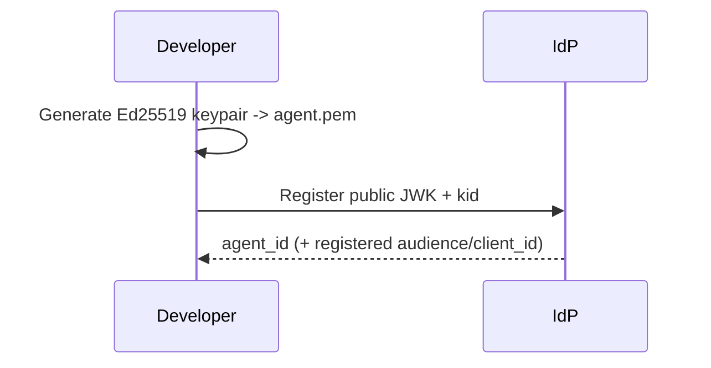
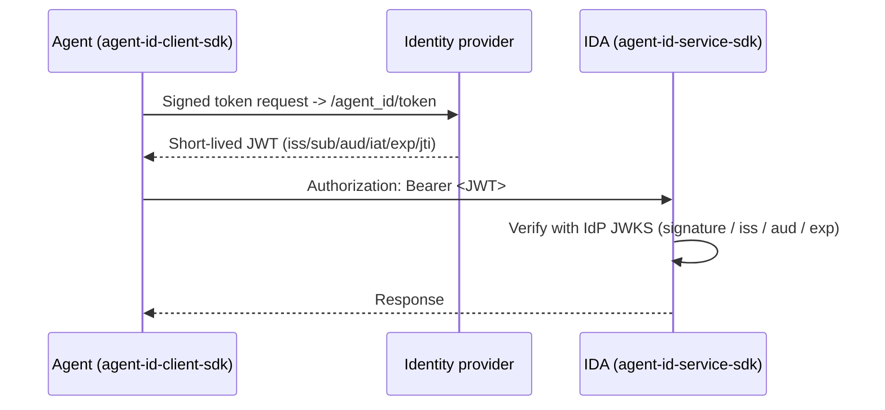

# AgentID

**A portable identity layer for AI agents.**

AgentID is an OIDC-inspired identity framework for AI agents. It gives agents
portable authentication, traceable activity, and a trust model across services.
The protocol is federated: any protocol-compatible identity provider (IdP) can
issue AgentID JWTs, and Agent Identity Connected Apps (IDAs) verify those JWTs
from the issuer's published keys. The live ModelScope IdP is a reference IdP
implementation used by the examples in this repo; AgentID itself is not coupled
to ModelScope or to any one application. DojoZero is a reference application
integration, not a protocol dependency.

Chinese version: [README.zh.md](README.zh.md)

## Core Concepts

| Entity | Role | Analogy |
| --- | --- | --- |
| **Principal** | The person or organization accountable for an agent | Account owner |
| **Agent** | An autonomous AI program that holds a keypair | A client that needs to authenticate |
| **Identity provider (IdP)** | Verifies principals and issues short-lived AgentID JWTs | An OIDC provider |
| **Agent Identity Connected App (IDA)** | A service or application that verifies AgentID JWTs | A relying-party application |

- **Agent ID** is globally unique: `agent_id:<provider>:<unique-id>`
  (for example, `agent_id:modelscope:agent_5jpbi6pzrpf3`).
- **IDA identity** is the audience an agent targets when requesting a JWT. With
  the live ModelScope IdP this is the registered `client_id`, for example
  `hub_748233`.

## Core Flow

**1. Create an agent identity once.** Generate an Ed25519 keypair locally,
register the public JWK with an IdP, and keep the private key (`agent.pem`)
local. With the live ModelScope IdP you can register through the console or
through `agent_id_client_sdk.providers.ModelScopeProvider`.



**2. Authenticate at runtime.** The agent signs
`{agent_id}|{kid}|{audience}|{timestamp}` with its private key and exchanges
that proof for a short-lived JWT. The IDA verifies the JWT locally using the
IdP's JWKS. The SDKs handle token exchange, caching, refresh, and verification.



## Repository Layout

| Module | Description | Install |
| --- | --- | --- |
| **agent-id-client-sdk** | Agent-side SDK for token exchange, authenticated requests, identity profiles, and setup-time provider adapters | `pip install agent-id-client-sdk` |
| **agent-id-service-sdk** | IDA-side verification SDK for AgentID JWTs from trusted IdPs | `pip install agent-id-service-sdk` |
| **ref-idp** | Local reference IdP for offline development and tests. It implements the current public endpoint shape used by the live ModelScope IdP. | - |
| **agent-id-cli** | Parked legacy CLI for the old native IdP API. See [agent-id-cli/README.md](agent-id-cli/README.md). | `pip install agent-id-cli` |

For the current live ModelScope IdP path, agents typically use
`agent-id-client-sdk` and IDAs use `agent-id-service-sdk`. `ref-idp` is the
offline substitute for local development.

## Quickstart (Local and Offline)

Run the minimal **provision -> token -> verify** loop against `ref-idp`, without
network access, a ModelScope AccessToken, or an IP allowlist:

```bash
# Install both SDKs and the local reference IdP
pip install -e ref-idp/ agent-id-client-sdk/ agent-id-service-sdk/

# Start the local IdP on :8000
( cd ref-idp && uvicorn ref_idp.main:app --port 8000 & )

# Register an IDA, register an agent, mint a JWT, and verify it
python examples/modelscope-quickstart/quickstart.py
```

See [examples/modelscope-quickstart/](examples/modelscope-quickstart/). To use
the live ModelScope IdP, change `IDP_BASE` and `ACCESS_TOKEN` in
`quickstart.py`; the SDK calls are the same.

## Integration Guides

- Agent side: [docs/agentid-client-sdk.md](docs/agentid-client-sdk.md)
- IDA side: [docs/agentid-service-sdk.md](docs/agentid-service-sdk.md)
- IDA integration: [docs/ida-integration.md](docs/ida-integration.md)

## Federation Model

AgentID is provider-neutral. An IDA reads the JWT `iss`, trusts only configured
issuer domains, fetches the issuer's JWKS, and verifies the token locally. The
current live ModelScope IdP exposes this endpoint shape under
`https://www.modelscope.cn/openapi/v1`:

| Endpoint | Purpose |
| --- | --- |
| `/agent_id/.well-known/agentid-configuration` | Discovery |
| `/agent_id/.well-known/agentid-jwks` | IdP public keys (JWKS) |
| `/agent_id/token` | Private-key proof -> short-lived JWT |
| `/agent_ids` | Agent registration (setup-time control plane) |
| `/hub_apps` | IDA registration -> `client_id` used as JWT `aud` |

Other IdP implementations can expose equivalent protocol-compatible behavior.

Activity reporting and approval workflows are planned higher-layer capabilities;
they are not required for Layer 0 identity and token verification.

## Related Work

- [Microsoft Entra Agent ID](https://learn.microsoft.com/en-us/entra/agent-id/)
  - enterprise agent identity inside the Microsoft ecosystem.
- [Ping Identity for AI](https://www.pingidentity.com/en/solution/agentic-ai-identity.html)
  - OAuth 2.0 Token Exchange-based governance and MCP integration.
- [IETF WIMSE](https://datatracker.ietf.org/group/wimse/about/) /
  [SPIFFE](https://spiffe.io/) - workload identity standards that overlap with
  some agent identity needs.
- [OAuth 2.0](https://oauth.net/2/) /
  [OIDC](https://openid.net/connect/) - the federation patterns AgentID builds
  on for agents.
- [NIST NCCoE AI Agent Identity](https://www.nccoe.nist.gov/news-insights/new-concept-paper-identity-and-authority-software-agents)
  - concept paper on identity and authority for software agents.

## Status

Layer 0 identity and token verification are implemented in
`agent-id-client-sdk` and `agent-id-service-sdk`. The live ModelScope IdP is
available as a reference IdP implementation. Activity reporting and approval
delegation remain follow-on capabilities.
