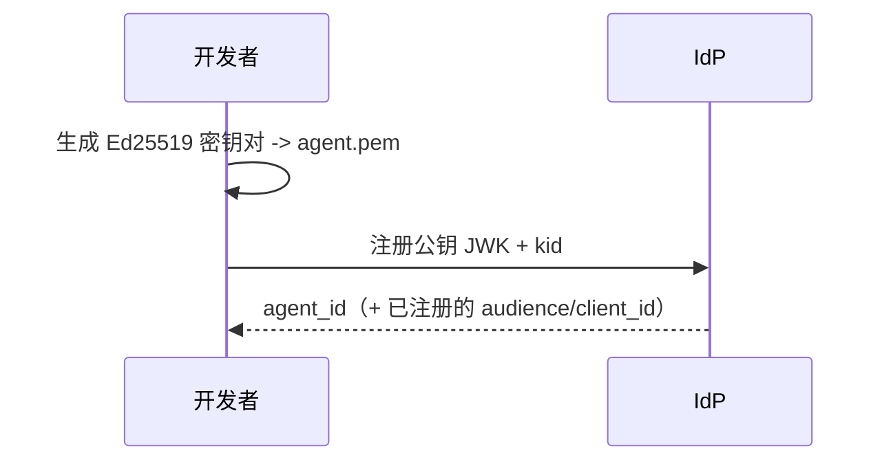
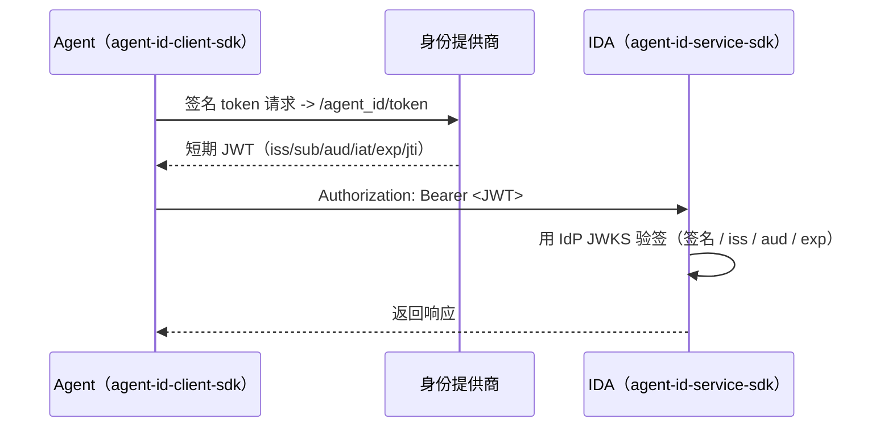

# AgentID

**给 AI Agent 一张可跨服务使用的身份证。**

AgentID 是受 OIDC 启发的 AI Agent 身份框架，为 Agent 提供可迁移的认证、
活动追踪和跨服务信任模型。协议是联邦式的：任何兼容协议的身份提供商（IdP）
都可以签发 AgentID JWT，Agent身份互联应用（Agent Identity Connected App,
IDA）根据 issuer 发布的公钥完成本地验签。已上线的 ModelScope IdP 是一个
参考 IdP 实现，本仓库的示例会使用它；AgentID 协议本身不绑定 ModelScope，
也不绑定任何单一应用。DojoZero 是参考应用接入示例，不是协议依赖。

英文版：[README.md](README.md)

## 核心概念

| 实体 | 角色 | 类比 |
| --- | --- | --- |
| **主体（Principal）** | Agent 背后的责任人，可以是个人或组织 | 账号持有人 |
| **Agent** | 自主运行、持有密钥对的 AI 程序 | 需要认证的客户端 |
| **身份提供商（IdP）** | 验证主体身份，并签发短期 AgentID JWT | OIDC Provider |
| **Agent身份互联应用（IDA）** | 验证 AgentID JWT 的应用或服务 | Relying-party 应用 |

- **Agent ID** 全局唯一：`agent_id:<提供商>:<唯一标识>`，例如
  `agent_id:modelscope:agent_5jpbi6pzrpf3`。
- **IDA 身份** 是 Agent 获取 JWT 时填写的 audience。使用已上线的
  ModelScope IdP 时，它是已注册的 `client_id`，例如 `hub_748233`。

## 核心流程

**第一步：创建 Agent 身份（一次性）。** 本地生成 Ed25519 密钥对，把公钥
JWK 注册到 IdP，私钥（`agent.pem`）只保留在本地。使用已上线的 ModelScope
IdP 时，可以通过控制台注册，也可以通过
`agent_id_client_sdk.providers.ModelScopeProvider` 注册。



**第二步：运行时认证。** Agent 用私钥签名
`{agent_id}|{kid}|{audience}|{timestamp}`，向 IdP 换取短期 JWT。IDA 使用
IdP 的 JWKS 在本地验签。SDK 会处理 token 换取、缓存、刷新和验签。



## 项目结构

| 模块 | 说明 | 安装 |
| --- | --- | --- |
| **agent-id-client-sdk** | Agent 侧 SDK，用于换取 token、发起认证请求、管理身份 profile，以及调用 setup-time provider 适配器 | `pip install agent-id-client-sdk` |
| **agent-id-service-sdk** | IDA 侧验签 SDK，用于验证来自可信 IdP 的 AgentID JWT | `pip install agent-id-service-sdk` |
| **ref-idp** | 本地参考 IdP，用于离线开发和测试。它实现了当前已上线 ModelScope IdP 使用的公开端点形态。 | - |
| **agent-id-cli** | 已停更的旧版 CLI，面向历史 native IdP API。详见 [agent-id-cli/README.md](agent-id-cli/README.md)。 | `pip install agent-id-cli` |

接入当前已上线的 ModelScope IdP 时，Agent 侧通常使用
`agent-id-client-sdk`，IDA 侧使用 `agent-id-service-sdk`。`ref-idp` 是本地开发
时的离线替身。

## 快速体验（本地离线）

使用 `ref-idp` 跑通最小 **provision -> token -> verify** 流程，不需要网络、
ModelScope AccessToken 或 IP 白名单：

```bash
# 安装两个 SDK 和本地参考 IdP
pip install -e ref-idp/ agent-id-client-sdk/ agent-id-service-sdk/

# 在 :8000 启动本地 IdP
( cd ref-idp && uvicorn ref_idp.main:app --port 8000 & )

# 注册 IDA、注册 agent、签发 JWT 并验签
python examples/modelscope-quickstart/quickstart.py
```

详见 [examples/modelscope-quickstart/](examples/modelscope-quickstart/)。
要接入已上线的 ModelScope IdP，只需要修改 `quickstart.py` 中的 `IDP_BASE`
和 `ACCESS_TOKEN`；SDK 调用方式不变。

## 接入文档

- Agent 侧：[docs/agentid-client-sdk.zh.md](docs/agentid-client-sdk.zh.md)
- IDA 侧：[docs/agentid-service-sdk.zh.md](docs/agentid-service-sdk.zh.md)
- IDA 接入：[docs/ida-integration.zh.md](docs/ida-integration.zh.md)

## 联邦模型

AgentID 不绑定任何单一 provider。IDA 读取 JWT 的 `iss`，只信任显式配置过的
issuer domain，获取对应 issuer 的 JWKS，并在本地完成验签。当前已上线的
ModelScope IdP 在 `https://www.modelscope.cn/openapi/v1` 下暴露以下端点形态：

| 端点 | 用途 |
| --- | --- |
| `/agent_id/.well-known/agentid-configuration` | 服务发现 |
| `/agent_id/.well-known/agentid-jwks` | IdP 公钥（JWKS） |
| `/agent_id/token` | 私钥签名 proof -> 短期 JWT |
| `/agent_ids` | 注册 Agent（setup-time control plane） |
| `/hub_apps` | 注册 IDA -> 获取作为 JWT `aud` 的 `client_id` |

其他 IdP 实现可以提供等价的协议兼容行为。

活动上报和审批工作流是更高层能力；Layer 0 的身份认证和 token 验签不依赖它们。

## 相关工作

- [Microsoft Entra Agent ID](https://learn.microsoft.com/en-us/entra/agent-id/)：
  微软生态内的企业 Agent 身份方案。
- [Ping Identity for AI](https://www.pingidentity.com/en/solution/agentic-ai-identity.html)：
  基于 OAuth 2.0 Token Exchange 的治理与 MCP 集成方案。
- [IETF WIMSE](https://datatracker.ietf.org/group/wimse/about/) /
  [SPIFFE](https://spiffe.io/)：工作负载身份标准，与部分 Agent 身份需求重叠。
- [OAuth 2.0](https://oauth.net/2/) /
  [OIDC](https://openid.net/connect/)：AgentID 借鉴的联邦身份认证模式。
- [NIST NCCoE AI Agent Identity](https://www.nccoe.nist.gov/news-insights/new-concept-paper-identity-and-authority-software-agents)：
  NIST 关于软件 Agent 身份和权限的概念文件。

## 状态

Layer 0 身份认证和 token 验签已经在 `agent-id-client-sdk` 与
`agent-id-service-sdk` 中实现。已上线的 ModelScope IdP 可作为参考 IdP 实现。
活动上报和审批代理是后续能力。
