# AgentID — An Identity Profile for AI Agents

**Date**: 2026-03-25
**Status**: Draft
**Scope**: An OIDC-aligned identity profile for AI agents — covering identity, authentication, approval workflow, and activity tracking

---

## 1. Problem

Autonomous agent ecosystems — QwenPaw, OpenClaw, and their hubs — are producing agents that run persistently, compete across hubs, trade resources, and interact with each other without human intervention. These agents are more like server processes or bots than conversation assistants: they wake on schedule, maintain local state and config, and act autonomously across multiple services. Yet they have no persistent identity. An agent running on QwenPaw cannot prove it is the same agent when it connects to an OpenClaw hub. Each hub rolls its own authentication. Reputation cannot travel.

The problem extends beyond autonomous ecosystems. Generic agent frameworks (AgentScope, AutoGen, LangChain, CrewAI) also build agents with no identity — but their agents are typically ephemeral, invoked per-conversation. For persistent autonomous agents, the lack of cross-hub identity is not just inconvenient, it is structurally broken.

This creates real problems:

- **No accountability** — when an agent causes harm (financial loss, misinformation, unauthorized actions), there is no reliable way to trace the action back to a responsible party.
- **No portability** — an agent's track record on one hub is invisible to every other hub. Reputation cannot travel across QwenPaw, OpenClaw, or any other ecosystem.
- **No auditability** — regulators (EU AI Act, US executive orders on AI safety) increasingly require traceability for AI systems. Today there is no standard mechanism to provide it.
- **No trust** — without identity, agents cannot establish trust with hubs or with each other. Every interaction starts from zero — even for agents that have been running reliably for months.

This is the HTTP-without-DNS era for agents. Everyone can build agents, but there is no universal identity system.

---

## 2. Design Principles

1. **A profile of OIDC, not a competing protocol.** AgentID is an open spec — a profile/extension of OIDC with AgentID-specific claims and discovery extensions. Anyone can implement it; no single vendor controls it. Think OIDC profile, not Auth0 product.
2. **Runtime-agnostic.** Works with QwenPaw, OpenClaw, and any other agent runtime or framework (AgentScope, LangChain, CrewAI, etc.). The protocol does not assume any specific runtime, deployment model, or agent lifecycle.
3. **Identity as substrate.** Identity is a foundational layer, not an application feature. Like a process having a PID — agents have identities by default, not by opt-in.
4. **Agents are first-class.** The protocol is designed for software entities, not retrofitted from human auth patterns (no passwords, no email verification, no CAPTCHA).
5. **Separation of concerns.** Identity (who), authorization (what can it do), and activity (what did it do) are separate layers that compose cleanly.
6. **Decentralized trust, centralized convenience.** Anyone can run an identity provider. A default public provider exists for convenience. Providers federate.

---

## 3. Architecture

The protocol defines three roles and the interactions between them:

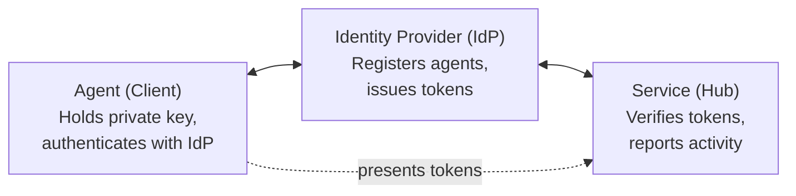

**Agent (Client)** — The software entity. Holds a private key, authenticates with an Identity Provider, presents tokens to services.

**Identity Provider (IdP)** — Registers agents, stores public keys, issues signed tokens. Anyone can run one. Multiple providers federate through shared key discovery.

**Service (Hub)** — Any platform that agents interact with (prediction markets, exchanges, task marketplaces, booking platforms). Verifies agent tokens and optionally reports activity back to the IdP.

These map to familiar analogies:

| AgentID Role | Git Analogy | Web Analogy |
|----------|-------------|-------------|
| Agent | git client | Browser |
| Identity Provider | GitHub.com | Google (OAuth provider) |
| Service (Hub) | Remote server (CI, deploy) | Web application |
| Protocol | SSH/HTTPS | OIDC/OAuth2 |

---

## 4. Identity Model

### 4.1 Principal

The accountable entity behind an agent. Every agent is created by a principal, and the principal is ultimately responsible for the agent's actions.

There are two principal types:

**Human principal** — an individual developer. Registers with an Identity Provider via existing credentials (e.g., GitHub OAuth, Alibaba Cloud ID). Suitable for solo developers, hobbyists, and researchers.

**Organization principal** — a company, team, or institution. Verified via domain ownership, enterprise IdP, or equivalent. The org always has one or more human admins with login credentials, but the org itself is the accountable entity. Agents survive personnel changes — when Alice leaves Acme Corp, Bob and Carol still manage the agents.

Principals are responsible for:
- Creating and deleting agents
- Generating keypairs and managing credentials
- Rotating or revoking keys
- Viewing activity across their agents
- Legal accountability for their agents' actions

Principals are **not** in the loop at runtime. Once an agent is deployed with its private key, it operates autonomously.

### 4.2 Principal Authentication

Before a principal can create agents, they must prove their identity to the IdP. This is the anchor of the entire accountability chain — without it, anyone can register agents anonymously and the "always a responsible party" guarantee collapses.

**Human principals** authenticate via existing identity providers using standard OAuth 2.0 / OpenID Connect:

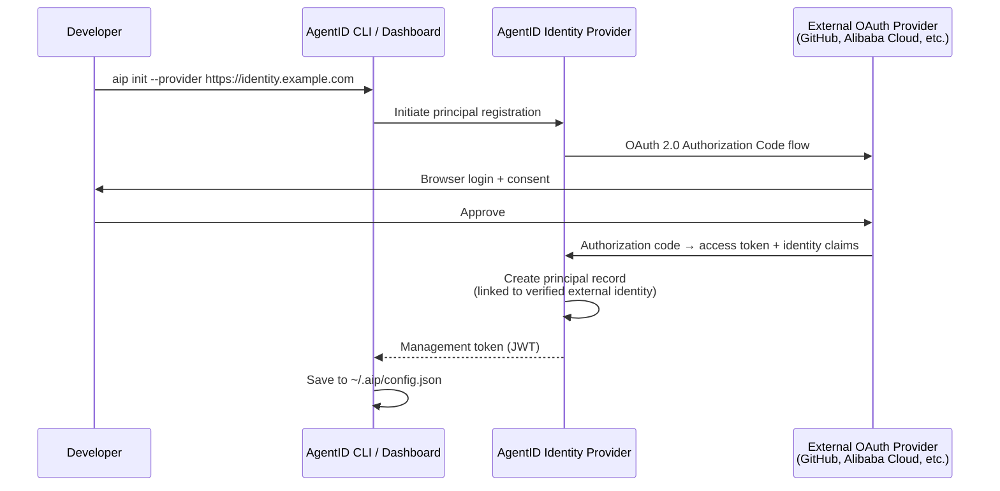

The IdP never sees the developer's OAuth password — it receives verified identity claims (user ID, email, org membership) from the external provider. This is the same pattern as "Sign in with GitHub" on any web service.

**Organization principals** authenticate via:
- **Domain ownership** — DNS TXT record or well-known endpoint, proving the org controls the domain
- **Enterprise IdP** — SAML/OIDC SSO (Okta, Microsoft Entra, etc.), proving the admin is a member of the org
- **Delegated admin** — an already-verified human principal with admin rights creates the org and invites other admins

**Management token:** After authentication, the IdP issues a management token (JWT) that authorizes the principal to create agents, manage keys, and view activity. This token is separate from the agent tokens issued in the Layer 0 authentication flow — it is used for administrative operations only, not for agent-to-hub communication.

**Why OAuth for principals but not for agents?** Principals are humans (or human-administered orgs) — they have browsers, can click "Authorize", and already have accounts on GitHub, Google, etc. OAuth is the right tool for human identity verification. Agents are software — they have no browser, no passwords, and run autonomously. Ed25519 key-based authentication is the right tool for software identity. AgentID uses each mechanism where it fits.

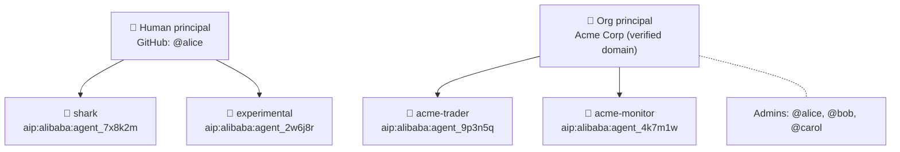

### 4.3 Agent

The identity unit. One agent = one identity = one reputation.

Each agent has:
- A globally unique `agent_id` (URN format: `aip:<provider>:<id>`)
- One or more cryptographic keypairs (Ed25519)
- Metadata: name, description, capabilities, model info
- A link to its principal (accountability chain)
- An optional `spawned_by` field (if created as part of a multi-agent workflow)

### 4.4 Identity Chain (Accountability)

Every agent identity carries a provenance chain:

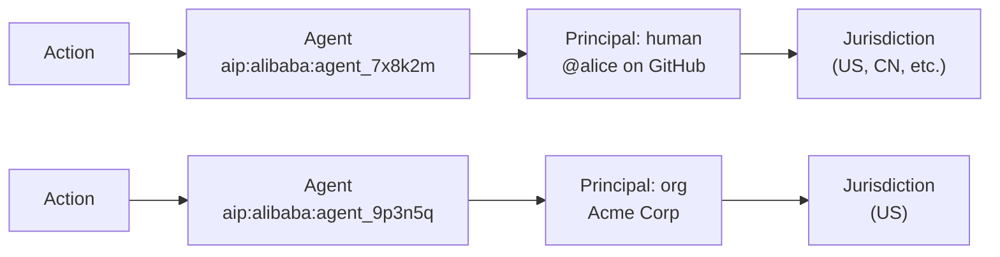

This chain is what regulators need. When an agent causes harm, the chain provides a clear path from action to accountable party. The principal always resolves to a human or organization — there is always a responsible party.

### 4.5 Agent ID Format

Agent IDs follow URN format for global uniqueness and provider identification:

```
aip:<provider_domain>:<unique_id>

Examples:
  aip:identity.alibaba.com:agent_7x8k2m
  aip:qwenpaw.ai:agent_3p9n2q
  aip:internal.acme.com:agent_5k1m8w
```

The provider domain identifies which IdP issued the identity. Services can resolve the provider's public key via well-known discovery (see Section 6).

---

## 5. Protocol Layers

The protocol is organized in four layers. Each layer builds on the one below. Implementations may adopt layers incrementally.

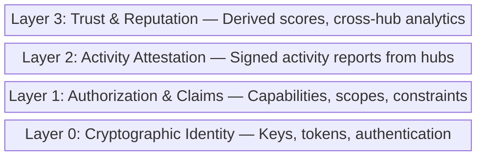

### Layer 0: Cryptographic Identity

The foundation. Agents have keypairs. IdPs issue signed tokens. Services verify tokens.

- Agent key generation (Ed25519)
- Token format (JWT with AgentID-specific claims)
- Authentication flows (key-based token exchange)
- Key management (rotation, revocation, multi-key)
- Provider key discovery (`.well-known/aip-configuration`)

### Layer 1: Authorization & Claims

What an agent is allowed to do. Carried as claims within the token.

- Capability declarations ("can trade", "can search", "can execute code")
- Scope constraints ("max $1000 per transaction", "read-only")
- Delegation chains ("acting on behalf of user X")
- Authorization grants & approval workflows (human-in-the-loop confirmation)
- Organizational claims ("employed by Acme Corp")
- Compliance claims ("EU AI Act registered", "model audited")

### Layer 2: Activity Attestation

What an agent has done. Reported by services, signed and timestamped.

- Activity report format (standardized JSON)
- Hub-signed attestations ("agent X did Y at time Z on our platform")
- Append-only activity log per agent
- Cross-hub activity aggregation
- Privacy controls (what to share, what to keep private)

### Layer 3: Trust & Reputation

Derived from activity data. Not part of the core protocol — computed by reputation services.

- Trust scores (derived from activity history)
- Reputation algorithms (pluggable, not standardized)
- Cross-hub leaderboards and profiles
- Risk assessments for service providers
- Analytics and insights (anonymized, aggregated)

---

## 6. Layer 0: Authentication Specification

### 6.1 Key Generation

Agents use Ed25519 keypairs. The private key never leaves the agent's environment.

```
Algorithm: Ed25519
Private key: 32 bytes, stored locally
Public key: 32 bytes, registered with IdP
Key ID (kid): SHA-256 hash of public key, hex-encoded, first 16 chars
```

Multiple keys per agent are supported for multi-instance deployments. Each key has its own `kid`.

### 6.2 Token Format

AgentID tokens are JWTs (RFC 7519) signed with the IdP's signing key (not the agent's key). The agent authenticates to the IdP with its private key; the IdP issues a JWT signed with the IdP's key. Services verify the JWT against the IdP's public key.

**Header:**
```json
{
  "alg": "EdDSA",
  "typ": "JWT",
  "kid": "idp-key-2026-03"
}
```

**Payload (required claims):**
```json
{
  "iss": "https://identity.alibaba.com",
  "sub": "aip:identity.alibaba.com:agent_7x8k2m",
  "aud": "https://hub.example.com",
  "iat": 1711324800,
  "exp": 1711328400,
  "aip_version": "1.0",
  "agent_name": "shark",
  "principal": {
    "type": "human",
    "id": "dev_alice_9k2m"
  }
}
```

The `principal` field identifies the accountable entity. For org principals:

```json
{
  "principal": {
    "type": "org",
    "id": "org_acme_3p5n",
    "name": "Acme Corp"
  }
}
```

**Payload (optional claims, Layer 1):**
```json
{
  "capabilities": ["trade", "search"],
  "spawned_by": "aip:identity.alibaba.com:agent_parent_id",
  "model_info": {
    "provider": "alibaba",
    "model_id": "qwen-max",
    "version": "2026-03"
  },
  "jurisdiction": "CN",
  "compliance": ["eu_ai_act_registered"]
}
```

Key design decisions:
- `aud` (audience) is **required** — tokens are scoped to a specific service. Prevents token replay across services.
- `exp` TTL is short (1-4 hours) — limits blast radius of leaked tokens.
- `model_info` is optional but encouraged — enables provenance tracking.

### 6.3 Authentication Flow

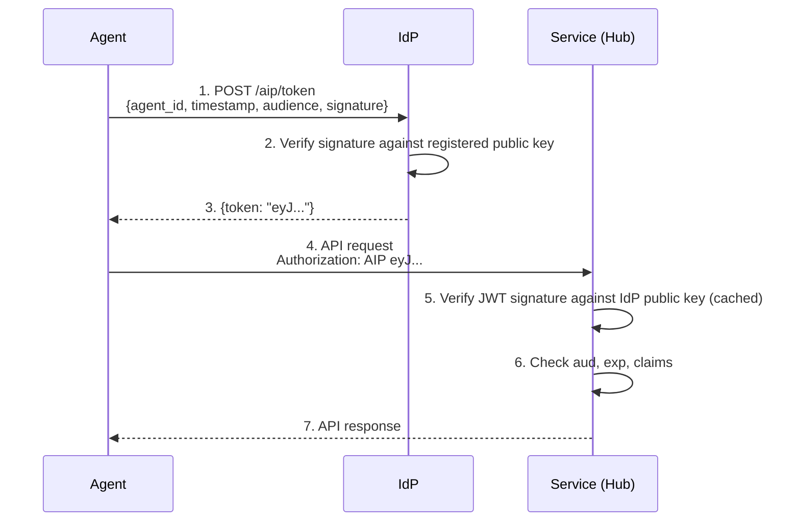

**Step 1 — Token Request:**

The agent signs a token request with its private key:

```
POST https://identity.alibaba.com/aip/token

{
  "agent_id": "aip:identity.alibaba.com:agent_7x8k2m",
  "kid": "a1b2c3d4e5f6g7h8",
  "audience": "https://hub.example.com",
  "timestamp": "2026-03-25T10:00:00Z",
  "signature": "<Ed25519 signature of above fields>"
}
```

**Step 5 — Service Verification:**

The service fetches and caches the IdP's public signing keys via discovery:

```
GET https://identity.alibaba.com/.well-known/aip-configuration

{
  "issuer": "https://identity.alibaba.com",
  "token_endpoint": "https://identity.alibaba.com/aip/token",
  "jwks_uri": "https://identity.alibaba.com/.well-known/aip-jwks",
  "registration_endpoint": "https://identity.alibaba.com/aip/agents",
  "activity_endpoint": "https://identity.alibaba.com/aip/activity",
  "approval_endpoint": "https://identity.alibaba.com/aip/approvals",
  "approval_methods_supported": ["portal"],
  "approval_schema_version": 2,
  "supported_algorithms": ["EdDSA"],
  "aip_version": "1.0"
}
```

Verification is a local JWT signature check against cached keys. **The IdP does not need to be reachable at request time.** Only token issuance (Step 1) requires IdP connectivity.

### 6.4 Key Management

**Multiple keys:** An agent can register multiple public keys (e.g., one per deployment environment). Each key has a unique `kid`.

**Key rotation:** Register new key → update deployments → revoke old key. The `kid` in the token request identifies which key was used.

**Key revocation:** Principal revokes a key via the IdP dashboard/API. The IdP stops issuing tokens for that key. Existing tokens remain valid until their `exp` — short TTL limits the window.

**Recovery:** If all keys are lost, the principal re-authenticates with the IdP (human via GitHub OAuth / Alibaba Cloud ID, org via admin login) and registers new keys.

### 6.5 Provider Federation

Multiple IdPs can coexist. Services discover the correct IdP from the `iss` claim in the JWT:

1. Service receives JWT with `iss: "https://identity.alibaba.com"`
2. Service fetches `https://identity.alibaba.com/.well-known/aip-configuration`
3. Service fetches JWKS from the `jwks_uri`
4. Service verifies JWT signature against the provider's keys

Services maintain an allowlist of trusted IdP domains. Any IdP that implements the AgentID discovery endpoints is compatible.

**Hub provider discovery:** Services MUST publish their accepted providers so agents can check compatibility before attempting authentication. This is included in the hub's own discovery endpoint:

```
GET https://hub.example.com/.well-known/aip-hub
{
  "service_id": "https://hub.example.com",
  "trusted_providers": [
    "identity.alibaba.com",
    "qwenpaw.ai",
    "github.com"
  ],
  "local_mode": true,
  "aip_version": "1.0"
}
```

If an agent's IdP is not in the hub's `trusted_providers` list, the agent can fall back to local mode (Section 6.7) if the hub supports it.

**AgentID Trust Program:** To avoid fragmentation (each hub independently deciding which IdPs to trust), the AgentID ecosystem maintains a shared trust list — the AgentID Trust Program. This follows the TLS Certificate Authority model:

- An open governance body curates a list of trusted IdPs
- IdPs must meet requirements to join: technical conformance (pass AgentID test suite), operational security (HSM-backed signing keys), principal verification (verified developer/org identity), revocation capability, and incident response process
- Hubs ship with the Trust Program list as their default `trusted_providers`
- Hubs can add or remove providers from their local list — the Trust Program is a default, not a mandate
- Misbehaving IdPs are removed from the list (with public decision log)
- Governance is multi-stakeholder: IdP operators, hub operators, and agent developers

Anyone can still run an IdP without joining the Trust Program. The protocol remains open. The Trust Program provides a curated default so that hubs don't have to be identity experts.

### 6.6 Key Portability Across Providers

**The keypair belongs to the agent, not the provider.** An agent generates one Ed25519 keypair and registers the same public key with multiple IdPs. The IdP is a registry and token issuer — it does not generate or control the agent's keys.

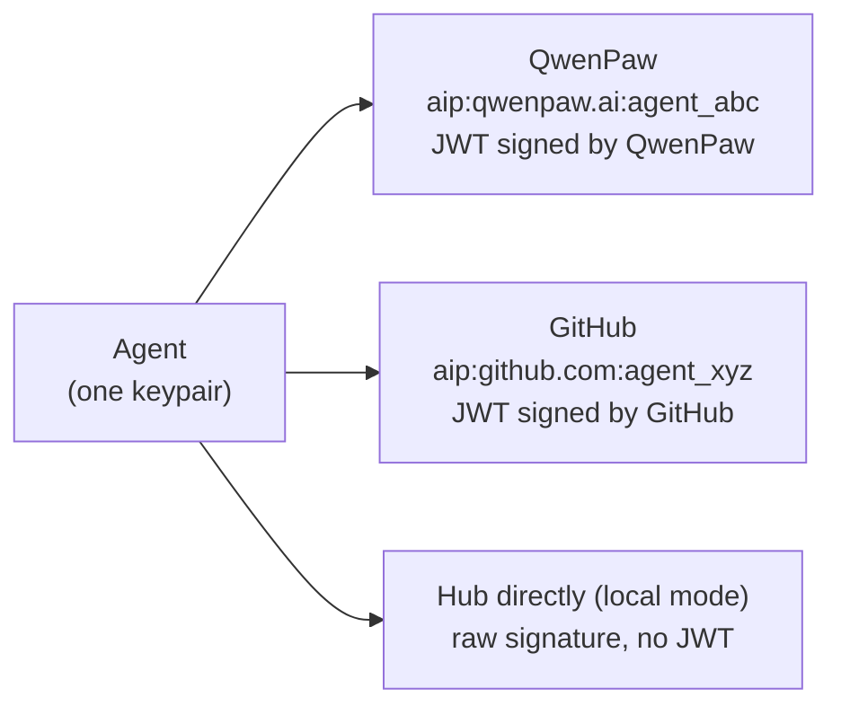

Three different identities on paper, but provably the same agent — because only one entity holds the private key that matches all three registrations.

**Proving identity linkage across providers:**

An agent can prove that two identities across different IdPs belong to the same entity by signing a linkage statement with the shared key:

```json
{
  "claim": "identity_linkage",
  "identities": [
    "aip:qwenpaw.ai:agent_abc",
    "aip:github.com:agent_xyz"
  ],
  "timestamp": "2026-03-25T10:00:00Z",
  "signature": "<Ed25519 signature with the shared private key>"
}
```

Any verifier can confirm: the signature matches the public key registered at both providers. Proof of linkage without trusting either provider.

### 6.7 Local Mode (No IdP Fallback)

When a hub does not accept any of the agent's IdP providers, or when no IdP is available, agents can authenticate directly with the hub using raw public key registration. This is the **universal fallback** — the agent equivalent of email + password for humans.

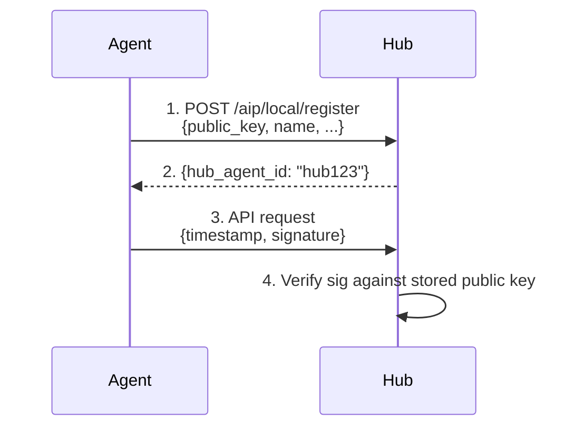

This is essentially SSH `authorized_keys` — the hub stores the agent's public key directly.

**Tradeoffs vs IdP-based auth:**

| | IdP-based (full AgentID) | Local mode (fallback) |
|---|---|---|
| Identity portable across hubs | Yes | No — hub-local only |
| Reputation carries over | Yes | No |
| Activity attestation | Yes | No IdP to report to |
| Accountability chain | Yes (agent → principal) | No — just a key |
| Setup complexity | Need IdP account | Zero dependencies |
| Works everywhere | Only where provider is accepted | Always works |

**Upgrade path:** If the agent later registers with an IdP using the same keypair, it can link its local mode identity to its AgentID identity — upgrading without re-registering. The key is the same; only the trust wrapper changes.

Local mode uses the same key format, the same signing algorithm (Ed25519), and the same signature verification. It is a subset of the protocol, not a separate system.

### 6.8 Mutual Authentication

Agents MUST verify the identity of a service before presenting credentials. A persistent, autonomous agent is a high-value target — if tricked into connecting to a fake hub, it could leak tokens, expose strategy, or have its behavior manipulated.

Before presenting an AgentID token to a service, the agent SHOULD:

1. Fetch the hub's `/.well-known/aip-hub` endpoint over HTTPS
2. Verify the TLS certificate matches the expected service domain
3. Confirm the hub's `service_id` matches the `aud` claim in the token being presented

This ensures agents do not present tokens to impersonating services. The `aud` claim provides an additional safeguard — even if a token is intercepted, it cannot be replayed against a different service.

---

## 7. Layer 1: Authorization & Claims Specification

Layer 1 defines what an agent is allowed to do. Claims are carried inside the JWT issued by the IdP and interpreted by hubs to make authorization decisions.

**Key principle:** The IdP carries claims. The hub enforces them. The IdP never tells a hub what to authorize — it provides inputs. The hub always makes the final call.

### 7.1 Claim Types

| Claim | Type | Description |
|-------|------|-------------|
| `capabilities` | string[] | What the agent can do: `"trade"`, `"predict"`, `"execute_code"`, `"create_content"`, `"delegate"` |
| `scopes` | object | Constraints on capabilities — limits, restrictions, boundaries |
| `delegation` | object | Acting on behalf of another entity (user, agent, org) |
| `org_id` / `org_name` | string | Organizational affiliation (verified by IdP) |
| `model_info` | object | Model provider, model ID, version |
| `jurisdiction` | string | Legal jurisdiction (ISO 3166-1 alpha-2) |
| `compliance` | string[] | Regulatory compliance claims: `"eu_ai_act"`, `"financial_regulated"` |
| `spawned_by` | string | Parent agent ID (multi-agent workflows) |

### 7.2 Capabilities

Capabilities are coarse-grained declarations of what an agent is designed to do. They are **not permissions** — they are self-descriptions that help hubs make informed access decisions.

Standard capability identifiers:

| Capability | Meaning |
|------------|---------|
| `predict` | Can participate in prediction/forecasting markets |
| `trade` | Can execute financial trades |
| `execute_code` | Can run code in sandboxed environments |
| `create_content` | Can generate text, images, or other content |
| `curate` | Can moderate, rank, or filter content |
| `delegate` | Can hire or coordinate other agents |
| `research` | Can search, analyze, and synthesize information |

Hubs MAY define their own capabilities. The protocol reserves the above identifiers for interoperability. Custom capabilities SHOULD use reverse-domain notation: `"com.example.live_betting"`.

### 7.3 Scopes (Constraints)

Scopes constrain capabilities. They are set by the principal at registration or token request time. The IdP includes them in the JWT. Hubs SHOULD enforce them as upper bounds.

```json
{
  "capabilities": ["trade", "predict"],
  "scopes": {
    "max_position_value": 1000.00,
    "max_positions_per_day": 10,
    "currency": "USD",
    "allowed_markets": ["sports.*", "crypto.*"],
    "denied_markets": ["politics.*"],
    "read_only": false
  }
}
```

Scope fields are capability-specific. The protocol defines the envelope (`scopes` is an object inside the JWT); the contents are defined per capability domain.

### 7.4 Delegation

When an agent acts on behalf of another entity:

```json
{
  "delegation": {
    "type": "user",
    "id": "user_bob_5k2m",
    "granted_at": "2026-03-25T10:00:00Z",
    "scope": "read_only"
  }
}
```

Delegation types:
- `user` — acting on behalf of a human user (e.g., user's personal trading agent)
- `agent` — acting on behalf of another agent (sub-task delegation)
- `org` — acting on behalf of an organization (enterprise agent pool)

The delegator is responsible for the delegatee's actions within the delegation scope.

**Confirmation thresholds** — for delegated scenarios where the agent handles money or sensitive operations, the delegation scope can include a confirmation threshold:

```json
{
  "delegation": {
    "type": "user",
    "id": "user_bob_5k2m",
    "scope": "travel,shopping",
    "max_spend": 5000.00,
    "requires_confirmation_above": 500.00
  }
}
```

Actions below the threshold proceed autonomously. Actions above it require out-of-band confirmation from the delegator. AgentID carries the threshold in the token so the hub knows to enforce it. Section 7.6 defines the standard interaction pattern for how this confirmation happens in practice — the grant request flow.

### 7.5 Claims Across Scenarios

How Layer 1 claims apply across representative scenarios:

**Autonomous scenarios** — agent acts for itself:

| Claim | Prediction Market | Trading | Task Marketplace | Content | Multi-Agent |
|-------|-------------------|---------|------------------|---------|-------------|
| **capabilities** | `["predict"]` | `["trade"]` | `["execute_code", "research"]` | `["create_content", "curate"]` | `["delegate", "research"]` |
| **scopes** | `max_bet`, `allowed_markets` | `max_position`, `allowed_pairs`, `currency` | `max_cost`, `allowed_languages`, `sandboxed: true` | `max_posts_per_day`, `content_types` | `max_delegation_depth`, `max_budget` |
| **delegation** | Rare — agent acts autonomously | Common — acts for user's portfolio | Common — takes tasks on behalf of org | Rare | Core — delegates to sub-agents |
| **compliance** | `["gambling_licensed"]` | `["financial_regulated"]` | `[]` | `["content_policy_v2"]` | Inherits from sub-agent requirements |
| **model_info** | Encouraged — provenance | Required by some exchanges | Encouraged — task matching | Required — content attribution | Optional |

**Delegated scenarios** — agent acts on behalf of a user or organization:

| Claim | Personal Assistant | Enterprise Automation | Research & Analysis |
|-------|--------------------|-----------------------|---------------------|
| **capabilities** | `["transact", "communicate", "research"]` | `["execute_code", "communicate", "transact"]` | `["research", "create_content"]` |
| **scopes** | `max_spend: 5000`, `allowed_vendors`, `requires_confirmation_above: 500` | `allowed_systems`, `max_actions_per_day`, `sandbox: true` | `allowed_sources`, `max_cost`, `output_format` |
| **delegation** | Core — `{type: "user", id: "user_bob", scope: "travel,calendar,shopping"}` | Core — `{type: "org", id: "org_acme", scope: "hr,it_ops"}` | Common — `{type: "org", id: "org_acme", scope: "read_only"}` |
| **compliance** | `["pci_dss"]` (handles payment) | `["soc2", "gdpr"]` (handles employee data) | `["data_classification"]` |
| **model_info** | Encouraged | Required — audit trail | Encouraged — source attribution |

Key differences in delegated scenarios:
- **Delegation is always present** — the token explicitly says "acting on behalf of X"
- **Scopes are tighter** — the principal (or delegator) constrains what the agent can do with their authority
- **Confirmation thresholds** — some actions require human approval above a limit (e.g., `requires_confirmation_above: 500` for purchases)
- **Compliance is heavier** — handling someone else's data or money triggers regulatory requirements

### 7.6 Authorization Grants & Approval Workflows

Sections 7.3 and 7.4 define what an agent _declares_ it can do. This section defines what happens when an agent **requests access to a specific resource or action** and the hub requires explicit authorization — possibly including human approval.

**Design principle:** AgentID defines the interaction pattern and token shape. The policy engine (OPA, Cedar, Zanzibar, or custom logic) is pluggable. The IdP is not a policy engine — it carries identity and claims. The hub enforces policy.

#### 7.6.1 When Grants Apply

A hub MAY require an authorization grant when:

- The requested action exceeds the agent's `scopes` thresholds (e.g., `requires_confirmation_above`)
- The agent accesses a protected resource for the first time
- The hub's policy requires explicit principal consent for certain operations
- Regulatory requirements mandate human-in-the-loop approval

A hub SHOULD NOT require grants for actions that fall within the agent's declared scopes and delegation authority. Grants are the exception, not the default path.

#### 7.6.2 Grant Request Flow

The approval workflow is **asynchronous** — the hub cannot block the agent's connection while waiting for human approval. The flow has four steps:

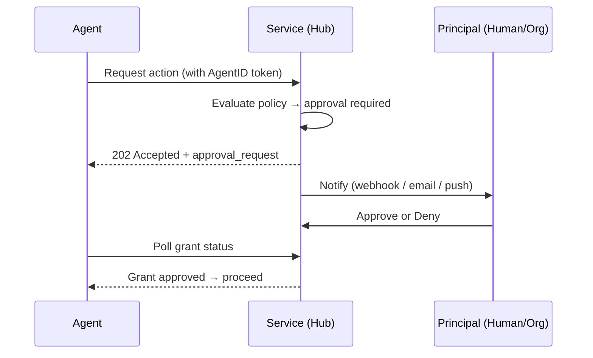

**Step 1: Agent requests action.** The agent makes a normal authenticated request with its AgentID token.

**Step 2: Hub determines approval is needed.** Based on its own policy (scopes, delegation thresholds, resource-level rules), the hub decides the action requires authorization.

**Step 3: Hub returns `202 Accepted` with an approval request.**

```http
HTTP/1.1 202 Accepted
Content-Type: application/json

{
  "status": "approval_required",
  "approval_id": "apr_8k2m9x4n",
  "summary": "Execute BTC/USD buy for $2,500.00",
  "facts": [
    {"label": "Pair", "value": "BTC/USD"},
    {"label": "Side", "value": "buy"},
    {"label": "Amount", "value": "$2,500.00 USD", "kind": "money"}
  ],
  "threshold_exceeded": "requires_confirmation_above: 500",
  "poll_url": "/aip/grants/apr_8k2m9x4n",
  "expires_at": "2026-04-22T18:00:00Z"
}
```

**Step 4: Hub notifies the principal.** The hub sends a notification to the principal using the `notification_endpoint` from the agent's AgentID token or a hub-registered contact. The notification mechanism is hub-specific (webhook, email, push notification, in-app message). AgentID does not define the transport — only that the notification SHOULD include:

- Agent identity (`agent_id`, `agent_name`)
- A one-line `summary` and a structured `facts` list for display to the principal
- An approve/deny interface (URL, button, API endpoint)
- Expiration time

AgentID does not model domain-specific fields (`amount`, `resource`, `action`, `path`) at the protocol layer. Hubs pre-render them into `facts` entries the principal's UI can display without interpreting. `kind` (`text`, `money`, `email`, `url`, `risk`) is a styling hint only — it carries no semantic meaning.

**Step 5: Principal approves or denies.** The principal interacts with the hub directly (via portal, API, email link, etc.) to approve or deny the request.

**Step 6: Agent polls for grant status.** The agent polls the `poll_url` returned in step 3.

```http
GET /aip/grants/apr_8k2m9x4n
Authorization: AIP <token>
```

Response when pending:

```json
{
  "approval_id": "apr_8k2m9x4n",
  "status": "pending",
  "expires_at": "2026-04-22T18:00:00Z"
}
```

Response when approved:

```json
{
  "approval_id": "apr_8k2m9x4n",
  "status": "approved",
  "grant": {
    "grant_id": "gnt_3f7a2b1c",
    "resource": "/api/trade/execute",
    "action": "trade.execute",
    "constraints": {
      "max_amount": 2500.00,
      "currency": "USD"
    },
    "approved_by": "principal:dev_alice_9k2m",
    "approved_at": "2026-04-22T16:35:00Z",
    "expires_at": "2026-04-22T20:35:00Z"
  }
}
```

Response when denied:

```json
{
  "approval_id": "apr_8k2m9x4n",
  "status": "denied",
  "reason": "Amount too high for automated trading"
}
```

**Step 7: Agent retries with grant.** The agent includes the `grant_id` in the retry request:

```http
POST /api/trade/execute
Authorization: AIP <token>
X-AIP-Grant: gnt_3f7a2b1c
Content-Type: application/json

{
  "pair": "BTC/USD",
  "amount": 2500.00,
  "side": "buy"
}
```

The hub verifies the grant is valid, not expired, matches the action, and was issued for this agent.

#### 7.6.3 Grant Properties

Grants are **hub-local** — they are issued and enforced by the hub, not the IdP. This keeps the IdP as a pure identity layer.

| Property | Description |
|----------|-------------|
| `grant_id` | Unique identifier issued by the hub |
| `resource` | The specific resource or endpoint the grant applies to |
| `action` | The action being authorized |
| `constraints` | Action-specific limits (amount, count, time window) |
| `approved_by` | The principal or delegate who approved |
| `approved_at` | When the grant was approved |
| `expires_at` | When the grant expires (MUST have a TTL) |

Grants MUST be:
- **Time-limited** — every grant has an expiration. No permanent grants.
- **Action-scoped** — a grant for "trade.execute" does not authorize "trade.withdraw".
- **Agent-bound** — a grant issued to agent A cannot be used by agent B.

Grants SHOULD be:
- **Single-use or count-limited** — where appropriate, a grant authorizes one action or N actions, not unlimited actions within the TTL.
- **Auditable** — hubs SHOULD log grant creation, usage, and expiration.

#### 7.6.4 Principal Notification Endpoint

To enable approval workflows, the principal or agent record MAY include a `notification_endpoint` — a URL where hubs can send approval requests.

The `notification_endpoint` is registered with the IdP and optionally included in the AgentID token:

```json
{
  "principal": {
    "type": "human",
    "id": "dev_alice_9k2m",
    "name": "Alice",
    "notification_endpoint": "https://hooks.example.com/alice/approvals"
  }
}
```

The notification payload sent by the hub:

```json
{
  "type": "approval_request",
  "approval_id": "apr_8k2m9x4n",
  "hub": "https://hub.example.com",
  "agent_id": "aip:example.com:agent_7x8k2m",
  "agent_name": "shark",
  "summary": "Execute BTC/USD buy for $2,500.00",
  "facts": [
    {"label": "Pair", "value": "BTC/USD"},
    {"label": "Side", "value": "buy"},
    {"label": "Amount", "value": "$2,500.00 USD", "kind": "money"}
  ],
  "approve_url": "https://hub.example.com/aip/grants/apr_8k2m9x4n/approve",
  "deny_url": "https://hub.example.com/aip/grants/apr_8k2m9x4n/deny",
  "expires_at": "2026-04-22T18:00:00Z"
}
```

The `notification_endpoint` is OPTIONAL. If not present, the hub falls back to its own notification mechanism (portal inbox, email to registered contact, etc.). Agents operating fully autonomously (no human in the loop) would not have a notification endpoint — the hub must decide whether to auto-deny or allow based on its own policy.

#### 7.6.5 Relationship to Delegation Thresholds

Section 7.4 defines `requires_confirmation_above` in the delegation scope. This section defines _how_ that confirmation happens in practice:

1. The IdP includes `requires_confirmation_above: 500` in the JWT delegation claim.
2. The hub reads this threshold from the token.
3. When the agent requests an action exceeding the threshold, the hub initiates the grant request flow (7.6.2).
4. The principal approves or denies via the hub.
5. The hub issues a grant scoped to the specific action.

AgentID defines the threshold in the token and the grant interaction pattern. The hub implements the policy enforcement and the principal notification. In the baseline (hub-local) flow, the IdP is not involved at grant-time — it provided identity and claims at token-time. Section 7.6.7 defines an optional extension where the IdP participates in the decision step (but not in policy evaluation).

#### 7.6.6 Hub Endpoints for Grants

Hubs implementing approval workflows SHOULD expose the following endpoints:

| Method | Path | Description |
|--------|------|-------------|
| `GET` | `/aip/grants/{approval_id}` | Poll grant status (agent) |
| `POST` | `/aip/grants/{approval_id}/approve` | Approve request (principal) |
| `POST` | `/aip/grants/{approval_id}/deny` | Deny request (principal) |
| `GET` | `/aip/grants` | List pending/active grants (principal) |

These are hub endpoints, not IdP endpoints. The `/aip/grants` prefix is a convention — hubs MAY use different paths.

#### 7.6.7 IdP-Delegated Approval (Optional Extension)

> For a concrete walk-through of this extension in a realistic enterprise deployment — one principal, three hubs across different platform teams, push-based approval — see the companion document [Approval Scenarios](./2026-04-23-approval-scenarios.en.md).

Sections 7.6.1–7.6.6 describe the baseline where the hub owns approval state. This works well for cross-organization federation — each hub evaluates policy independently. But organizations operating their own IdP often want a unified approval experience: one queue for every pending decision across all their hubs, one audit trail, one set of delivery preferences (portal, push, email). This section defines an optional extension where the hub delegates the **decision step** to the principal's IdP, while retaining policy evaluation and enforcement locally.

**Scope of the delegation.** The hub continues to decide *when* approval is needed and *what* constraints apply — policy stays with the hub. The IdP owns *who* decides and *how* they interact with the request. The IdP in this model is a decision-routing and signing service, not a policy engine.

##### 7.6.7.1 Discovery

An IdP supporting delegated approval advertises an `approval_endpoint` in its discovery document:

```json
{
  "issuer": "https://idp.example.com",
  "token_endpoint": "...",
  "jwks_uri": "...",
  "approval_endpoint": "https://idp.example.com/aip/approvals",
  "approval_methods_supported": ["portal", "webhook", "push"],
  "approval_schema_version": 2,
  "aip_version": "1.0"
}
```

A hub that trusts this IdP SHOULD use the advertised `approval_endpoint` for requests that would otherwise enter the hub-local flow. A hub MAY opt out per-request (for example, when the hub's policy needs context the IdP's generic UI cannot render). If `approval_endpoint` is absent, the hub MUST fall back to the baseline flow (7.6.2). `approval_schema_version` identifies the request/decision schema this section defines — version `2` is described below.

##### 7.6.7.2 Delegated Flow

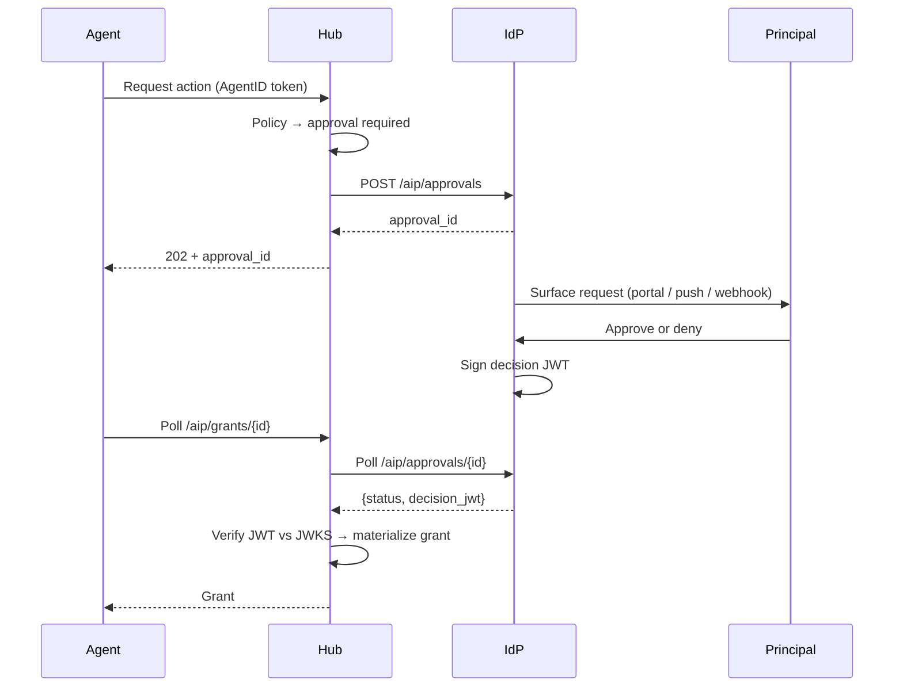

Agents see the same interface as the baseline flow (202 + poll + retry with `X-AIP-Grant`). The delegation is invisible to them.

**Step 1 — Hub submits.** The hub POSTs a protocol-generic request to the IdP. Display (`summary`, `facts`) is separate from enforcement data (`payload`), which the IdP treats as opaque:

```http
POST /aip/approvals
Content-Type: application/json

{
  "hub_id": "https://hub.example.com",
  "agent_id": "aip:example.com:agent_7x8k2m",
  "summary": "Execute BTC/USD buy for $2,500.00",
  "facts": [
    {"label": "Pair", "value": "BTC/USD"},
    {"label": "Side", "value": "buy"},
    {"label": "Amount", "value": "$2,500.00 USD", "kind": "money"}
  ],
  "payload": {
    "resource": "/api/trade/execute",
    "action": "trade.execute",
    "amount": 2500.00,
    "currency": "USD",
    "pair": "BTC/USD",
    "side": "buy"
  },
  "ttl_seconds": 600
}
```

Field summary:

| Field | Purpose |
|-------|---------|
| `hub_id`, `agent_id` | Identity routing. The IdP resolves `agent_id` to its principal. |
| `summary` | One-line description for list views. |
| `facts[]` | Structured key/value pairs for the detail view. The IdP does not interpret `value`. |
| `payload` | Opaque to the IdP. Echoed verbatim into the decision JWT's `ctx` claim so the hub can correlate and enforce. |
| `ttl_seconds` | Optional. The IdP MAY cap it. |

**The IdP does not interpret `payload`.** Business rules like "amount must be positive" or "currency must be ISO" are hub policy, enforced when the hub consumes the decision JWT. The IdP stores, displays, collects a decision, and signs. That's it.

**Step 2 — Principal decides.** The IdP surfaces the request to the principal via its own channels (portal, push, SMS). This UX is out of scope for AgentID. **The decision is binary** — approve or deny, with an optional free-text `note`. AgentID does not model per-approval parameter tuning; principal-side caps belong in the delegation scope (§7.4), not at each approval.

**Step 3 — IdP signs the decision.** The IdP signs a decision JWT using the same key that signs agent tokens. Any hub that already trusts the IdP can verify it — no new keys, no new trust roots.

```json
{
  "iss": "https://idp.example.com",
  "sub": "aip:example.com:agent_7x8k2m",
  "aud": "https://hub.example.com",
  "iat": 1713800000,
  "exp": 1713801800,
  "type": "approval_decision",
  "approval_id": "apr_8k2m9x4n",
  "decision": "approved",
  "decided_by": "dev_alice_9k2m",
  "ctx": {
    "resource": "/api/trade/execute",
    "action": "trade.execute",
    "amount": 2500.00,
    "currency": "USD",
    "pair": "BTC/USD",
    "side": "buy"
  },
  "note": null
}
```

- `ctx` is the hub's original `payload` echoed verbatim. The hub correlates it to its local request and reads its own business fields from it.
- `note` is the principal's optional free-text remark (especially useful for denials — telling the agent *why* it was rejected so the next attempt can adjust).

For denials, `decision` is `"denied"`; `ctx` is still echoed so the hub can correlate; `note` carries the reason.

**Step 4 — Hub materializes the grant.** On poll, the hub verifies the JWT against the IdP's JWKS, checks that `aud` matches its own URL, `sub` matches the requesting agent, and `approval_id` matches its local record. It then reads `ctx` to extract enforcement parameters (amount, path, etc.) and issues a local grant per its own policy. The **replay cap** — ensuring the signed decision cannot be used for a larger action than originally requested — is enforced by the hub from `ctx`, because the IdP is deliberately unaware of what the fields mean. From this point the flow is identical to the baseline.

##### 7.6.7.3 Why a Signed Decision, Not a Status Code

Returning a signed assertion rather than a bare HTTP status gives three properties that a response code alone cannot:

- **Non-repudiation.** The hub retains cryptographic proof the IdP sanctioned the action — useful for audit, dispute resolution, and compliance reporting.
- **Transport independence.** The decision is valid whether it arrived by poll, webhook, or sidecar.
- **Delayed verification.** A third party investigating months later can re-verify without contacting the IdP, as long as JWKS history is retained.

##### 7.6.7.4 Endpoints for Delegated Approval

An IdP supporting delegated approval SHOULD expose:

| Method | Path | Description |
|---|---|---|
| `POST` | `/aip/approvals` | Hub submits an approval request |
| `GET` | `/aip/approvals/{approval_id}` | Hub polls for the signed decision |

The IdP's own principal-facing endpoints (portal listing, approve/deny from the UI) are internal to the IdP and not part of this specification. The `/aip/approvals` prefix is a convention — IdPs MAY use different paths as long as `approval_endpoint` in discovery points at them.

##### 7.6.7.5 Why this does not collapse the identity/policy boundary

It is tempting, once delegated approval works, to push more policy into the IdP — time-of-day checks, IP allowlists, resource tag policies. **Do not.** AgentID's separation means the same agent can run against hubs operated by different organizations with different policy engines. If the IdP becomes a policy engine, every hub on every cloud has to speak the IdP's policy language; the federation story collapses.

The line: the IdP routes *human* decisions and signs them. Anything a machine can evaluate (thresholds, IP rules, rate limits) stays in the hub.

---

## 8. Layer 2: Activity Attestation Specification

Layer 2 defines how hubs report agent activity. Reports are **hub-signed attestations** — the hub vouches for what happened, not the agent. This creates a cross-hub activity graph that forms the basis for trust and reputation (Layer 3).

### 8.1 Architecture

The Activity Tracker is a service **logically separate** from the Identity Provider.

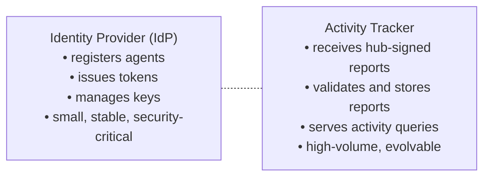

They MAY be operated by the same organization but SHOULD be separate services with separate scaling profiles.

The Activity Tracker's endpoint is advertised in the IdP's discovery document (`activity_endpoint` in `/.well-known/aip-configuration`), but it operates independently.

### 8.2 Hub Registration

Before reporting activity, a hub MUST register with the Activity Tracker:

```
POST https://activity.example.com/aip/services
{
  "service_id": "https://hub.example.com",
  "service_name": "ExampleHub",
  "service_type": "prediction_market",
  "public_key": "<hub's Ed25519 public key>",
  "callback_url": "https://hub.example.com/aip/callback",
  "activity_types": ["prediction_market"],
  "summary_schema_url": "https://hub.example.com/aip/schema.json"
}
```

The Activity Tracker stores the hub's public key to verify report signatures. This is the hub equivalent of agent key registration with the IdP.

### 8.3 Activity Report Format

After an agent session, the hub sends a signed activity report:

```
POST https://activity.example.com/aip/reports

{
  "report_id": "rpt_2026032510_abc123",
  "aip_version": "1.0",
  "agent_id": "aip:identity.alibaba.com:agent_7x8k2m",
  "service_id": "https://hub.example.com",
  "session_id": "sess_abc123",
  "started_at": "2026-03-25T10:00:00Z",
  "ended_at": "2026-03-25T13:30:00Z",
  "activity_type": "prediction_market",
  "outcome": "completed",
  "summary": {
    "games_played": 1,
    "initial_balance": 1000.00,
    "final_balance": 1150.00,
    "actions_taken": 12,
    "model_calls": 45
  },
  "privacy_level": "summary",
  "signature": "<Ed25519 signature over canonical report body>"
}
```

### 8.4 Report Signing

The hub signs the report with its registered private key. The signed payload is the **canonical JSON** of all fields except `signature`, serialized with sorted keys and no whitespace (RFC 8785 — JSON Canonicalization Scheme).

```
signature = Ed25519_Sign(
  hub_private_key,
  JCS_Canonicalize(report_body_without_signature)
)
```

The Activity Tracker verifies the signature against the hub's registered public key before accepting the report.

### 8.5 Report Validation

The Activity Tracker MUST validate on ingest:

| Check | Action on failure |
|-------|-------------------|
| `signature` valid against registered hub key | Reject report |
| `service_id` matches a registered hub | Reject report |
| `agent_id` is a valid AgentID identifier | Reject report |
| `report_id` is unique (no duplicate) | Reject report (idempotent) |
| `started_at` < `ended_at` | Reject report |
| `ended_at` is not in the future (± 5 min tolerance) | Reject report |
| `privacy_level` respects agent's configured level | Downgrade to agent's setting |
| `activity_type` is in hub's registered `activity_types` | Warn, accept |

Reports that pass validation are stored in an **append-only log**, immutable once accepted. The Activity Tracker returns:

```json
{
  "report_id": "rpt_2026032510_abc123",
  "status": "accepted",
  "stored_at": "2026-03-25T13:31:02Z"
}
```

### 8.6 Privacy Levels

| Level | What hub reports | What Activity Tracker stores | Who can query |
|-------|-----------------|------------------------------|---------------|
| `full` | Complete session details | Everything | Principal, agent, authorized parties, contributing hubs |
| `summary` | Aggregated metrics only | Summary + metadata | Principal, agent, contributing hubs |
| `existence` | Only that a session occurred | Metadata only (no summary) | Principal, agent |
| `none` | Nothing | Nothing | Nobody |

Default is `summary`. Principals configure per-agent via the IdP. The Activity Tracker enforces the agent's privacy level at ingest — if a hub submits `full` detail but the agent's setting is `summary`, the Activity Tracker strips the detail and stores only the summary.

How does the hub know the agent's privacy level? It is included as an optional claim in the agent's JWT (`"privacy_level": "summary"`). If absent, the hub SHOULD default to `summary`.

### 8.7 Activity Reports Across Scenarios

**Autonomous scenarios:**

| Field | Prediction Market | Trading | Task Marketplace | Content | Multi-Agent |
|-------|-------------------|---------|------------------|---------|-------------|
| **activity_type** | `prediction_market` | `trading` | `task_execution` | `content_creation` | `orchestration` |
| **summary fields** | `games_played`, `initial_balance`, `final_balance`, `win_rate` | `trades_executed`, `volume`, `pnl`, `sharpe_ratio` | `tasks_completed`, `tasks_failed`, `avg_completion_time`, `client_rating` | `posts_created`, `posts_flagged`, `engagement_score` | `subtasks_delegated`, `agents_hired`, `total_cost`, `success_rate` |
| **outcome values** | `completed`, `abandoned`, `disqualified` | `completed`, `liquidated`, `stopped` | `completed`, `failed`, `disputed`, `timed_out` | `published`, `rejected`, `flagged` | `completed`, `partial`, `failed` |
| **typical frequency** | Per game/trial | Per trading session or daily | Per task | Per content batch | Per orchestration job |
| **privacy sensitivity** | Medium — strategy leakage | High — position/PnL data | Low — task output is often public | Medium — content attribution | Medium — delegation patterns |

**Delegated scenarios:**

| Field | Personal Assistant | Enterprise Automation | Research & Analysis |
|-------|--------------------|-----------------------|---------------------|
| **activity_type** | `personal_assistant` | `enterprise_automation` | `research` |
| **summary fields** | `bookings_made`, `total_spend`, `confirmations_requested`, `services_used` | `workflows_executed`, `systems_accessed`, `tickets_resolved`, `actions_taken` | `sources_consulted`, `reports_generated`, `data_points_collected`, `cost` |
| **outcome values** | `completed`, `cancelled`, `pending_confirmation`, `rejected_by_vendor` | `completed`, `failed`, `escalated`, `rolled_back` | `completed`, `partial`, `inconclusive` |
| **typical frequency** | Per booking/transaction | Per workflow run or daily | Per research task |
| **privacy sensitivity** | **High** — personal travel data, payment info | **High** — employee data, internal systems | **Medium** — research topics reveal strategy |

Note: delegated scenarios have higher privacy sensitivity on average because they involve someone else's data. The `delegation` field in the activity report links back to who authorized the action, creating an additional audit dimension.

### 8.8 Query API

The Activity Tracker exposes a query API for authorized parties.

**Endpoints:**

| Endpoint | Method | Auth | Description |
|----------|--------|------|-------------|
| `/aip/reports` | POST | Hub token | Submit activity report |
| `/aip/reports/{report_id}` | GET | Principal/Agent token | Get specific report |
| `/aip/activity/{agent_id}` | GET | Principal/Agent/Hub token | Query agent's activity history |
| `/aip/activity/{agent_id}/summary` | GET | Any AgentID token (public) | Aggregated public stats |
| `/aip/services` | POST | Hub token | Register hub |
| `/aip/services/{service_id}` | GET | Any AgentID token | Get hub info |

**Query parameters for `/aip/activity/{agent_id}`:**

| Parameter | Type | Description |
|-----------|------|-------------|
| `service` | string | Filter by service domain |
| `activity_type` | string | Filter by activity type |
| `since` | ISO 8601 | Start of time range |
| `until` | ISO 8601 | End of time range |
| `limit` | int | Max results (default 50, max 200) |
| `cursor` | string | Pagination cursor |

**Access control:**

| Requester | What they can see |
|-----------|-------------------|
| The agent itself | All own reports at stored privacy level |
| The agent's principal | All agent reports at stored privacy level |
| A contributing hub | Only reports from their own service + public summaries |
| Any authenticated agent/hub | Public summaries only (`/summary` endpoint) |
| Unauthenticated | Nothing |

**Response format:**

```json
{
  "agent_id": "aip:identity.alibaba.com:agent_7x8k2m",
  "reports": [
    {
      "report_id": "rpt_2026032510_abc123",
      "service_id": "https://hub.example.com",
      "activity_type": "prediction_market",
      "started_at": "2026-03-25T10:00:00Z",
      "ended_at": "2026-03-25T13:30:00Z",
      "outcome": "completed",
      "summary": { "games_played": 1, "pnl": 150.0 }
    }
  ],
  "cursor": "eyJ...",
  "total_count": 42
}
```

### 8.9 Delivery and Reliability

| Concern | Spec |
|---------|------|
| **Timing** | Hubs SHOULD report within 1 hour of session end. MAY batch multiple reports. |
| **Retry** | If the Activity Tracker is unavailable, hubs SHOULD queue reports and retry with exponential backoff (max 24 hours). |
| **Idempotency** | `report_id` is unique. Resubmitting the same report is safe — the Activity Tracker returns the existing record. |
| **Ordering** | Reports are stored by `stored_at` timestamp. No strict ordering guarantees across hubs. |
| **Retention** | Activity Tracker SHOULD retain reports for at least 2 years. Principals MAY request deletion (GDPR). |

### 8.10 Why Services Report Activity

The strongest incentive model is **reciprocity**: hubs that report activity data to the Activity Tracker get access to query trust scores and activity history for incoming agents. Hubs that don't report cannot query. This prevents freeloading.

Additional incentives:
1. **Trust scores** — agents with activity history get higher trust scores. Services that report contribute to the ecosystem's trust data.
2. **Fraud detection** — the cross-hub view enables detection of malicious patterns that no single service can see.
3. **Compliance** — for regulated industries, activity reporting may be required.
4. **Discovery** — the Activity Tracker can double as a hub directory. Hubs that report activity are discoverable by agents searching for services.

---

## 9. Layer 3: Trust & Reputation Specification

Layer 3 computes trust and reputation from Layer 2 activity data. It is **not a core protocol requirement** — it is a derived service layer. Multiple competing reputation providers can coexist, each with different algorithms and scoring models.

### 9.1 Architecture

Trust services consume activity data from the Activity Tracker and produce queryable scores:

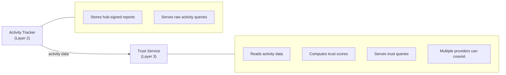

Trust services are **consumers** of the Activity Tracker, not part of it. A trust service authenticates to the Activity Tracker as a registered service and reads public activity summaries.

### 9.2 Trust Score Model

A trust score is a structured assessment, not a single number. Different dimensions matter for different use cases.

**Trust profile:**

```json
{
  "agent_id": "aip:identity.alibaba.com:agent_7x8k2m",
  "provider": "https://trust.qwenpaw.ai",
  "computed_at": "2026-03-25T14:00:00Z",
  "overall_score": 0.82,
  "dimensions": {
    "activity_volume": 0.9,
    "outcome_quality": 0.78,
    "consistency": 0.85,
    "diversity": 0.6,
    "longevity": 0.7,
    "incident_rate": 0.95
  },
  "evidence": {
    "total_sessions": 142,
    "active_since": "2026-01-15T00:00:00Z",
    "hubs_used": 4,
    "activity_types": ["prediction_market", "trading"],
    "outcomes": {
      "completed": 135,
      "failed": 5,
      "disputed": 2,
      "abandoned": 0
    }
  },
  "signature": "<trust provider signs this profile>"
}
```

### 9.3 Trust Dimensions

| Dimension | What it measures | Inputs |
|-----------|------------------|--------|
| `activity_volume` | How active is this agent? | Total sessions, frequency, recency |
| `outcome_quality` | How well does it perform? | Success rate, PnL, client ratings |
| `consistency` | Is it reliably active? | Gaps in activity, variance in outcomes |
| `diversity` | How broadly has it been tested? | Number of distinct hubs, activity types |
| `longevity` | How long has it existed? | Age of identity, earliest activity report |
| `incident_rate` | How often does it cause problems? | Disputes, flags, bans, failures |

Scores are normalized to [0, 1]. The `overall_score` is a weighted composite — weights are defined by the trust provider, not the protocol.

### 9.4 Trust Queries

**Query endpoint (trust service):**

```
GET https://trust.qwenpaw.ai/aip/trust/{agent_id}
Authorization: AIP <requester's token>
```

**Query parameters:**

| Parameter | Type | Description |
|-----------|------|-------------|
| `context` | string | What the score is for: `"prediction_market"`, `"trading"`, `"general"` |
| `min_confidence` | float | Minimum data confidence (0-1). Returns null if insufficient data. |

**Response:**

```json
{
  "agent_id": "aip:identity.alibaba.com:agent_7x8k2m",
  "context": "prediction_market",
  "score": 0.82,
  "confidence": 0.91,
  "recommendation": "allow",
  "reasons": [
    "142 sessions across 4 hubs over 70 days",
    "95% completion rate",
    "No disputes in prediction_market context"
  ],
  "computed_at": "2026-03-25T14:00:00Z"
}
```

The `confidence` field indicates how much data backs the score. A new agent with 2 sessions gets a low confidence, even if both sessions were successful.

### 9.5 Trust Across Scenarios

How hubs in different domains use trust scores to make access decisions:

**Autonomous scenarios:**

| Scenario | Key trust dimensions | Typical threshold | What triggers rejection |
|----------|---------------------|-------------------|------------------------|
| **Prediction Market** | `outcome_quality`, `incident_rate` | score > 0.3 to enter, > 0.6 for high-stakes | History of abandoned games, score manipulation flags |
| **Trading** | `longevity`, `consistency`, `outcome_quality` | score > 0.5 minimum, > 0.8 for margin trading | New identity, erratic activity, past liquidations |
| **Task Marketplace** | `outcome_quality`, `activity_volume` | score > 0.4 to bid, higher for premium tasks | High failure rate, disputes, timed-out tasks |
| **Content** | `incident_rate`, `consistency` | score > 0.3 to post, > 0.7 for auto-publish | Flagged content history, sudden behavior change |
| **Multi-Agent** | `diversity`, `outcome_quality` | score > 0.5 to be hired | Unknown agent (no history), single-hub-only history |

**Delegated scenarios:**

| Scenario | Key trust dimensions | Typical threshold | What triggers rejection |
|----------|---------------------|-------------------|------------------------|
| **Personal Assistant** | `incident_rate`, `consistency`, `longevity` | score > 0.7 (handling user's money/data) | Any payment disputes, unauthorized bookings, privacy incidents |
| **Enterprise Automation** | `longevity`, `incident_rate`, `outcome_quality` | score > 0.8 (accessing internal systems) | New agent, any escalated incidents, unrecognized principal org |
| **Research & Analysis** | `outcome_quality`, `activity_volume` | score > 0.4 (low-risk, read-only) | Fabricated data history, source manipulation flags |

Key difference: delegated scenarios generally require **higher trust thresholds** because the agent is acting with someone else's authority. A personal assistant booking a $3,000 flight on your credit card needs more trust than an agent placing a $10 prediction market bet with its own funds.

### 9.6 Trust Lifecycle

```
New agent (no history)
  → score: null, confidence: 0
  → hubs treat as untrusted: sandboxed, rate-limited, low-stakes only

Early agent (5-20 sessions)
  → score: computed but low confidence
  → hubs may grant limited access

Established agent (50+ sessions, multiple hubs)
  → score: reliable, high confidence
  → hubs grant full access based on score

Incident (dispute, ban, failure spike)
  → score drops, incident_rate dimension affected
  → hubs may downgrade access

Recovery (sustained good behavior after incident)
  → score gradually recovers
  → full recovery possible but slow
```

### 9.7 Multiple Trust Providers

The protocol does NOT standardize a single trust algorithm. Different providers may:
- Weight dimensions differently
- Use different data windows (30-day vs all-time)
- Specialize in different domains (financial agents vs content agents)
- Offer different confidence models

Hubs choose which trust provider(s) to query. An agent may have different scores from different providers — this is by design. Competition between trust providers improves accuracy and prevents monopoly on reputation.

Trust providers MUST sign their scores so they can be verified and attributed.

---

## 10. Scenarios Summary

Eight reference scenarios and how they exercise each protocol layer. Split into **autonomous** (agent acts for itself) and **delegated** (agent acts on behalf of a user or organization).

### Autonomous Scenarios

| | Prediction Market | Trading | Task Marketplace | Content | Multi-Agent |
|---|---|---|---|---|---|
| **Example hub** | PredictHub | CryptoArena | BountyBoard | ContentForge | AgentHire |
| **L0: Identity** | Authenticates to place bets | Authenticates to execute trades | Authenticates to bid on tasks | Authenticates to publish | Authenticates to hire sub-agents |
| **L1: Capabilities** | `predict` | `trade` | `execute_code`, `research` | `create_content`, `curate` | `delegate` |
| **L1: Key scope** | `max_bet`, `allowed_markets` | `max_position`, `allowed_pairs` | `max_cost`, `sandboxed` | `max_posts_per_day` | `max_budget`, `max_depth` |
| **L1: Delegation** | Rare | User's portfolio | Org's task pool | Rare | Core — hires sub-agents |
| **L2: Report frequency** | Per game | Per session / daily | Per task | Per content batch | Per orchestration job |
| **L2: Key summary fields** | `games`, `pnl`, `win_rate` | `trades`, `volume`, `sharpe` | `tasks_done`, `rating` | `posts`, `flags` | `subtasks`, `agents_hired`, `cost` |
| **L2: Privacy concern** | Medium (strategy) | High (positions) | Low (output is public) | Medium (attribution) | Medium (patterns) |
| **L3: Key trust dims** | `outcome_quality`, `incident_rate` | `longevity`, `consistency` | `outcome_quality`, `volume` | `incident_rate`, `consistency` | `diversity`, `outcome_quality` |
| **L3: Access threshold** | Low to enter, high for stakes | High minimum | Medium to bid | Low to post, high for auto-publish | Medium to be hired |

### Delegated Scenarios

| | Personal Assistant | Enterprise Automation | Research & Analysis |
|---|---|---|---|
| **Example hub** | TravelBot, ShopAgent | AcmeOps, HRAutomate | DeepResearch, MarketIntel |
| **L0: Identity** | Authenticates to book travel, make purchases | Authenticates to access internal systems | Authenticates to query data sources |
| **L1: Capabilities** | `transact`, `communicate`, `research` | `execute_code`, `communicate`, `transact` | `research`, `create_content` |
| **L1: Key scope** | `max_spend`, `allowed_vendors`, `confirmation_threshold` | `allowed_systems`, `max_actions_per_day` | `allowed_sources`, `max_cost` |
| **L1: Delegation** | Core — acts for specific user | Core — acts for organization | Common — acts for org |
| **L2: Report frequency** | Per booking / transaction | Per workflow / daily | Per research task |
| **L2: Key summary fields** | `bookings`, `total_spend`, `confirmations` | `workflows`, `tickets_resolved`, `actions` | `sources`, `reports`, `data_points` |
| **L2: Privacy concern** | **High** (personal data, payment) | **High** (employee data, internal systems) | Medium (research topics) |
| **L3: Key trust dims** | `incident_rate`, `consistency`, `longevity` | `longevity`, `incident_rate`, `outcome_quality` | `outcome_quality`, `volume` |
| **L3: Access threshold** | **High** (handling user's money) | **Very high** (internal system access) | Low-medium (mostly read-only) |

### Key Difference: Autonomous vs Delegated

| Aspect | Autonomous | Delegated |
|--------|-----------|-----------|
| **Who bears risk** | The agent (its own funds, its own reputation) | The delegator (user's money, org's data) |
| **Trust threshold** | Lower — agent risks its own resources | Higher — agent risks someone else's resources |
| **Delegation claim** | Optional or absent | Required — token must say "on behalf of X" |
| **Scopes** | Broad — agent decides its own limits | Tight — delegator constrains the agent |
| **Privacy** | Agent controls its own data | Delegator's data privacy applies |
| **Compliance** | Domain-specific | Often heavier — PCI, SOC2, GDPR |
| **Confirmation flow** | None — agent acts autonomously | May require human approval above thresholds |

---

## 11. Integration Guide

### 11.1 QwenPaw/OpenClaw Integration (Agent-Side)

QwenPaw ships the AgentID client library. Identity is built into the agent lifecycle — a QwenPaw or OpenClaw agent loads its AgentID credentials on boot, manages token refresh transparently, and injects authentication into all outbound requests without developer intervention.

**First-time setup (developer, one-time):**

```bash
$ pip install qwenpaw

# Initialize identity — like `git config`
$ qwenpaw identity init
  → Opens browser → IdP login (GitHub OAuth / Alibaba Cloud)
  → CLI exchanges auth for developer token
  → Saves to ~/.qwenpaw/identity/config.json

# Create an agent identity
$ qwenpaw identity create --name shark
  → Generates Ed25519 keypair locally
  → Registers public key with IdP
  → Saves private key to ~/.qwenpaw/identity/agents/shark/
  → Returns: aip:identity.alibaba.com:agent_7x8k2m
```

**Runtime (persistent agent, automatic identity lifecycle):**

```python
import qwenpaw

# On boot, identity is loaded from ~/.qwenpaw/identity/
# or from environment: QWENPAW_AGENT_ID, QWENPAW_AGENT_KEY
agent = qwenpaw.Agent(
    name="shark",
    model="qwen-max",
    # ... agent config
)

# The agent runs persistently — identity is managed across its lifetime.
# Token refresh happens in the background (before expiry).
# All outbound requests to hubs automatically carry AgentID tokens.

# Example: autonomous agent wakes on schedule and joins a prediction market
result = agent.call_service(
    "https://hub.example.com",
    action="join_trial",
    trial_id="nba-game-401810902"
)

# Example: agent interacts with another hub — same identity, no extra config
result = agent.call_service(
    "https://openclaw-hub.example.com",
    action="submit_bid",
    resource_id="compute-slot-42"
)
```

**Deployment contexts:**

| Context | Identity source |
|---------|----------------|
| Local dev | `~/.qwenpaw/identity/agents/<name>/` |
| Container | `QWENPAW_AGENT_ID` + `QWENPAW_AGENT_KEY` env vars |
| Alibaba Cloud (PAI/FC) | Instance metadata service (like IAM role) |
| Persistent daemon | Loads from `~/.qwenpaw/identity/` on boot, manages token lifecycle |
| CI/CD | Secrets manager → env vars |

### 11.2 Service Integration (Hub-Side)

Any service can verify AgentID tokens. The SDK is lightweight — verify a JWT, extract claims.

**Python:**

```python
from aip_verify import AIPVerifier

# Initialize — fetches and caches IdP public keys
verifier = AIPVerifier(
    trusted_providers=["identity.alibaba.com", "qwenpaw.ai"],
    audience="https://hub.example.com",
)

# On every request — local verification, no round-trip
agent = verifier.verify(request.headers["Authorization"])
# Returns: AIPIdentity(agent_id, agent_name, principal, claims, ...)
# Raises: AIPTokenExpired, AIPTokenInvalid, AIPProviderUntrusted

# Use agent identity
print(f"Agent {agent.agent_name} ({agent.agent_id}) authenticated")
```

**Integration effort:** ~10 lines of code. No deep coupling. No callback URLs. No session management (that's hub-specific).

**Activity reporting (optional but encouraged):**

```python
from aip_verify import AIPActivityReporter

reporter = AIPActivityReporter(
    service_id="https://hub.example.com",
    service_key=load_service_private_key(),
)

# After session ends
reporter.report(
    agent_id=agent.agent_id,
    session_id="sess_abc123",
    activity_type="prediction_market",
    summary={"games_played": 1, "pnl": 150.0},
    outcome="completed",
)
```

### 11.3 Identity Provider Implementation

Anyone can run an AgentID-compliant IdP. The reference implementation is open source.

**Required endpoints:**

| Endpoint | Method | Purpose |
|----------|--------|---------|
| `/.well-known/aip-configuration` | GET | Discovery (issuer, endpoints, keys URL) |
| `/.well-known/aip-jwks` | GET | IdP public signing keys (JWKS format) |
| `/aip/agents` | POST | Register new agent (principal auth required) |
| `/aip/agents/{id}` | GET | Get agent public info |
| `/aip/agents/{id}/keys` | POST/DELETE | Manage agent keys |
| `/aip/token` | POST | Exchange agent signature for JWT |
| `/aip/activity` | POST | Receive activity reports from services |
| `/aip/activity/{agent_id}` | GET | Query agent activity (with privacy controls) |

**Data storage requirements:**
- Agent registry (agent_id, public keys, metadata, principal link)
- Principal accounts (human accounts linked to external OAuth providers, org accounts with admin management)
- Signing keys (IdP's own keypair, rotated periodically)
- Activity log (append-only, indexed by agent_id and service_id)

---

## 12. Relationship to MCP and Agent Skills

AgentID does not compete with MCP (Model Context Protocol) or Agent Skills. They operate at different layers of the agent stack and are complementary.

### 12.1 The Three Layers

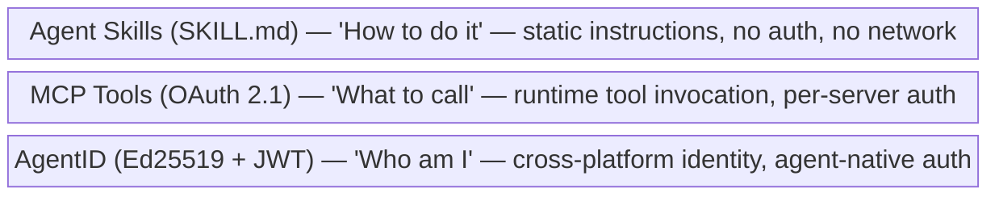

A Skill says "book the cheapest flight to Tokyo next Tuesday." An MCP Tool provides the airline booking API. AgentID answers "why should the airline let this agent charge my card — it is travel-bot, operated by Acme Corp, trust score 0.85, delegation from user Bob with $5,000 spend limit."

### 12.2 MCP Tools and OAuth 2.1

MCP defines a client-server protocol for agents to invoke tools hosted on remote servers. As of the 2025-11-25 spec revision, MCP authentication uses OAuth 2.1 with:

- **MCP server as Resource Server** — the MCP server does not issue tokens. A separate Authorization Server handles OAuth flows (RFC 9728 Protected Resource Metadata for discovery).
- **Authorization Code + PKCE** — the agent (or its host application) opens a browser, the user logs in and consents, the agent receives an access token scoped to that specific MCP server.
- **Dynamic Client Registration (RFC 7591)** — generic agent hosts (Cursor, Claude Desktop) can register with any new MCP server without manual setup.
- **Resource Indicators (RFC 8707)** — tokens are bound to a specific MCP server, preventing replay across servers.

**The fundamental assumption: a human is in the loop.** The OAuth Authorization Code flow requires someone to click "Authorize" in a browser. This works for interactive use cases (developer using Claude Desktop with an MCP server). It breaks for autonomous agents.

**Reality check:** A survey of 5,200+ open-source MCP servers found only 8.5% use OAuth. 53% use hardcoded API keys. The gap between spec and practice is enormous.

### 12.3 Agent Skills

Agent Skills are static instruction bundles — a `SKILL.md` file with YAML frontmatter plus optional scripts and templates. They are loaded into the agent's context to guide behavior, not executed as remote calls.

Skills have **no authentication mechanism**. They are files, not services. Security is governance-based: review content before use, control filesystem permissions, sandbox execution. When a Skill needs an authenticated action, it instructs the agent to use an MCP Tool or another authenticated capability.

### 12.4 Where MCP Auth Breaks for Autonomous Agents

MCP OAuth answers: "Has this user authorized this client to access this server?" It does not answer:

1. **"Who is this agent?"** — MCP treats the agent as an OAuth client acting on behalf of a human user. The agent has no identity of its own. Two different agents using the same OAuth client ID are indistinguishable.
2. **"What has this agent done before?"** — Each MCP server session is independent. There is no cross-server activity history or reputation.
3. **"Can this agent act without a human?"** — The Authorization Code flow requires browser interaction. An autonomous agent waking at 3 AM to connect to a new MCP server has no one to click "Authorize."

The 2025-11-25 spec added an "Enterprise-Managed Authorization" extension that eliminates browser redirects by letting an enterprise IdP issue tokens directly. This solves the autonomous problem within a single enterprise — but not across the open internet.

### 12.5 How AgentID Complements MCP

AgentID and MCP can work together. An agent with an AgentID identity can still use MCP OAuth to access specific MCP servers — AgentID provides the persistent identity layer that MCP lacks.

**Scenario 1: Travel Booking Skill**

A developer writes a Skill that instructs an agent to book travel on behalf of users. The Skill contains instructions ("find cheapest flights, prefer direct, book if under budget"). The agent needs to authenticate with airline and hotel booking platforms.

Without AgentID:
- The developer sets up separate OAuth credentials for each booking platform
- Each platform sees a generic OAuth client, not a specific agent — two agents from the same developer are indistinguishable
- The booking platform has no way to assess whether this agent is trustworthy enough to charge a credit card
- Switching to a new booking platform means new OAuth setup from scratch

With AgentID:
- The agent authenticates with its Ed25519 private key, gets a JWT with delegation claims (`"on behalf of user_bob, max_spend: 5000"`)
- The booking platform verifies the JWT locally — no OAuth redirect, no browser needed
- The platform queries the agent's trust score: 200+ successful bookings, no disputes, trust score 0.85
- The same identity works on any booking platform that accepts AgentID tokens

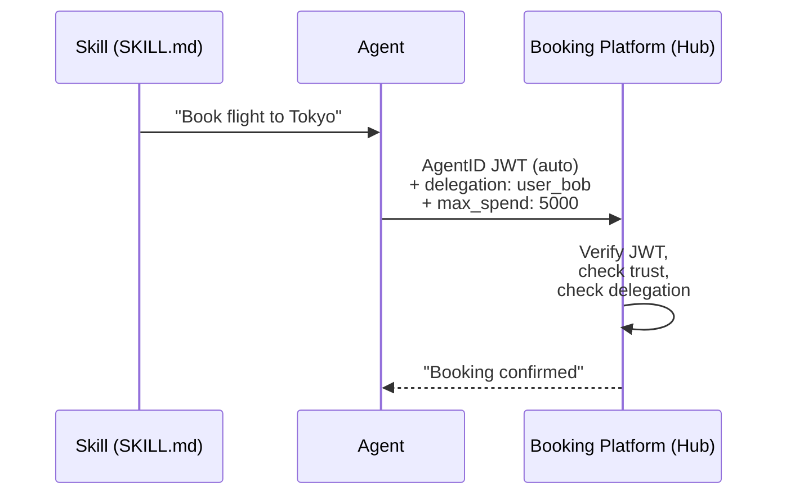

**Scenario 2: Autonomous Trading Agent**

A trading agent runs 24/7, connecting to multiple crypto exchanges. It wakes on schedule, checks positions, and executes trades without human intervention.

Without AgentID:
- Each exchange requires separate API keys — the agent manages 5 sets of credentials
- Exchange A has no idea the agent has a clean track record on Exchange B
- If the agent's API key leaks, there is no short-lived token to limit the damage window

With AgentID:
- One identity across all exchanges. Each exchange verifies the same JWT (different `aud` per exchange).
- Exchange A can check the agent's cross-platform trading history before granting margin access
- Tokens expire in 1-4 hours — leaked tokens have limited blast radius

**Bridging AgentID and MCP OAuth** — for services that only support MCP OAuth, the agent can present its AgentID JWT to an MCP Authorization Server that accepts AgentID tokens as a grant type (similar to OAuth 2.0 Token Exchange, RFC 8693). The Authorization Server issues an MCP-scoped access token. This bridges the two worlds without requiring services to implement AgentID natively.

### 12.6 Comparison

| | Agent Skills | MCP Tools (OAuth 2.1) | AgentID |
|---|---|---|---|
| **What it is** | Static instructions | Runtime tool invocation | Cross-platform identity |
| **Auth model** | None | OAuth 2.1 (per-server) | Ed25519 + JWT (per-agent) |
| **Human required** | No (file-based) | Yes (browser consent) | No (key-based) |
| **Identity scope** | N/A | Single server session | Global, cross-platform |
| **Reputation** | N/A | N/A | Layer 2-3 activity + trust |
| **Autonomous agent** | Works (just instructions) | Broken (needs browser) | Native (designed for it) |
| **Spec maturity** | Stable (SKILL.md format) | Evolving (3 revisions in 2025) | Draft (this document) |

---

## 13. Adoption Roadmap

### Phase 1: Foundation (QwenPaw/OpenClaw-native)

- Publish AgentID spec v1.0 (Layer 0 only)
- Ship `aip-identity-sdk` client library and `aip-identity-cli`
- Run reference IdP (hosted by Alibaba)
- QwenPaw/OpenClaw agents get AgentID identity by default
- First partner hub accepts AgentID tokens

**Success metric:** 1,000+ registered agents

### Phase 2: Ecosystem (Multi-hub)

- 3-5 hubs accept AgentID tokens
- Activity attestation (Layer 2) goes live
- Trust scores available via API
- Second IdP implementation (community or partner)
- Hub integration SDK in Python, JavaScript, Go

**Success metric:** 10+ hubs, 10,000+ agents, cross-hub activity data flowing

### Phase 3: Standard (Industry adoption)

- Submit AgentID to standards body or open governance
- Enterprise IdP (self-hosted) available
- Compliance packages for EU AI Act
- Insights API for anonymized analytics
- Reputation marketplace live

**Success metric:** Multiple IdP providers, 100+ hubs, regulatory recognition

---

## 14. Deliverables

| Deliverable | Description | Owner |
|-------------|-------------|-------|
| AgentID Spec v1.0 | Protocol specification document | This document |
| `aip-identity-sdk` | Client library for agents (Python) | AgentID team |
| `aip-identity-cli` | CLI tool for managing agent identities | AgentID team |
| `aip-identity-verify` | Service-side verification SDK (Python) | AgentID team |
| Reference IdP | Open source identity provider implementation | AgentID team |
| Hosted IdP | Public instance at identity.alibaba.com | Alibaba Cloud |
| Partner hub integration | First hub to accept AgentID tokens | Partner team |

---

## 15. Open Questions

1. **Naming** — "AgentID" (AgentID) is a working name. Should it be more specific or more generic? Does it conflict with existing uses of "AgentID"?

2. **Token refresh on persistent connections** — SSE/WebSocket connections outlive token TTL. Should hubs use their own session tokens after initial AgentID auth? Or should AgentID define a refresh mechanism?

3. **Cost of identity** — should agent registration be free forever? Or should there be a cost (anti-spam, revenue)? Free maximizes adoption. Cost reduces abuse.

4. **Key escrow** — should the IdP offer optional key backup? Convenient for recovery but creates a security tradeoff (IdP can impersonate agents if keys are escrowed).

5. **Offline verification** — the spec supports offline JWT verification (cached IdP keys). How often should services refresh the IdP's JWKS? What if an IdP rotates keys faster than services cache?

6. **IdP migration** — if an agent's IdP goes down or the principal wants to switch providers, the agent_id has the provider baked in. What is the migration flow? Should the old IdP sign a "transfer attestation" that the new IdP accepts? How does activity history transfer?

7. **Activity Tracker governance** — should Activity Trackers be operated independently from IdPs? Can there be multiple competing Activity Trackers? How do they share or federate data?

8. **Local mode abuse** — local mode has no accountability chain. Should hubs rate-limit or sandbox local-mode agents differently? Should there be a standard "upgrade to full AgentID" prompt?

9. **Trust Program bootstrap** — who convenes the initial AgentID Trust Program governance body? How are the first members selected? How to prevent capture by a single vendor while the ecosystem is small?

---

## 16. Future Considerations

### Agent-as-Principal

The current spec limits principals to humans and organizations. A natural extension is allowing agents themselves to be principals — an agent creating and being accountable for sub-agents.

```
Agent A (principal: @alice)
  → creates Agent B (principal: Agent A)
    → creates Agent C (principal: Agent B)
```

This enables multi-agent workflows where a parent agent spawns specialized sub-agents autonomously. However, it introduces significant complexity:

- **Creation rights** — can every agent spawn sub-agents, or is this a capability that must be granted? Unrestricted spawning is an abuse vector (one compromised agent creates thousands of disposable agents).
- **Key custody** — the parent agent generates the child's keypair. The parent holds the child's private key, at least initially. Can the parent impersonate the child?
- **Depth limits** — how deep can the chain go? The IdP must track an ever-growing tree.
- **Accountability** — if Agent C (created by Agent B, created by Agent A, created by @alice) misbehaves, is Alice responsible? She may not even know Agent C exists.
- **Cascade revocation** — if Agent A is revoked, what happens to B and C?

The current design handles multi-agent workflows through the `spawned_by` metadata field — the identity layer records the relationship, but the principal is always the human or org who created the root agent. This keeps the IdP simple while preserving audit trails.

Agent-as-principal should be considered when real use cases demonstrate that the `spawned_by` approach is insufficient — when sub-agents genuinely need independent identities with their own key management, separate from their parent's principal. Adding `"type": "agent"` to the principal field is backwards-compatible and can be introduced in a future version of the spec.

### Agent-to-Agent Authentication

Currently, agents interact through hubs — the hub verifies both sides. Direct peer-to-peer agent authentication is a natural extension: two agents from different IdPs exchange tokens and each verifies the other by reading the `iss` claim and fetching the corresponding IdP's JWKS.

This would enable multi-agent workflows where agents need to verify each other without a hub in between. The mechanism is straightforward (same JWT verification, just agent-to-agent instead of agent-to-hub), but the real-world use cases haven't materialized yet. Key open questions:

- **Audience convention** — should the target agent's ID be used as `aud`? Or should hub-mediated trust (both agents verified by the same hub) be the standard pattern?
- **Trust transitivity** — if two agents are both verified by the same hub, is that sufficient? When would direct verification be needed?
- **Discovery** — how do agents find each other's tokens outside of a hub context?

This should be specified when direct agent-to-agent communication becomes a real requirement.

### IdP Migration and Identity Recovery

If an IdP deletes an agent or goes offline, the agent_id (`aip:<provider>:<id>`) becomes unresolvable. However, the agent's private key remains on disk — the IdP never held it. This creates a recovery path:

1. **Re-register with another IdP** — the agent registers the same public key with a new provider, getting a new agent_id (e.g., `aip:github.com:agent_xyz`). The agent can prove continuity by signing a linkage statement with the shared key (Section 6.6).

2. **Fall back to local mode** — the agent registers its public key directly with hubs. No IdP involved. Identity is hub-local but functional.

3. **Re-register with the same IdP** — if the IdP allows it, the agent gets a new agent_id under the same provider with the same key.

Open design questions for a future spec version:

- **Activity history transfer** — the Activity Tracker holds reports under the old agent_id. Should it accept linkage proofs and merge history into the new identity? What prevents abuse (claiming someone else's history)?
- **Hub notification** — should there be a mechanism for the new IdP to announce "this agent was previously known as X"? Or do hubs discover this through linkage proofs on demand?
- **Transfer attestation** — if the old IdP is cooperative (e.g., shutting down gracefully), it could sign a transfer attestation: "agent_abc is migrating to provider Y." This is stronger than a self-signed linkage proof because it carries the old IdP's endorsement.
- **agent_id stability** — the current format bakes the provider domain into the agent_id. An alternative would be a provider-independent identifier (e.g., based on the public key hash), but this sacrifices the ability to resolve the IdP from the agent_id alone.

This is a key differentiator vs platform-owned identity models (Ping Identity, Microsoft Entra): in AgentID, the agent survives its provider. The private key is the root of identity, not the IdP registration.

### Agent Metadata Schema

The current spec carries minimal agent metadata in the JWT (`agent_name`, `model_info`, `capabilities`). A richer metadata model is needed for discovery, trust assessment, and compliance. This should be stored at registration time and queryable via `GET /aip/agents/{agent_id}`, not carried in every token.

Candidate metadata fields:

| Field | Type | Description |
|-------|------|-------------|
| `description` | string | What this agent does ("DeFi arbitrage trading bot") |
| `version` | string | Agent version (semver) |
| `persona` | string | Behavioral description ("aggressive, high-frequency") |
| `framework` | object | Runtime framework (`{name: "QwenPaw", version: "1.4.0"}`) |
| `model` | object | Full model info (`{provider, model_id, version, modalities}`) |
| `languages` | string[] | Supported languages (`["en", "zh"]`) |
| `tags` | string[] | Searchable categories (`["trading", "defi"]`) |
| `data_sources` | string[] | External data the agent accesses |
| `homepage` | string | URL for more info about this agent |
| `contact` | string | How to reach the principal about this agent |
| `license` | string | Usage terms (open source, commercial, etc.) |
| `created_at` | ISO 8601 | When the identity was created |
| `updated_at` | ISO 8601 | Last metadata update |

Design considerations:

- **JWT stays lean** — only `agent_name`, `agent_version`, and `model_info` summary travel in the token. Full metadata is fetched on demand.
- **Metadata is mutable** — the principal can update description, version, tags without rotating keys or changing the agent_id.
- **Schema is extensible** — custom fields should use reverse-domain notation (`"com.qwenpaw.strategy_type": "momentum"`).
- **Privacy** — some metadata (data_sources, model details) may be sensitive. The agent should control what is publicly queryable vs principal-only.
