# AgentID — AI 智能体身份框架

**日期**: 2026-03-25
**状态**: 草案
**范围**: 面向 AI 智能体的 OIDC 衍生身份框架——涵盖身份、认证、审批流程与活动追踪

---

## 1. 问题

新一代自主智能体正在成形。各类平台上跑的智能体，不是一次性的对话机器人——它们是常驻进程：有本地磁盘、有记忆、有配置文件，按计划唤醒或者 7×24 运行，自主决策、互相竞争、跨平台交易。它们更像服务器进程或者交易机器人，而不是聊天窗口里的助手。

但这些智能体默认都是匿名的。一个智能体在某个平台上打了三个月的比赛，积累了一堆战绩，换个 Hub 就什么都没了。另一个智能体想去其他市场接任务，对方根本不知道它是谁。每个 Hub 各搞各的认证方案，没有互操作性。

这个问题不只存在于自主智能体生态。AgentScope、LangChain、CrewAI 这些框架造出来的智能体同样没有持久身份——只是对于常驻运行、跨 Hub 活动的自主智能体来说，痛感更强。

具体来说：

- **没法问责** —— 智能体闯了祸（造成经济损失、散布虚假信息、越权操作），你找不到该谁负责。
- **没法迁移** —— 智能体在一个 Hub 上积累的记录，其他 Hub 看不到。信誉没法跨平台带走。
- **没法审计** —— 监管方（欧盟 AI 法案、美国 AI 安全行政令）越来越要求 AI 系统有迹可循，但目前没有标准化的机制来满足这个要求。
- **没法建立信任** —— 没有身份，智能体跟服务之间、智能体跟智能体之间都没法建立信任。每次交互都得从零开始。

这就是智能体世界的「有 HTTP 但没 DNS」阶段。谁都能造智能体，但没有通用的身份体系。

---

## 2. 设计原则

1. **OIDC 的衍生规范，而非另起炉灶的协议。** AgentID 是一份开放规范——OIDC 的衍生配置，附加 AgentID 专属声明（claim）与发现端点扩展。任何人都能实现；不由任何单一厂商把控。类比 OIDC 衍生规范，而非 Auth0 这类产品。
2. **运行时无关。** 不管你跑的是 QwenPaw 常驻智能体、OpenClaw 交易机器人，还是 AgentScope、LangChain 的会话智能体，协议都一样用。不绑定任何运行时、任何框架。
3. **身份是基础设施。** 身份是底层能力，不是上层功能。就像进程天生有 PID 一样——智能体默认就有身份，不用专门去开通。
4. **智能体优先。** 协议为软件实体而生，不是从人类认证模式硬改过来的（没有密码、没有邮箱验证、没有验证码）。
5. **关注点分离。** 身份（谁）、授权（能干什么）、活动（干了什么）是三个独立的层，可以干净地组合。
6. **去中心化信任，中心化便利。** 任何人都可以跑自己的身份提供方。有一个默认的公共提供方方便大家用。各提供方之间联邦互通。

---

## 3. 架构

协议定义了三个角色及其交互关系：

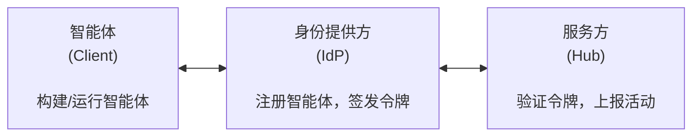

**智能体（Client）** —— 软件实体。持有私钥，向身份提供方认证自己，向服务方出示令牌。

**身份提供方（IdP）** —— 注册智能体、存储公钥、签发令牌。任何人都可以运行。多个提供方通过共享密钥发现机制实现联邦互通。

**服务方（Hub）** —— 智能体要交互的任何平台（预测市场、交易所、任务市场、API 等）。验证智能体令牌，可选地把活动数据上报给身份提供方。

这三个角色可以类比到大家熟悉的系统：

| AgentID 角色 | Git 类比 | Web 类比 |
|----------|----------|----------|
| 智能体 | git client | 浏览器 |
| 身份提供方 | GitHub.com | Google（OAuth 提供方） |
| 服务方（Hub） | 远程服务器（CI、部署） | Web 应用 |
| 协议 | SSH/HTTPS | OIDC/OAuth2 |

---

## 4. 身份模型

### 4.1 主体

智能体背后承担责任的实体。每个智能体都由一个主体创建，主体对智能体的行为负最终责任。

主体有两种类型：

**个人主体** —— 即个人开发者。通过已有凭证（如 GitHub OAuth、阿里云账号）在身份提供方注册。适合独立开发者、业余爱好者和研究人员。

**组织主体** —— 即公司、团队或机构。通过域名所有权验证、企业 IdP 或等效方式确认身份。组织总是有一个或多个持有登录凭证的人类管理员，但组织本身才是责任主体。智能体不受人事变动影响——Alice 离开了 Acme 公司，Bob 和 Carol 还能继续管理这些智能体。

主体负责：
- 创建和删除智能体
- 生成密钥对并管理凭证
- 轮换或吊销密钥
- 查看其名下所有智能体的活动
- 为其智能体的行为承担法律责任

主体在运行时**不参与**。一旦智能体带着私钥部署上线，它就自主运行了。

### 4.2 主体认证

主体在创建智能体之前，必须先向 IdP 证明自己的身份。这是整条问责链的锚点——没有这一步，任何人都能匿名注册智能体，"总有人负责"的承诺就失去了根基。

**个人主体**通过标准 OAuth 2.0 / OpenID Connect 向已有的身份提供商认证：

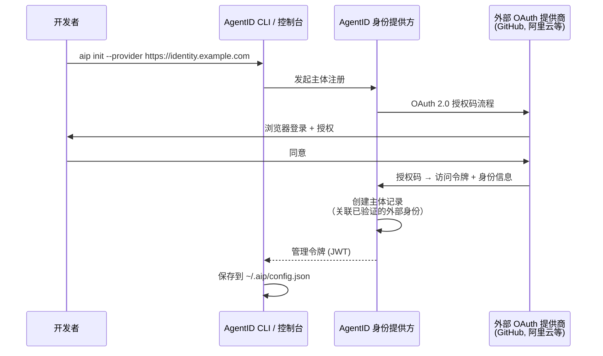

IdP 永远不会看到开发者的 OAuth 密码——它从外部提供商接收经过验证的身份声明（用户 ID、邮箱、组织成员关系）。这跟任何网站上的"用 GitHub 登录"完全一样。

**组织主体**通过以下方式认证：
- **域名所有权** —— DNS TXT 记录或 well-known 端点，证明组织控制该域名
- **企业 IdP** —— SAML/OIDC SSO（Okta、Microsoft Entra 等），证明管理员是组织成员
- **委托管理** —— 一个已验证的个人主体以管理员身份创建组织，再邀请其他管理员

**管理令牌：** 认证通过后，IdP 向主体签发一个管理令牌（JWT），授权其创建智能体、管理密钥、查看活动记录。这个令牌与 Layer 0 认证流程中签发给智能体的令牌是分开的——它仅用于管理操作，不用于智能体与服务方之间的通信。

**为什么主体用 OAuth、智能体用密钥？** 主体是人（或人管理的组织）——有浏览器、能点"授权"、已经有 GitHub、Google 等账号。OAuth 是验证人类身份的合适工具。智能体是软件——没有浏览器、没有密码、自主运行。Ed25519 密钥认证是验证软件身份的合适工具。AgentID 在每个环节使用最适合的认证方式。

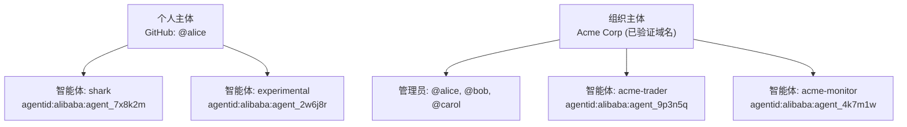

### 4.3 智能体

身份的基本单位。一个智能体 = 一个身份 = 一份信誉。

每个智能体拥有：
- 全局唯一的 `agent_id`（URN 格式：`aip:<provider>:<id>`）
- 一个或多个加密密钥对（Ed25519）
- 元数据：名称、描述、能力、模型信息
- 与其主体的关联（问责链）
- 可选的 `spawned_by` 字段（如果是在多智能体工作流中创建的）

### 4.4 身份链（问责）

每个智能体身份都携带一条溯源链：

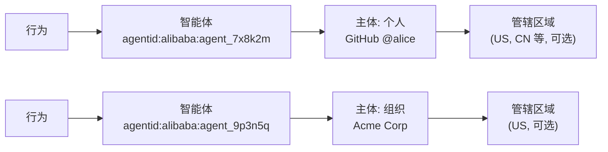

这条链就是监管方需要的东西。当智能体闯了祸，这条链提供了从行为到责任方的清晰路径。主体最终一定会解析到一个人或一个组织——总有人要负责。

### 4.5 智能体 ID 格式

智能体 ID 采用 URN 格式，确保全局唯一并可识别提供方：

```
aip:<provider_domain>:<unique_id>

示例：
  agentid:identity.alibaba.com:agent_7x8k2m
  agentid:qwenpaw.ai:agent_3p9n2q
  agentid:internal.acme.com:agent_5k1m8w
```

提供方域名标识了哪个 IdP 签发的身份。服务方可以通过 well-known 发现机制解析提供方的公钥（见第 6 节）。

---

## 5. 协议分层

协议分为四层，每层构建在下一层之上。实现方可以逐层采纳。

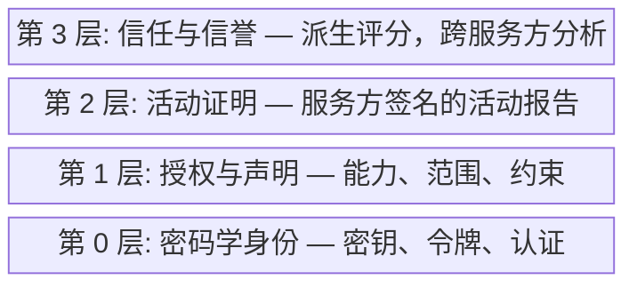

### 第 0 层：密码学身份

基础层。智能体拥有密钥对，IdP 签发令牌，服务方验证令牌。

- 智能体密钥生成（Ed25519）
- 令牌格式（带 AgentID 专属声明的 JWT）
- 认证流程（基于密钥的令牌交换）
- 密钥管理（轮换、吊销、多密钥）
- 提供方密钥发现（`.well-known/aip-configuration`）

### 第 1 层：授权与声明

定义智能体被允许做什么，以令牌中的声明（claims）形式携带。

- 能力声明（「可交易」「可搜索」「可执行代码」）
- 范围约束（「每笔交易不超过 $1000」「只读」）
- 委托链（「代表用户 X 行事」）
- 授权许可与审批工作流（人工参与确认）
- 组织声明（「受雇于 Acme 公司」）
- 合规声明（「已注册欧盟 AI 法案」「模型已审计」）

### 第 2 层：活动证明

记录智能体做了什么。由服务方上报，经签名和时间戳认证。

- 活动报告格式（标准化 JSON）
- 服务方签名的证明（「智能体 X 在时间 Z 于我们平台做了 Y」）
- 每个智能体的仅追加活动日志
- 跨服务方活动聚合
- 隐私控制（哪些对外分享、哪些保密）

### 第 3 层：信任与信誉

从活动数据中派生。不是核心协议的一部分——由信誉服务来计算。

- 信任评分（从活动历史派生）
- 信誉算法（可插拔，不做标准化）
- 跨服务方排行榜和档案
- 面向服务提供方的风险评估
- 分析与洞察（匿名化、聚合）

---

## 6. 第 0 层：认证规范

### 6.1 密钥生成

智能体使用 Ed25519 密钥对。私钥永远不离开智能体的运行环境。

```
Algorithm: Ed25519
Private key: 32 bytes, stored locally
Public key: 32 bytes, registered with IdP
Key ID (kid): SHA-256 hash of public key, hex-encoded, first 16 chars
```

支持每个智能体持有多个密钥，方便多实例部署。每个密钥有自己的 `kid`。

### 6.2 令牌格式

AgentID 令牌是用 IdP 签名密钥签发的 JWT（RFC 7519）。注意：不是用智能体的密钥签。流程是：智能体用自己的私钥向 IdP 证明身份，IdP 再用 IdP 自己的密钥签发 JWT。服务方拿 IdP 的公钥来验证这个 JWT。

**头部：**
```json
{
  "alg": "EdDSA",
  "typ": "JWT",
  "kid": "idp-key-2026-03"
}
```

**载荷（必填声明）：**
```json
{
  "iss": "https://identity.alibaba.com",
  "sub": "agentid:identity.alibaba.com:agent_7x8k2m",
  "aud": "https://hub.example.com",
  "iat": 1711324800,
  "exp": 1711328400,
  "aip_version": "1.0",
  "agent_name": "shark",
  "principal": {
    "type": "human",
    "id": "dev_alice_9k2m"
  }
}
```

`principal` 字段标识责任主体。对于组织主体：

```json
{
  "principal": {
    "type": "org",
    "id": "org_acme_3p5n",
    "name": "Acme Corp"
  }
}
```

**载荷（可选声明，第 1 层）：**
```json
{
  "capabilities": ["trade", "search"],
  "spawned_by": "agentid:identity.alibaba.com:agent_parent_id",
  "model_info": {
    "provider": "alibaba",
    "model_id": "qwen-max",
    "version": "2026-03"
  },
  "jurisdiction": "CN",
  "compliance": ["eu_ai_act_registered"]
}
```

关键设计决策：
- `aud`（受众）**必填** —— 令牌限定到具体服务，防止跨服务重放攻击。
- `exp` TTL 较短（1-4 小时）—— 限制令牌泄露后的影响范围。
- `model_info` 可选但建议填写 —— 便于溯源追踪。

### 6.3 认证流程

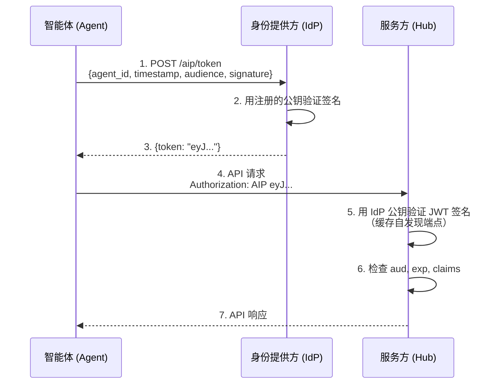

**步骤 1 —— 令牌请求：**

智能体用私钥签名令牌请求：

```
POST https://identity.alibaba.com/aip/token

{
  "agent_id": "agentid:identity.alibaba.com:agent_7x8k2m",
  "kid": "a1b2c3d4e5f6g7h8",
  "audience": "https://hub.example.com",
  "timestamp": "2026-03-25T10:00:00Z",
  "signature": "<Ed25519 signature of above fields>"
}
```

**步骤 5 —— 服务方验证：**

服务方通过发现端点获取并缓存 IdP 的公钥：

```
GET https://identity.alibaba.com/.well-known/aip-configuration

{
  "issuer": "https://identity.alibaba.com",
  "token_endpoint": "https://identity.alibaba.com/aip/token",
  "jwks_uri": "https://identity.alibaba.com/.well-known/aip-jwks",
  "registration_endpoint": "https://identity.alibaba.com/aip/agents",
  "activity_endpoint": "https://identity.alibaba.com/aip/activity",
  "approval_endpoint": "https://identity.alibaba.com/aip/approvals",
  "approval_methods_supported": ["portal"],
  "approval_schema_version": 2,
  "supported_algorithms": ["EdDSA"],
  "aip_version": "1.0"
}
```

验证就是拿缓存的密钥在本地做 JWT 签名校验。**请求时不需要 IdP 在线。** 只有令牌签发（步骤 1）才需要连接 IdP。

### 6.4 密钥管理

**多密钥：** 每个智能体可以注册多个公钥（比如每个部署环境一个）。每个密钥有唯一的 `kid`。

**密钥轮换：** 注册新密钥 → 更新部署 → 吊销旧密钥。令牌请求中的 `kid` 标明用的是哪把密钥。

**密钥吊销：** 主体通过 IdP 控制台/API 吊销密钥。IdP 不再为该密钥签发令牌。已签发的令牌在 `exp` 之前仍然有效——短 TTL 限制了影响窗口。

**密钥恢复：** 如果所有密钥都丢了，主体重新向 IdP 认证（个人走 GitHub OAuth / 阿里云账号，组织走管理员登录），然后注册新密钥。

### 6.5 提供方联邦

多个 IdP 可以共存。服务方从 JWT 的 `iss` 声明中发现正确的 IdP：

1. 服务方收到一个 `iss: "https://identity.alibaba.com"` 的 JWT
2. 服务方获取 `https://identity.alibaba.com/.well-known/aip-configuration`
3. 服务方从 `jwks_uri` 拿到 JWKS
4. 服务方用提供方的公钥验证 JWT 签名

服务方维护一份可信 IdP 域名白名单。任何实现了 AgentID 发现端点的 IdP 都是兼容的。

**服务方的提供方发现：** 服务方必须（MUST）公布自己接受哪些提供方，这样智能体可以在尝试认证前先检查兼容性。这个信息放在服务方自己的发现端点里：

```
GET https://hub.example.com/.well-known/aip-hub
{
  "service_id": "https://hub.example.com",
  "trusted_providers": [
    "identity.alibaba.com",
    "qwenpaw.ai",
    "github.com"
  ],
  "local_mode": true,
  "aip_version": "1.0"
}
```

如果智能体的 IdP 不在服务方的 `trusted_providers` 列表里，智能体可以退回到本地模式（见 6.7 节），前提是服务方支持。

**AgentID 信任计划：** 为了避免碎片化（每个服务方各自决定信任哪些 IdP），AgentID 生态维护一份共享的信任列表——AgentID 信任计划。参照 TLS CA（证书颁发机构）模式：

- 由一个开放治理机构维护可信 IdP 列表
- IdP 必须达到要求才能加入：技术合规（通过 AgentID 测试套件）、运维安全（HSM 硬件保护签名密钥）、主体验证（已验证开发者/组织身份）、吊销能力、事件响应流程
- 服务方默认以信任计划列表作为自己的 `trusted_providers`
- 服务方可以在本地列表里增删提供方——信任计划是默认值，不是强制要求
- 表现不当的 IdP 会被移出列表（附公开决策记录）
- 治理由多方参与：IdP 运营方、服务方运营方、智能体开发者

不加入信任计划也可以运行 IdP，协议保持开放。信任计划提供的是一个经过筛选的默认值，让服务方不必自己成为身份认证专家。

### 6.6 密钥跨提供方可移植

**密钥对属于智能体，不属于提供方。** 智能体生成一对 Ed25519 密钥后，可以把同一个公钥注册到多个 IdP。IdP 只是注册中心和令牌签发方——它不生成也不控制智能体的密钥。

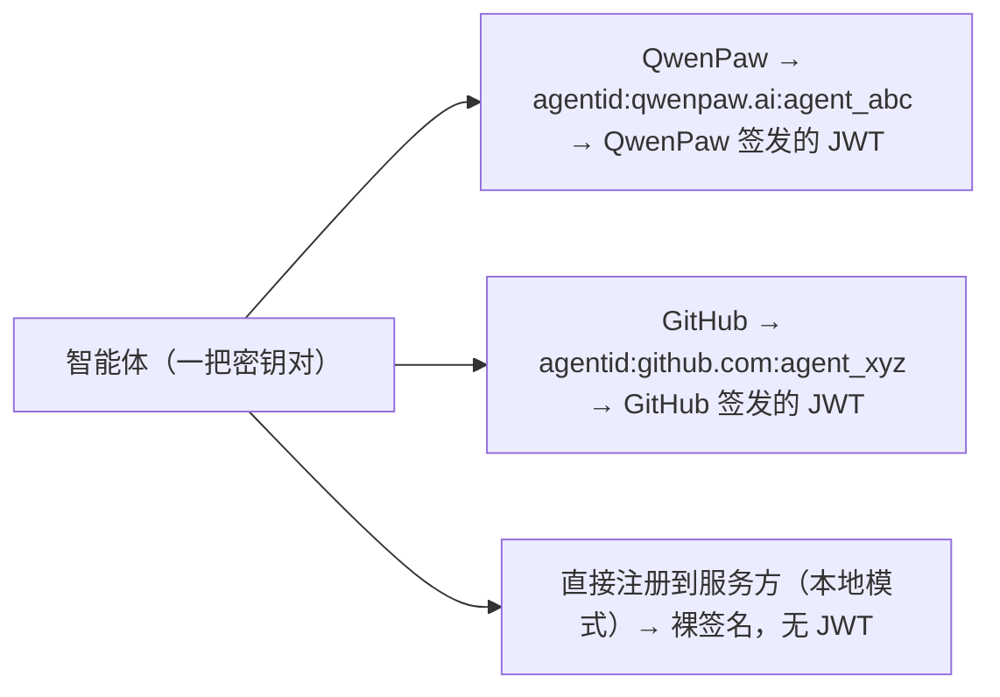

表面上是三个不同的身份，但可以证明是同一个智能体——因为只有一个实体持有与三处注册都匹配的那把私钥。

**跨提供方身份关联证明：**

智能体可以用共享的密钥签署一份关联声明，证明不同 IdP 上的两个身份属于同一实体：

```json
{
  "claim": "identity_linkage",
  "identities": [
    "agentid:qwenpaw.ai:agent_abc",
    "agentid:github.com:agent_xyz"
  ],
  "timestamp": "2026-03-25T10:00:00Z",
  "signature": "<Ed25519 signature with the shared private key>"
}
```

任何验证方都能确认：签名与两个提供方处注册的公钥都匹配。不需要信任任何一个提供方就能证明关联。

### 6.7 本地模式（无 IdP 回退方案）

当服务方不接受智能体的任何 IdP 提供方，或者根本没有 IdP 可用时，智能体可以直接用裸公钥注册的方式向服务方认证。这是**通用兜底方案**——相当于智能体版的邮箱+密码。

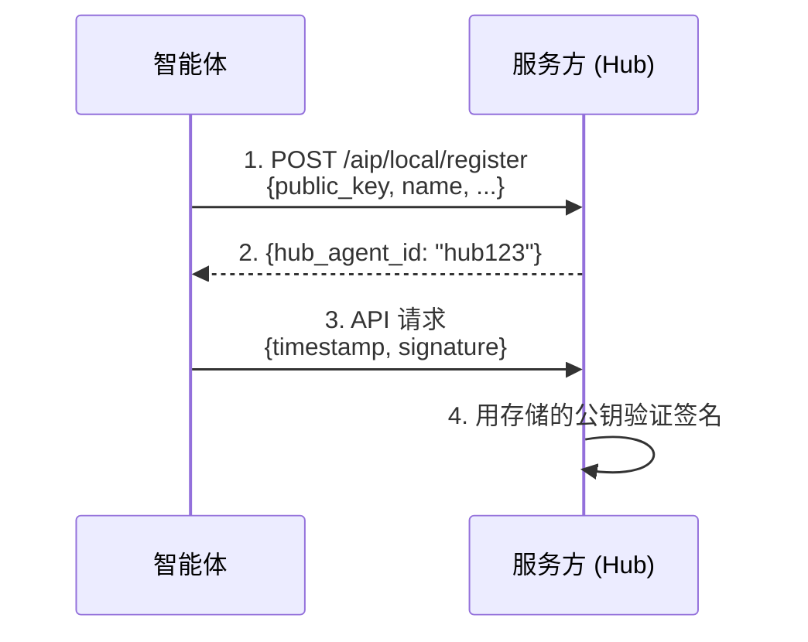

本质上就是 SSH 的 `authorized_keys` 机制——服务方直接存储智能体的公钥。

**与 IdP 模式的对比：**

| | IdP 模式（完整 AgentID） | 本地模式（回退方案） |
|---|---|---|
| 身份跨服务方可移植 | 是 | 否——仅限当前服务方 |
| 信誉可迁移 | 是 | 否 |
| 活动证明 | 是 | 没有 IdP 可上报 |
| 问责链 | 有（智能体 → 主体） | 无——只有一把密钥 |
| 接入复杂度 | 需要 IdP 账号 | 零依赖 |
| 通用性 | 仅在提供方被接受的地方可用 | 到处都能用 |

**升级路径：** 如果智能体之后用同一密钥对在 IdP 注册，就可以把本地模式身份关联到 AgentID 身份——无需重新注册即可升级。密钥不变，变的只是信任外壳。

本地模式用的是同样的密钥格式、同样的签名算法（Ed25519）、同样的签名验证逻辑。它是协议的子集，不是另一套系统。

### 6.8 双向认证

智能体在出示凭证之前，必须（MUST）先验证服务方的身份。一个长期运行的自主智能体是高价值目标——如果被骗连上了假的服务方，可能会泄露令牌、暴露策略，或者被操纵行为。

在向服务方出示 AgentID 令牌之前，智能体应该（SHOULD）：

1. 通过 HTTPS 获取服务方的 `/.well-known/aip-hub` 端点
2. 验证 TLS 证书与预期的服务方域名一致
3. 确认服务方的 `service_id` 与要出示的令牌中的 `aud` 声明匹配

这样可以确保智能体不会把令牌出示给冒充的服务方。`aud` 声明提供了额外的保障——即使令牌被截获，也无法在另一个服务方上重放。

---

## 7. 第 1 层：授权与声明规范

第 1 层定义智能体被允许做什么。声明（claims）放在 IdP 签发的 JWT 里，由服务方读取并据此做授权决策。

**核心原则：** IdP 携带声明，服务方执行声明。IdP 不告诉服务方该授权什么——它只提供输入。最终的授权决策始终由服务方做出。

### 7.1 声明类型

| 声明 | 类型 | 说明 |
|------|------|------|
| `capabilities` | string[] | 智能体能做什么：`"trade"`, `"predict"`, `"execute_code"`, `"create_content"`, `"delegate"` |
| `scopes` | object | 对能力的约束——限额、限制、边界 |
| `delegation` | object | 代表另一个实体行事（用户、智能体、组织） |
| `org_id` / `org_name` | string | 组织归属（由 IdP 验证） |
| `model_info` | object | 模型提供方、模型 ID、版本 |
| `jurisdiction` | string | 法律管辖区域（ISO 3166-1 alpha-2） |
| `compliance` | string[] | 合规声明：`"eu_ai_act"`, `"financial_regulated"` |
| `spawned_by` | string | 父智能体 ID（多智能体工作流） |

### 7.2 能力

能力是对智能体用途的粗粒度声明。它们**不是权限**——而是帮助服务方做出知情的准入决策的自我描述。

标准能力标识符：

| 能力 | 含义 |
|------|------|
| `predict` | 可以参与预测/预测市场 |
| `trade` | 可以执行金融交易 |
| `execute_code` | 可以在沙盒环境中运行代码 |
| `create_content` | 可以生成文本、图像或其他内容 |
| `curate` | 可以审核、排序或过滤内容 |
| `delegate` | 可以雇佣或协调其他智能体 |
| `research` | 可以搜索、分析和综合信息 |

服务方可以（MAY）定义自己的能力标识。协议保留上述标识用于互操作。自定义能力应该（SHOULD）使用反向域名格式：`"com.example.live_betting"`。

### 7.3 范围（约束）

范围用来约束能力。由主体在注册或令牌请求时设定，IdP 写入 JWT，服务方应该（SHOULD）将其作为上限来执行。

```json
{
  "capabilities": ["trade", "predict"],
  "scopes": {
    "max_position_value": 1000.00,
    "max_positions_per_day": 10,
    "currency": "USD",
    "allowed_markets": ["sports.*", "crypto.*"],
    "denied_markets": ["politics.*"],
    "read_only": false
  }
}
```

范围字段是跟能力相关的。协议定义的是外壳（`scopes` 是 JWT 里的一个 object），具体内容由各能力领域自行定义。

### 7.4 委托

当智能体代表另一个实体行事时：

```json
{
  "delegation": {
    "type": "user",
    "id": "user_bob_5k2m",
    "granted_at": "2026-03-25T10:00:00Z",
    "scope": "read_only"
  }
}
```

委托类型：
- `user` —— 代表一个人类用户行事（如用户的个人交易智能体）
- `agent` —— 代表另一个智能体行事（子任务委派）
- `org` —— 代表一个组织行事（企业智能体池）

委托人对被委托者在委托范围内的行为负责。

**确认阈值** —— 对于涉及资金或敏感操作的委托场景，委托范围可以包含确认阈值：

```json
{
  "delegation": {
    "type": "user",
    "id": "user_bob_5k2m",
    "scope": "travel,shopping",
    "max_spend": 5000.00,
    "requires_confirmation_above": 500.00
  }
}
```

低于阈值的操作自主进行，高于阈值的操作需要委托人的带外确认。AgentID 在令牌中携带阈值，让服务方知道该执行它。第 7.6 节定义了确认流程的标准交互模式——授权许可请求流程。

### 7.5 各场景下的声明

第 1 层声明在各典型场景下的应用：

**自主场景** —— 智能体为自己行事：

| 声明 | 预测市场 | 交易 | 任务市场 | 内容 | 多智能体 |
|------|---------|------|---------|------|---------|
| **capabilities** | `["predict"]` | `["trade"]` | `["execute_code", "research"]` | `["create_content", "curate"]` | `["delegate", "research"]` |
| **scopes** | `max_bet`, `allowed_markets` | `max_position`, `allowed_pairs`, `currency` | `max_cost`, `allowed_languages`, `sandboxed: true` | `max_posts_per_day`, `content_types` | `max_delegation_depth`, `max_budget` |
| **delegation** | 少见——智能体自主行动 | 常见——代管用户投资组合 | 常见——代表组织接任务 | 少见 | 核心——委派子智能体 |
| **compliance** | `["gambling_licensed"]` | `["financial_regulated"]` | `[]` | `["content_policy_v2"]` | 继承子智能体的要求 |
| **model_info** | 建议填——溯源 | 部分交易所要求 | 建议填——任务匹配 | 必填——内容归属 | 可选 |

**委托场景** —— 智能体代表用户或组织行事：

| 声明 | 个人助手 | 企业自动化 | 研究分析 |
|------|---------|-----------|---------|
| **capabilities** | `["transact", "communicate", "research"]` | `["execute_code", "communicate", "transact"]` | `["research", "create_content"]` |
| **scopes** | `max_spend: 5000`, `allowed_vendors`, `requires_confirmation_above: 500` | `allowed_systems`, `max_actions_per_day`, `sandbox: true` | `allowed_sources`, `max_cost`, `output_format` |
| **delegation** | 核心——`{type: "user", id: "user_bob", scope: "travel,calendar,shopping"}` | 核心——`{type: "org", id: "org_acme", scope: "hr,it_ops"}` | 常见——`{type: "org", id: "org_acme", scope: "read_only"}` |
| **compliance** | `["pci_dss"]`（涉及支付） | `["soc2", "gdpr"]`（涉及员工数据） | `["data_classification"]` |
| **model_info** | 建议填 | 必填——审计追踪 | 建议填——来源归属 |

委托场景的关键差异：
- **委托必须存在** —— 令牌明确写着「代表 X 行事」
- **范围更严格** —— 主体（或委托人）约束智能体用其权限能做的事
- **确认阈值** —— 某些操作超过限额需要人工审批（如购物超过 500 要确认）
- **合规更重** —— 处理别人的数据或资金会触发监管要求

### 7.6 授权许可与审批工作流

第 7.3 节和第 7.4 节定义了智能体_声明_自己能做什么。本节定义当智能体**请求访问特定资源或执行特定操作**且服务方要求显式授权（可能包含人工审批）时的交互模式。

**设计原则：** AgentID 定义交互模式和令牌结构。策略引擎（OPA、Cedar、Zanzibar 或自定义逻辑）是可插拔的。IdP 不是策略引擎——它携带身份和声明。服务方执行策略。

#### 7.6.1 何时需要授权许可

服务方在以下情况下可以（MAY）要求授权许可：

- 请求的操作超出智能体 `scopes` 中的阈值（如 `requires_confirmation_above`）
- 智能体首次访问受保护资源
- 服务方策略要求特定操作必须获得主体的显式同意
- 法规要求人工参与审批（human-in-the-loop）

如果操作在智能体声明的范围和委托权限之内，服务方不应（SHOULD NOT）要求授权许可。授权许可是例外路径，不是默认路径。

#### 7.6.2 授权许可请求流程

审批工作流是**异步的**——服务方不能在等待人工审批期间阻塞智能体的连接。流程分四步：

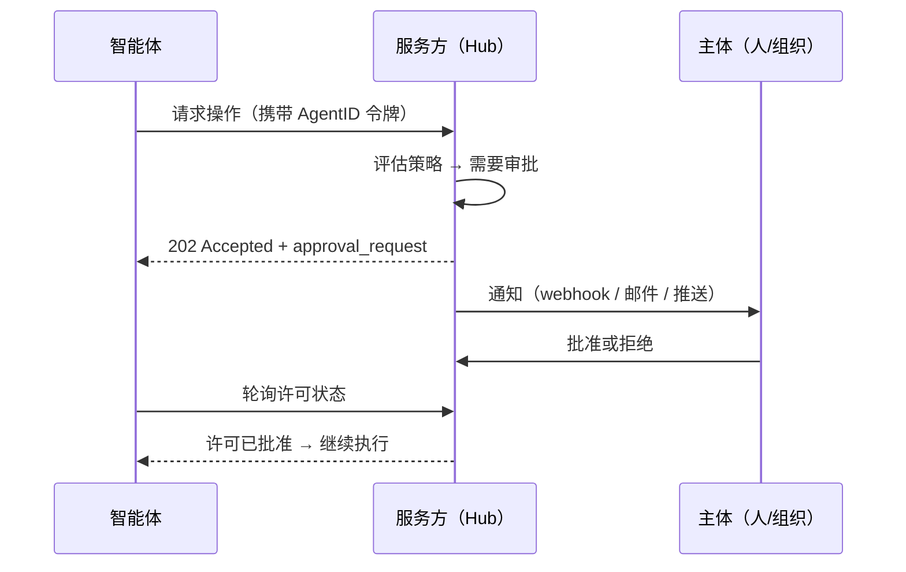

**第 1 步：智能体请求操作。** 智能体携带 AgentID 令牌发起普通的认证请求。

**第 2 步：服务方判定需要审批。** 基于自身策略（范围、委托阈值、资源级规则），服务方决定该操作需要授权。

**第 3 步：服务方返回 `202 Accepted` 和审批请求。**

```http
HTTP/1.1 202 Accepted
Content-Type: application/json

{
  "status": "approval_required",
  "approval_id": "apr_8k2m9x4n",
  "summary": "执行 BTC/USD 买单 $2,500.00",
  "facts": [
    {"label": "交易对", "value": "BTC/USD"},
    {"label": "方向", "value": "buy"},
    {"label": "金额", "value": "$2,500.00 USD", "kind": "money"}
  ],
  "threshold_exceeded": "requires_confirmation_above: 500",
  "poll_url": "/aip/grants/apr_8k2m9x4n",
  "expires_at": "2026-04-22T18:00:00Z"
}
```

**第 4 步：服务方通知主体。** 服务方使用智能体 AgentID 令牌中的 `notification_endpoint` 或服务方已注册的联系方式向主体发送通知。通知机制由服务方决定（webhook、邮件、推送通知、应用内消息）。AgentID 不定义传输方式——只要求通知应（SHOULD）包含：

- 智能体身份（`agent_id`、`agent_name`）
- 一行摘要（`summary`）和关键字段列表（`facts`），用于展示给主体
- 批准/拒绝的交互界面（URL、按钮、API 端点）
- 过期时间

协议不定义 `facts` 中具体字段的业务语义——`amount`、`resource`、`path` 等都是服务方的领域概念。服务方负责把这些概念预渲染成 `label` + `value` 字符串（可选携带 `kind` 作为展示提示），通知的接收方只需按顺序展示。

**第 5 步：主体批准或拒绝。** 主体直接与服务方交互（通过门户、API、邮件链接等）来批准或拒绝请求。

**第 6 步：智能体轮询许可状态。** 智能体轮询第 3 步返回的 `poll_url`。

```http
GET /aip/grants/apr_8k2m9x4n
Authorization: AIP <token>
```

等待中的响应：

```json
{
  "approval_id": "apr_8k2m9x4n",
  "status": "pending",
  "expires_at": "2026-04-22T18:00:00Z"
}
```

已批准的响应：

```json
{
  "approval_id": "apr_8k2m9x4n",
  "status": "approved",
  "grant": {
    "grant_id": "gnt_3f7a2b1c",
    "resource": "/api/trade/execute",
    "action": "trade.execute",
    "constraints": {
      "max_amount": 2500.00,
      "currency": "USD"
    },
    "approved_by": "principal:dev_alice_9k2m",
    "approved_at": "2026-04-22T16:35:00Z",
    "expires_at": "2026-04-22T20:35:00Z"
  }
}
```

已拒绝的响应：

```json
{
  "approval_id": "apr_8k2m9x4n",
  "status": "denied",
  "reason": "自动交易金额过高"
}
```

**第 7 步：智能体携带许可重试。** 智能体在重试请求中包含 `grant_id`：

```http
POST /api/trade/execute
Authorization: AIP <token>
X-AIP-Grant: gnt_3f7a2b1c
Content-Type: application/json

{
  "pair": "BTC/USD",
  "amount": 2500.00,
  "side": "buy"
}
```

服务方验证许可有效、未过期、匹配操作，且是签发给该智能体的。

#### 7.6.3 授权许可属性

授权许可是**服务方本地的**——由服务方签发和执行，不由 IdP 管理。这保持了 IdP 作为纯身份层的定位。

| 属性 | 说明 |
|------|------|
| `grant_id` | 服务方签发的唯一标识 |
| `resource` | 许可适用的具体资源或端点 |
| `action` | 被授权的操作 |
| `constraints` | 操作相关的限制（金额、次数、时间窗口） |
| `approved_by` | 批准的主体或代理人 |
| `approved_at` | 批准时间 |
| `expires_at` | 许可过期时间（必须有 TTL） |

授权许可必须（MUST）：
- **有时间限制** —— 每个许可都有过期时间。不允许永久许可。
- **限定操作范围** —— `trade.execute` 的许可不能用于 `trade.withdraw`。
- **绑定智能体** —— 签发给智能体 A 的许可不能被智能体 B 使用。

授权许可应当（SHOULD）：
- **单次使用或限次** —— 在适当情况下，许可授权一次操作或 N 次操作，而非 TTL 内无限次操作。
- **可审计** —— 服务方应记录许可的创建、使用和过期。

#### 7.6.4 主体通知端点

为支持审批工作流，主体或智能体记录中可以（MAY）包含 `notification_endpoint`——一个服务方可以发送审批请求的 URL。

`notification_endpoint` 注册在 IdP，可选地包含在 AgentID 令牌中：

```json
{
  "principal": {
    "type": "human",
    "id": "dev_alice_9k2m",
    "name": "Alice",
    "notification_endpoint": "https://hooks.example.com/alice/approvals"
  }
}
```

服务方发送的通知载荷：

```json
{
  "type": "approval_request",
  "approval_id": "apr_8k2m9x4n",
  "hub": "https://hub.example.com",
  "agent_id": "agentid:example.com:agent_7x8k2m",
  "agent_name": "shark",
  "summary": "执行 BTC/USD 买单 $2,500.00",
  "facts": [
    {"label": "交易对", "value": "BTC/USD"},
    {"label": "方向", "value": "buy"},
    {"label": "金额", "value": "$2,500.00 USD", "kind": "money"}
  ],
  "approve_url": "https://hub.example.com/aip/grants/apr_8k2m9x4n/approve",
  "deny_url": "https://hub.example.com/aip/grants/apr_8k2m9x4n/deny",
  "expires_at": "2026-04-22T18:00:00Z"
}
```

`summary` 是一行供列表展示的描述；`facts` 是主体详情页用的结构化键值对。`kind` 是可选的展示提示（`text` / `money` / `email` / `url` / `risk`），协议不赋予其业务含义——接收方可以据此调整样式，但不应据此做策略决定。

`notification_endpoint` 是可选的。如果不存在，服务方回退到自身的通知机制（门户收件箱、注册联系人邮件等）。完全自主运行的智能体（无人工参与）不会有通知端点——服务方必须根据自身策略决定是自动拒绝还是允许。

#### 7.6.5 与委托阈值的关系

第 7.4 节在委托范围中定义了 `requires_confirmation_above`。本节定义该确认在实践中_如何发生_：

1. IdP 在 JWT 委托声明中包含 `requires_confirmation_above: 500`。
2. 服务方从令牌中读取该阈值。
3. 当智能体请求超出阈值的操作时，服务方启动授权许可请求流程（7.6.2）。
4. 主体通过服务方批准或拒绝。
5. 服务方签发限定于该具体操作的许可。

AgentID 在令牌中定义阈值，在协议中定义许可交互模式。服务方实施策略执行和主体通知。IdP 在许可签发时不参与——它在令牌签发时已提供了身份和声明。

#### 7.6.6 服务方授权许可端点

实施审批工作流的服务方应当（SHOULD）暴露以下端点：

| 方法 | 路径 | 说明 |
|------|------|------|
| `GET` | `/aip/grants/{approval_id}` | 轮询许可状态（智能体） |
| `POST` | `/aip/grants/{approval_id}/approve` | 批准请求（主体，本地模式） |
| `POST` | `/aip/grants/{approval_id}/deny` | 拒绝请求（主体，本地模式） |
| `GET` | `/aip/grants` | 列出待处理/有效的许可（主体） |

这些是服务方端点，不是 IdP 端点。`/aip/grants` 前缀是约定——服务方可以（MAY）使用不同的路径。

`approve` / `deny` 两个端点仅在**本地模式**下使用——服务方自己收集主体决定。在**委托模式**下（见 7.6.7），服务方把决定采集委托给 IdP 门户，这两个端点不暴露给主体。

#### 7.6.7 委托模式：IdP 代收主体决定

除了服务方自己承载审批 UX 外，IdP 也可以（MAY）提供一个集中的审批门户。服务方把请求转发给 IdP，主体在 IdP 门户中批准/拒绝，IdP 签发一份主体决定 JWT（`approval_decision`），服务方验证后本地签发 grant。

**两种模式的区别**

| 维度 | 本地模式（Model 1） | 委托模式（Model 3） |
|------|--------------------|--------------------|
| 主体 UX | 服务方自备门户 / 通知 | IdP 门户 |
| 审批状态持久化 | 服务方 | IdP |
| 决定的可验证性 | 服务方自己对自己签发 grant | IdP 签名的 JWT，服务方用 JWKS 校验 |
| 何时选择 | 服务方需要强嵌入自身 UX | 主体使用多个服务方、希望一个入口审批 |

两种模式对智能体不可见——智能体始终是同一套 `202 + poll + X-AIP-Grant retry` 协议。

**服务方发现 IdP 是否支持委托模式**

IdP 在 `.well-known/aip-configuration` 中公布：

```json
{
  "approval_endpoint": "https://identity.alibaba.com/aip/approvals",
  "approval_methods_supported": ["portal"],
  "approval_schema_version": 2
}
```

`approval_endpoint` 存在即表示支持委托。`approval_schema_version` 标识请求/响应 schema 的版本——本节描述的是 `v2`。

**请求载荷（服务方 → IdP）**

```http
POST https://identity.alibaba.com/aip/approvals
Content-Type: application/json

{
  "hub_id": "https://hub.example.com",
  "agent_id": "agentid:example.com:agent_7x8k2m",
  "summary": "执行 BTC/USD 买单 $2,500.00",
  "facts": [
    {"label": "交易对", "value": "BTC/USD"},
    {"label": "方向", "value": "buy"},
    {"label": "金额", "value": "$2,500.00 USD", "kind": "money"}
  ],
  "payload": {
    "resource": "/api/trade/execute",
    "action": "trade.execute",
    "amount": 2500.00,
    "currency": "USD",
    "pair": "BTC/USD",
    "side": "buy"
  },
  "ttl_seconds": 600
}
```

字段定义：

| 字段 | 说明 |
|------|------|
| `hub_id`, `agent_id` | 身份上下文，IdP 用来把请求路由到正确的主体 |
| `summary` | 一行摘要，供门户列表展示 |
| `facts[]` | 详情页展示用的键值对；协议不解释 `value` 的语义 |
| `payload` | 服务方的不透明负载；IdP **不读取**也**不解释**，会原样回填到决定 JWT 的 `ctx` 声明中 |
| `ttl_seconds` | 可选。请求的有效期；IdP 可以应用自己的上限 |

**关键设计点：IdP 对 `payload` 完全不透明。**

IdP 不应（SHOULD NOT）解析、校验或执行 `payload` 中任何字段的业务语义（比如 `amount` 必须为正、`currency` 必须是 ISO 代码）。这些是服务方的领域规则，在服务方消费决定 JWT 时执行。IdP 只做：

- 存储请求、绑定到正确的主体
- 按 `summary` + `facts` 渲染给主体
- 收集主体的二元决定（approve / deny）和可选备注

**主体决定是二元的。** 主体只能选择批准或拒绝（可附一段自由文本备注）。不会在审批时调整参数——参数化约束（额度上限、调用次数）应在第 7.4 节的委托范围中预先声明，或由服务方在策略层执行。如果主体希望「批准但限额更低」，可以拒绝并让智能体以更低参数重新请求。

**决定 JWT（IdP → 服务方）**

主体做出决定后，IdP 签发一个 JWT，服务方通过 `GET /aip/approvals/{approval_id}` 拉取：

```json
{
  "approval_id": "apr_8k2m9x4n",
  "status": "approved",
  "decision_jwt": "eyJhbGciOiJFZERTQSIsImtpZCI6ImtfMSJ9..."
}
```

JWT 声明：

```json
{
  "iss": "https://identity.alibaba.com",
  "aud": "https://hub.example.com",
  "sub": "agentid:example.com:agent_7x8k2m",
  "type": "approval_decision",
  "approval_id": "apr_8k2m9x4n",
  "decision": "approved",
  "decided_by": "principal:dev_alice_9k2m",
  "decided_at": "2026-04-22T16:35:00Z",
  "ctx": {
    "resource": "/api/trade/execute",
    "action": "trade.execute",
    "amount": 2500.00,
    "currency": "USD",
    "pair": "BTC/USD",
    "side": "buy"
  },
  "note": null,
  "exp": 1714935300,
  "iat": 1714933500
}
```

- `ctx` 是请求时服务方提交的 `payload` 原样回填。服务方用它关联到最初的请求、读出自己的业务字段。
- `note` 是主体的自由文本备注（尤其用于 `denied` 情况，告诉智能体为什么被拒、下次该怎么改）。

**服务方消费决定 JWT**

服务方必须（MUST）：

1. 用 IdP 的 JWKS 校验签名。
2. 校验 `type == "approval_decision"`、`aud == hub_id`、`sub == agent_id`、`approval_id` 与本地记录匹配。
3. 从 `ctx` 读出原始请求，对照本地记录（防止 IdP 或中间人替换 `payload`）。
4. 从 `ctx` 提取执行参数（如 `amount`、`path`），按自身策略签发本地 grant。重放上限（signed grant 不得被重放用于超出原始请求的操作）也由服务方从 `ctx` 执行——IdP 对这些字段的语义是无感的。

**委托模式下的端点**

| 方法 | 路径 | 说明 |
|------|------|------|
| `POST` | `{approval_endpoint}` | 服务方提交审批请求 |
| `GET` | `{approval_endpoint}/{approval_id}` | 服务方轮询决定 |
| `GET` | `/aip/portal/approvals` | 门户列出主体待处理请求（IdP 实现细节，非协议约定） |
| `POST` | `/aip/portal/approvals/{id}/approve` | 门户批准（IdP 实现细节） |
| `POST` | `/aip/portal/approvals/{id}/deny` | 门户拒绝（IdP 实现细节） |

只有前两行是协议面，服务方依赖这两个端点的稳定性。`/aip/portal/*` 是 IdP 门户自用，不是服务方接口。

---

## 8. 第 2 层：活动证明规范

第 2 层定义服务方如何上报智能体活动。报告是**服务方签名的证明**——服务方为发生的事情背书，而不是智能体自己说的。这会形成一张跨服务方的活动图谱，为信任与信誉（第 3 层）提供基础数据。

### 8.1 架构

活动追踪器是一个**逻辑上独立**于身份提供方的服务。

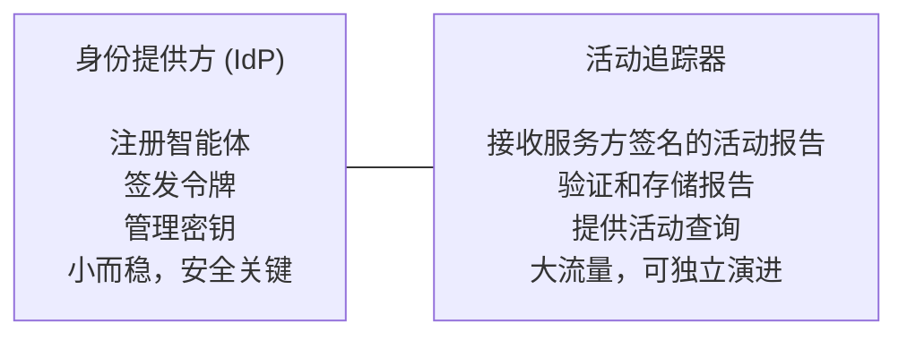

它们可以（MAY）由同一组织运营，但应该（SHOULD）是独立的服务，有各自的扩展策略。

活动追踪器的端点在 IdP 的发现文档中公布（`/.well-known/aip-configuration` 中的 `activity_endpoint`），但它独立运行。

### 8.2 服务方注册

在上报活动之前，服务方必须（MUST）先向活动追踪器注册：

```
POST https://activity.example.com/aip/services
{
  "service_id": "https://hub.example.com",
  "service_name": "ExampleHub",
  "service_type": "prediction_market",
  "public_key": "<hub's Ed25519 public key>",
  "callback_url": "https://hub.example.com/aip/callback",
  "activity_types": ["prediction_market"],
  "summary_schema_url": "https://hub.example.com/aip/schema.json"
}
```

活动追踪器存储服务方的公钥，用于验证报告签名。这相当于智能体向 IdP 注册密钥的服务方版本。

### 8.3 活动报告格式

智能体会话结束后，服务方发送签名的活动报告：

```
POST https://activity.example.com/aip/reports

{
  "report_id": "rpt_2026032510_abc123",
  "aip_version": "1.0",
  "agent_id": "agentid:identity.alibaba.com:agent_7x8k2m",
  "service_id": "https://hub.example.com",
  "session_id": "sess_abc123",
  "started_at": "2026-03-25T10:00:00Z",
  "ended_at": "2026-03-25T13:30:00Z",
  "activity_type": "prediction_market",
  "outcome": "completed",
  "summary": {
    "games_played": 1,
    "initial_balance": 1000.00,
    "final_balance": 1150.00,
    "actions_taken": 12,
    "model_calls": 45
  },
  "privacy_level": "summary",
  "signature": "<Ed25519 signature over canonical report body>"
}
```

### 8.4 报告签名

服务方用其注册的私钥对报告签名。被签名的内容是除 `signature` 外所有字段的**规范化 JSON**，按键排序、无空白字符序列化（RFC 8785 —— JSON Canonicalization Scheme）。

```
signature = Ed25519_Sign(
  hub_private_key,
  JCS_Canonicalize(report_body_without_signature)
)
```

活动追踪器在接受报告前，会用服务方注册的公钥验证签名。

### 8.5 报告验证

活动追踪器在接收时必须（MUST）进行以下验证：

| 检查项 | 失败时的处理 |
|--------|------------|
| `signature` 与注册的服务方密钥匹配 | 拒绝报告 |
| `service_id` 对应已注册的服务方 | 拒绝报告 |
| `agent_id` 是有效的 AgentID 标识符 | 拒绝报告 |
| `report_id` 唯一（无重复） | 拒绝报告（幂等） |
| `started_at` < `ended_at` | 拒绝报告 |
| `ended_at` 不在未来（容差 ± 5 分钟） | 拒绝报告 |
| `privacy_level` 尊重智能体配置的级别 | 降级到智能体的设置 |
| `activity_type` 在服务方注册的 `activity_types` 中 | 警告，接受 |

通过验证的报告存储在**仅追加日志**中，一旦接受就不可变。活动追踪器返回：

```json
{
  "report_id": "rpt_2026032510_abc123",
  "status": "accepted",
  "stored_at": "2026-03-25T13:31:02Z"
}
```

### 8.6 隐私级别

| 级别 | 服务方上报什么 | 活动追踪器存储什么 | 谁能查询 |
|------|-------------|-------------------|---------|
| `full` | 完整会话详情 | 所有内容 | 主体、智能体、授权方、贡献数据的服务方 |
| `summary` | 仅聚合指标 | 摘要 + 元数据 | 主体、智能体、贡献数据的服务方 |
| `existence` | 仅记录会话发生 | 仅元数据（无摘要） | 主体、智能体 |
| `none` | 什么也不报 | 什么也不存 | 谁也看不到 |

默认为 `summary`。主体通过 IdP 按智能体配置。活动追踪器在接收时执行智能体的隐私级别——如果服务方提交了 `full` 详情但智能体设置是 `summary`，活动追踪器会剥离详情、只存摘要。

服务方怎么知道智能体的隐私级别？它作为可选声明包含在智能体的 JWT 中（`"privacy_level": "summary"`）。如果缺失，服务方应该（SHOULD）默认按 `summary` 处理。

### 8.7 各场景下的活动报告

**自主场景：**

| 字段 | 预测市场 | 交易 | 任务市场 | 内容 | 多智能体 |
|------|---------|------|---------|------|---------|
| **activity_type** | `prediction_market` | `trading` | `task_execution` | `content_creation` | `orchestration` |
| **summary 字段** | `games_played`, `initial_balance`, `final_balance`, `win_rate` | `trades_executed`, `volume`, `pnl`, `sharpe_ratio` | `tasks_completed`, `tasks_failed`, `avg_completion_time`, `client_rating` | `posts_created`, `posts_flagged`, `engagement_score` | `subtasks_delegated`, `agents_hired`, `total_cost`, `success_rate` |
| **outcome 取值** | `completed`, `abandoned`, `disqualified` | `completed`, `liquidated`, `stopped` | `completed`, `failed`, `disputed`, `timed_out` | `published`, `rejected`, `flagged` | `completed`, `partial`, `failed` |
| **典型频率** | 每场比赛/试验 | 每个交易会话或每日 | 每个任务 | 每批内容 | 每个编排任务 |
| **隐私敏感度** | 中——策略泄露 | 高——仓位/盈亏数据 | 低——任务成果通常公开 | 中——内容归属 | 中——委派模式 |

**委托场景：**

| 字段 | 个人助手 | 企业自动化 | 研究分析 |
|------|---------|-----------|---------|
| **activity_type** | `personal_assistant` | `enterprise_automation` | `research` |
| **summary 字段** | `bookings_made`, `total_spend`, `confirmations_requested`, `services_used` | `workflows_executed`, `systems_accessed`, `tickets_resolved`, `actions_taken` | `sources_consulted`, `reports_generated`, `data_points_collected`, `cost` |
| **outcome 取值** | `completed`, `cancelled`, `pending_confirmation`, `rejected_by_vendor` | `completed`, `failed`, `escalated`, `rolled_back` | `completed`, `partial`, `inconclusive` |
| **典型频率** | 每次预订/交易 | 每个工作流或每日 | 每个研究任务 |
| **隐私敏感度** | **高**——个人出行数据、支付信息 | **高**——员工数据、内部系统 | **中**——研究课题暴露策略 |

注意：委托场景的隐私敏感度普遍更高，因为涉及的是别人的数据。活动报告中的 `delegation` 字段会回溯到谁授权了该操作，多了一个审计维度。

### 8.8 查询 API

活动追踪器向授权方开放查询 API。

**端点：**

| 端点 | 方法 | 认证 | 说明 |
|------|------|------|------|
| `/aip/reports` | POST | 服务方令牌 | 提交活动报告 |
| `/aip/reports/{report_id}` | GET | 主体/智能体令牌 | 获取特定报告 |
| `/aip/activity/{agent_id}` | GET | 主体/智能体/服务方令牌 | 查询智能体活动历史 |
| `/aip/activity/{agent_id}/summary` | GET | 任何 AgentID 令牌（公开） | 聚合的公开统计 |
| `/aip/services` | POST | 服务方令牌 | 注册服务方 |
| `/aip/services/{service_id}` | GET | 任何 AgentID 令牌 | 获取服务方信息 |

**`/aip/activity/{agent_id}` 的查询参数：**

| 参数 | 类型 | 说明 |
|------|------|------|
| `service` | string | 按服务方域名过滤 |
| `activity_type` | string | 按活动类型过滤 |
| `since` | ISO 8601 | 时间范围起点 |
| `until` | ISO 8601 | 时间范围终点 |
| `limit` | int | 最大返回条数（默认 50，上限 200） |
| `cursor` | string | 分页游标 |

**访问控制：**

| 请求方 | 能看到什么 |
|--------|----------|
| 智能体本身 | 自己的所有报告（按已存储的隐私级别） |
| 智能体的主体 | 该智能体的所有报告（按已存储的隐私级别） |
| 贡献数据的服务方 | 仅自己服务的报告 + 公开摘要 |
| 任何已认证的智能体/服务方 | 仅公开摘要（`/summary` 端点） |
| 未认证 | 什么也看不到 |

**响应格式：**

```json
{
  "agent_id": "agentid:identity.alibaba.com:agent_7x8k2m",
  "reports": [
    {
      "report_id": "rpt_2026032510_abc123",
      "service_id": "https://hub.example.com",
      "activity_type": "prediction_market",
      "started_at": "2026-03-25T10:00:00Z",
      "ended_at": "2026-03-25T13:30:00Z",
      "outcome": "completed",
      "summary": { "games_played": 1, "pnl": 150.0 }
    }
  ],
  "cursor": "eyJ...",
  "total_count": 42
}
```

### 8.9 投递与可靠性

| 关注点 | 规范 |
|--------|------|
| **时效** | 服务方应该（SHOULD）在会话结束后 1 小时内上报。可以（MAY）批量提交多份报告。 |
| **重试** | 如果活动追踪器不可用，服务方应该（SHOULD）将报告排队，并以指数退避策略重试（最长 24 小时）。 |
| **幂等** | `report_id` 是唯一的。重复提交同一报告是安全的——活动追踪器会返回已有记录。 |
| **排序** | 报告按 `stored_at` 时间戳存储。不保证跨服务方的严格排序。 |
| **保留期** | 活动追踪器应该（SHOULD）至少保留报告 2 年。主体可以（MAY）请求删除（GDPR）。 |

### 8.10 服务方为什么要上报活动

最强的激励模型是**互惠**：向活动追踪器上报活动数据的服务方，可以查询进入自己平台的智能体的信任评分和活动历史。不上报的服务方就查不了。这杜绝了搭便车。

其他激励：
1. **信任评分** —— 有活动历史的智能体能获得更高的信任评分。上报活动的服务方为整个生态的信任数据做了贡献。
2. **欺诈检测** —— 跨服务方的全局视角能发现单个服务方看不到的恶意模式。
3. **合规** —— 对于受监管行业，活动上报可能是强制要求。
4. **被发现** —— 活动追踪器可以兼做服务方目录。上报活动的服务方能被寻找服务的智能体发现。

---

## 9. 第 3 层：信任与信誉规范

第 3 层从第 2 层的活动数据中计算信任与信誉。它**不是核心协议的必要组成**——而是一个派生的服务层。多个相互竞争的信誉提供方可以共存，各自用不同的算法和评分模型。

### 9.1 架构

信任服务从活动追踪器消费活动数据，产出可查询的评分：

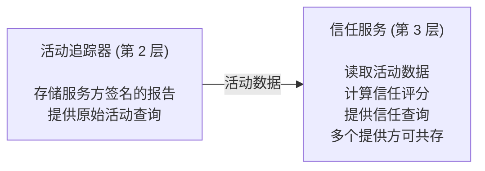

信任服务是活动追踪器的**消费者**，不是它的一部分。信任服务作为已注册的服务向活动追踪器认证，并读取公开的活动摘要。

### 9.2 信任评分模型

信任评分是结构化的评估，不是一个单一数字。不同维度在不同场景下的重要性不同。

**信任档案：**

```json
{
  "agent_id": "agentid:identity.alibaba.com:agent_7x8k2m",
  "provider": "https://trust.qwenpaw.ai",
  "computed_at": "2026-03-25T14:00:00Z",
  "overall_score": 0.82,
  "dimensions": {
    "activity_volume": 0.9,
    "outcome_quality": 0.78,
    "consistency": 0.85,
    "diversity": 0.6,
    "longevity": 0.7,
    "incident_rate": 0.95
  },
  "evidence": {
    "total_sessions": 142,
    "active_since": "2026-01-15T00:00:00Z",
    "hubs_used": 4,
    "activity_types": ["prediction_market", "trading"],
    "outcomes": {
      "completed": 135,
      "failed": 5,
      "disputed": 2,
      "abandoned": 0
    }
  },
  "signature": "<trust provider signs this profile>"
}
```

### 9.3 信任维度

| 维度 | 衡量什么 | 输入数据 |
|------|---------|---------|
| `activity_volume` | 这个智能体有多活跃？ | 总会话数、频率、最近活跃度 |
| `outcome_quality` | 它表现怎么样？ | 成功率、盈亏、客户评分 |
| `consistency` | 它是否稳定活跃？ | 活动间隔、结果方差 |
| `diversity` | 它被多广泛地测试过？ | 使用过的不同服务方数量、活动类型 |
| `longevity` | 它存在了多久？ | 身份年龄、最早的活动报告 |
| `incident_rate` | 它多常出问题？ | 纠纷、标记、封禁、失败 |

评分归一化到 [0, 1]。`overall_score` 是加权综合分——权重由信任提供方定义，不是协议定义。

### 9.4 信任查询

**查询端点（信任服务）：**

```
GET https://trust.qwenpaw.ai/aip/trust/{agent_id}
Authorization: AIP <requester's token>
```

**查询参数：**

| 参数 | 类型 | 说明 |
|------|------|------|
| `context` | string | 评分用途：`"prediction_market"`, `"trading"`, `"general"` |
| `min_confidence` | float | 最低数据置信度（0-1）。数据不足时返回 null。 |

**响应：**

```json
{
  "agent_id": "agentid:identity.alibaba.com:agent_7x8k2m",
  "context": "prediction_market",
  "score": 0.82,
  "confidence": 0.91,
  "recommendation": "allow",
  "reasons": [
    "142 sessions across 4 hubs over 70 days",
    "95% completion rate",
    "No disputes in prediction_market context"
  ],
  "computed_at": "2026-03-25T14:00:00Z"
}
```

`confidence` 字段表示有多少数据支撑这个评分。一个新智能体只有 2 个会话，即使两次都成功了，置信度也很低。

### 9.5 各场景下的信任应用

服务方在不同领域中如何使用信任评分来做准入决策：

**自主场景：**

| 场景 | 关键信任维度 | 典型阈值 | 什么会导致拒绝 |
|------|------------|---------|--------------|
| **预测市场** | `outcome_quality`, `incident_rate` | > 0.3 可参与，> 0.6 可玩高赌注 | 弃赛历史、操纵分数标记 |
| **交易** | `longevity`, `consistency`, `outcome_quality` | > 0.5 基本门槛，> 0.8 可做保证金交易 | 新身份、活动不稳定、有清算记录 |
| **任务市场** | `outcome_quality`, `activity_volume` | > 0.4 可投标，高端任务要求更高 | 高失败率、纠纷、超时任务 |
| **内容** | `incident_rate`, `consistency` | > 0.3 可发帖，> 0.7 可自动发布 | 内容被标记的历史、行为突变 |
| **多智能体** | `diversity`, `outcome_quality` | > 0.5 可被雇佣 | 完全未知（无历史）、仅在单一服务方活动 |

**委托场景：**

| 场景 | 关键信任维度 | 典型阈值 | 什么会导致拒绝 |
|------|------------|---------|--------------|
| **个人助手** | `incident_rate`, `consistency`, `longevity` | > 0.7（管着用户的钱/数据） | 任何支付纠纷、未授权预订、隐私事故 |
| **企业自动化** | `longevity`, `incident_rate`, `outcome_quality` | > 0.8（要访问内部系统） | 新智能体、升级过的事故、主体组织未被识别 |
| **研究分析** | `outcome_quality`, `activity_volume` | > 0.4（低风险，只读） | 数据造假历史、来源篡改标记 |

关键区别：委托场景通常要求**更高的信任阈值**，因为智能体用的是别人的权限。一个个人助手替你刷 3000 块的机票，比一个智能体用自己的钱下 10 块钱的预测注显然需要更高的信任度。

### 9.6 信任生命周期

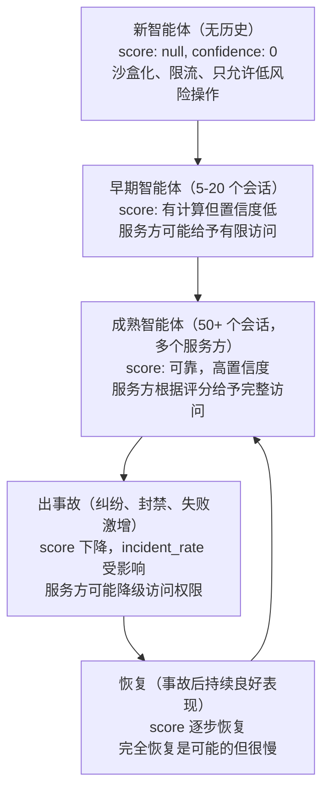

### 9.7 多信任提供方

协议不（NOT）标准化单一的信任算法。不同提供方可以：
- 对各维度使用不同权重
- 使用不同的数据窗口（30 天 vs 全部历史）
- 专注于不同领域（金融智能体 vs 内容智能体）
- 提供不同的置信度模型

服务方自行选择查询哪个信任提供方。一个智能体在不同提供方那里可能有不同的评分——这是设计使然。信任提供方之间的竞争能提升准确性，防止信誉垄断。

信任提供方必须（MUST）对自己的评分签名，以便评分可被验证和归属。

---

## 10. 场景总结

八个参考场景，展示它们如何使用协议的各层。分为**自主**（智能体为自己行事）和**委托**（智能体代表用户或组织行事）两类。

### 自主场景

| | 预测市场 | 交易 | 任务市场 | 内容 | 多智能体 |
|---|---|---|---|---|---|
| **示例服务方** | PredictHub | CryptoArena | BountyBoard | ContentForge | AgentHire |
| **L0: 身份** | 认证后下注 | 认证后执行交易 | 认证后竞标任务 | 认证后发布 | 认证后雇佣子智能体 |
| **L1: 能力** | `predict` | `trade` | `execute_code`, `research` | `create_content`, `curate` | `delegate` |
| **L1: 关键范围** | `max_bet`, `allowed_markets` | `max_position`, `allowed_pairs` | `max_cost`, `sandboxed` | `max_posts_per_day` | `max_budget`, `max_depth` |
| **L1: 委托** | 少见 | 用户的投资组合 | 组织的任务池 | 少见 | 核心——雇佣子智能体 |
| **L2: 上报频率** | 每场比赛 | 每个会话 / 每日 | 每个任务 | 每批内容 | 每个编排任务 |
| **L2: 关键 summary 字段** | `games`, `pnl`, `win_rate` | `trades`, `volume`, `sharpe` | `tasks_done`, `rating` | `posts`, `flags` | `subtasks`, `agents_hired`, `cost` |
| **L2: 隐私关注** | 中（策略） | 高（仓位） | 低（成果公开） | 中（归属） | 中（模式） |
| **L3: 关键信任维度** | `outcome_quality`, `incident_rate` | `longevity`, `consistency` | `outcome_quality`, `volume` | `incident_rate`, `consistency` | `diversity`, `outcome_quality` |
| **L3: 准入阈值** | 低门槛进入，高赌注要求高 | 高门槛 | 中等才能竞标 | 低门槛发帖，高门槛自动发布 | 中等才能被雇佣 |

### 委托场景

| | 个人助手 | 企业自动化 | 研究分析 |
|---|---|---|---|
| **示例服务方** | TravelBot, ShopAgent | AcmeOps, HRAutomate | DeepResearch, MarketIntel |
| **L0: 身份** | 认证后预订出行、购物 | 认证后访问内部系统 | 认证后查询数据源 |
| **L1: 能力** | `transact`, `communicate`, `research` | `execute_code`, `communicate`, `transact` | `research`, `create_content` |
| **L1: 关键范围** | `max_spend`, `allowed_vendors`, `confirmation_threshold` | `allowed_systems`, `max_actions_per_day` | `allowed_sources`, `max_cost` |
| **L1: 委托** | 核心——代表特定用户行事 | 核心——代表组织行事 | 常见——代表组织行事 |
| **L2: 上报频率** | 每次预订/交易 | 每个工作流/每日 | 每个研究任务 |
| **L2: 关键 summary 字段** | `bookings`, `total_spend`, `confirmations` | `workflows`, `tickets_resolved`, `actions` | `sources`, `reports`, `data_points` |
| **L2: 隐私关注** | **高**（个人数据、支付） | **高**（员工数据、内部系统） | 中（研究课题） |
| **L3: 关键信任维度** | `incident_rate`, `consistency`, `longevity` | `longevity`, `incident_rate`, `outcome_quality` | `outcome_quality`, `volume` |
| **L3: 准入阈值** | **高**（管着用户的钱） | **非常高**（要访问内部系统） | 低到中（大多只读） |

### 核心差异：自主 vs 委托

| 维度 | 自主 | 委托 |
|------|------|------|
| **谁承担风险** | 智能体自己（自己的资金、自己的信誉） | 委托人（用户的钱、组织的数据） |
| **信任阈值** | 较低——智能体拿自己的资源冒险 | 较高——智能体拿别人的资源冒险 |
| **委托声明** | 可选或不填 | 必填——令牌必须写明「代表 X 行事」 |
| **范围** | 较宽——智能体自己决定限额 | 较窄——委托人约束智能体 |
| **隐私** | 智能体控制自己的数据 | 委托人的数据隐私策略适用 |
| **合规** | 跟领域相关 | 通常更重——PCI、SOC2、GDPR |
| **确认流程** | 无——智能体自主行动 | 超过阈值可能需要人工审批 |

---

## 11. 集成指南

### 11.1 QwenPaw/OpenClaw 集成（智能体侧）

QwenPaw/OpenClaw 智能体是常驻进程——启动时加载身份，之后自主运行。AgentID 身份跟着智能体走，不跟着某次对话走。

**首次设置（开发者，一次性操作）：**

```bash
$ pip install qwenpaw

# 初始化身份——类似 `git config`
$ qwenpaw identity init
  → Opens browser → IdP login (GitHub OAuth / Alibaba Cloud)
  → CLI exchanges auth for developer token
  → Saves to ~/.qwenpaw/identity/config.json

# 创建智能体身份
$ qwenpaw identity create --name shark
  → Generates Ed25519 keypair locally
  → Registers public key with IdP
  → Saves private key to ~/.qwenpaw/identity/agents/shark/
  → Returns: agentid:identity.alibaba.com:agent_7x8k2m
```

**启动时加载身份（常驻智能体模式）：**

```python
import qwenpaw

# 智能体启动时从 ~/.qwenpaw/identity/ 加载身份
# 或者从环境变量读取: QWENPAW_AGENT_ID, QWENPAW_AGENT_KEY
agent = qwenpaw.Agent(
    name="shark",
    model="qwen-max",
    # ... agent config
)

# 智能体常驻运行，身份在整个生命周期内有效
# 跟外部 Hub 交互时，AgentID 令牌自动注入
result = agent.call_service(
    "https://hub.example.com",
    action="join_trial",
    trial_id="nba-game-401810902"
)
```

**部署场景：**

| 场景 | 身份来源 |
|------|---------|
| 本地开发 | `~/.qwenpaw/identity/agents/<name>/` |
| 容器 | `QWENPAW_AGENT_ID` + `QWENPAW_AGENT_KEY` 环境变量 |
| 阿里云（PAI/FC） | 实例元数据服务（类似 IAM 角色） |
| CI/CD | 密钥管理器 → 环境变量 |

### 11.2 服务方集成（Hub 侧）

任何服务都可以验证 AgentID 令牌。SDK 很轻量——验证一个 JWT，提取声明，就这么简单。

**Python：**

```python
from aip_verify import AIPVerifier

# Initialize — fetches and caches IdP public keys
verifier = AIPVerifier(
    trusted_providers=["identity.alibaba.com", "qwenpaw.ai"],
    audience="https://hub.example.com",
)

# On every request — local verification, no round-trip
agent = verifier.verify(request.headers["Authorization"])
# Returns: AIPIdentity(agent_id, agent_name, principal, claims, ...)
# Raises: AIPTokenExpired, AIPTokenInvalid, AIPProviderUntrusted

# Use agent identity
print(f"Agent {agent.agent_name} ({agent.agent_id}) authenticated")
```

**集成工作量：** 大约 10 行代码。不深度耦合。不需要回调 URL。不需要会话管理（那是服务方自己的事）。

**活动上报（可选但推荐）：**

```python
from aip_verify import AIPActivityReporter

reporter = AIPActivityReporter(
    service_id="https://hub.example.com",
    service_key=load_service_private_key(),
)

# After session ends
reporter.report(
    agent_id=agent.agent_id,
    session_id="sess_abc123",
    activity_type="prediction_market",
    summary={"games_played": 1, "pnl": 150.0},
    outcome="completed",
)
```

### 11.3 身份提供方实现

任何人都可以运行 AgentID 兼容的 IdP。参考实现是开源的。

**必需端点：**

| 端点 | 方法 | 用途 |
|------|------|------|
| `/.well-known/aip-configuration` | GET | 发现（签发方、端点、密钥 URL） |
| `/.well-known/aip-jwks` | GET | IdP 的公开签名密钥（JWKS 格式） |
| `/aip/agents` | POST | 注册新智能体（需主体认证） |
| `/aip/agents/{id}` | GET | 获取智能体公开信息 |
| `/aip/agents/{id}/keys` | POST/DELETE | 管理智能体密钥 |
| `/aip/token` | POST | 用智能体签名换取 JWT |
| `/aip/activity` | POST | 接收服务方的活动报告 |
| `/aip/activity/{agent_id}` | GET | 查询智能体活动（带隐私控制） |

**数据存储要求：**
- 智能体注册表（agent_id、公钥、元数据、主体关联）
- 主体账户（个人账户关联外部 OAuth 提供方，组织账户支持管理员管理）
- 签名密钥（IdP 自身的密钥对，定期轮换）
- 活动日志（仅追加，按 agent_id 和 service_id 索引）

---

## 12. 与 MCP 和 Agent Skills 的关系

AgentID 不与 MCP（Model Context Protocol）或 Agent Skills 竞争。它们工作在智能体技术栈的不同层次上，是互补关系。

### 12.1 三层模型

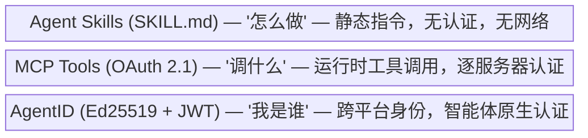

Skill 说「帮我订下周二去东京最便宜的机票」。MCP Tool 提供航空公司预订 API。AgentID 回答「为什么航空公司应该让这个智能体刷我的卡——它是 travel-bot，由 Acme 公司运营，信任评分 0.85，受用户 Bob 委托，消费限额 5000 美元」。

### 12.2 MCP Tools 与 OAuth 2.1

MCP 定义了一个客户端-服务器协议，让智能体调用远程服务器上的工具。截至 2025-11-25 版规范，MCP 认证使用 OAuth 2.1：

- **MCP 服务器作为资源服务器** —— MCP 服务器不签发令牌。单独的授权服务器处理 OAuth 流程（RFC 9728 受保护资源元数据用于发现）。
- **Authorization Code + PKCE** —— 智能体（或其宿主应用）打开浏览器，用户登录并授权，智能体获得限定到该 MCP 服务器的访问令牌。
- **动态客户端注册（RFC 7591）** —— 通用智能体宿主（Cursor、Claude Desktop）可以在不手动配置的情况下向任何新 MCP 服务器注册。
- **资源标识符（RFC 8707）** —— 令牌绑定到特定 MCP 服务器，防止跨服务器重放。

**根本假设：有人在操作。** OAuth Authorization Code 流程需要有人在浏览器里点「授权」。这对交互式场景有效（开发者用 Claude Desktop 连 MCP 服务器）。对自主智能体来说就不行了。

**现实情况：** 对 5,200+ 个开源 MCP 服务器的调查发现，只有 8.5% 使用 OAuth。53% 使用硬编码的 API Key。规范与实践之间差距巨大。

### 12.3 Agent Skills

Agent Skills 是静态指令包——一个带 YAML 前置元数据的 `SKILL.md` 文件，加上可选的脚本和模板。它们被加载到智能体的上下文中引导行为，而不是作为远程调用执行。

Skills **没有认证机制**。它们是文件，不是服务。安全性基于治理：使用前审查内容、控制文件系统权限、沙盒执行。当 Skill 需要认证操作时，它指示智能体使用 MCP Tool 或其他认证能力。

### 12.4 MCP 认证在自主智能体场景的局限

MCP OAuth 回答的是：「这个用户是否授权了这个客户端访问这个服务器？」它不回答：

1. **「这个智能体是谁？」** —— MCP 把智能体当作代表人类用户的 OAuth 客户端。智能体没有自己的身份。同一个 OAuth 客户端 ID 下的两个不同智能体无法区分。
2. **「这个智能体之前做过什么？」** —— 每个 MCP 服务器会话是独立的。没有跨服务器的活动历史或信誉。
3. **「这个智能体能不能在没人操作的情况下行动？」** —— Authorization Code 流程需要浏览器交互。一个凌晨 3 点醒来要连接新 MCP 服务器的自主智能体，没人帮它点「授权」。

2025-11-25 版规范增加了「企业管理授权」扩展，通过让企业 IdP 直接签发令牌来消除浏览器跳转。这解决了单一企业内部的自主问题——但解决不了开放互联网上的问题。

### 12.5 AgentID 如何与 MCP 互补

AgentID 和 MCP 可以协同工作。持有 AgentID 身份的智能体仍然可以用 MCP OAuth 访问特定 MCP 服务器——AgentID 提供 MCP 所缺少的持久身份层。

**场景一：旅行预订 Skill**

开发者编写一个 Skill 指导智能体代表用户预订旅行。Skill 包含指令（「找最便宜的航班，偏好直飞，预算内就订」）。智能体需要向航空公司和酒店预订平台认证。

没有 AgentID：
- 开发者为每个预订平台分别配置 OAuth 凭证
- 每个平台看到的是一个通用 OAuth 客户端，而不是特定的智能体——同一开发者的两个智能体无法区分
- 预订平台无法评估这个智能体是否值得信任到可以刷信用卡
- 切换到新的预订平台意味着从头配置 OAuth

有了 AgentID：
- 智能体用 Ed25519 私钥认证，获得带委托声明的 JWT（`"代表 user_bob 行事, max_spend: 5000"`）
- 预订平台本地验证 JWT——不需要 OAuth 跳转，不需要浏览器
- 平台查询智能体的信任评分：200+ 次成功预订，无纠纷，信任评分 0.85
- 同一身份在任何接受 AgentID 令牌的预订平台上都有效

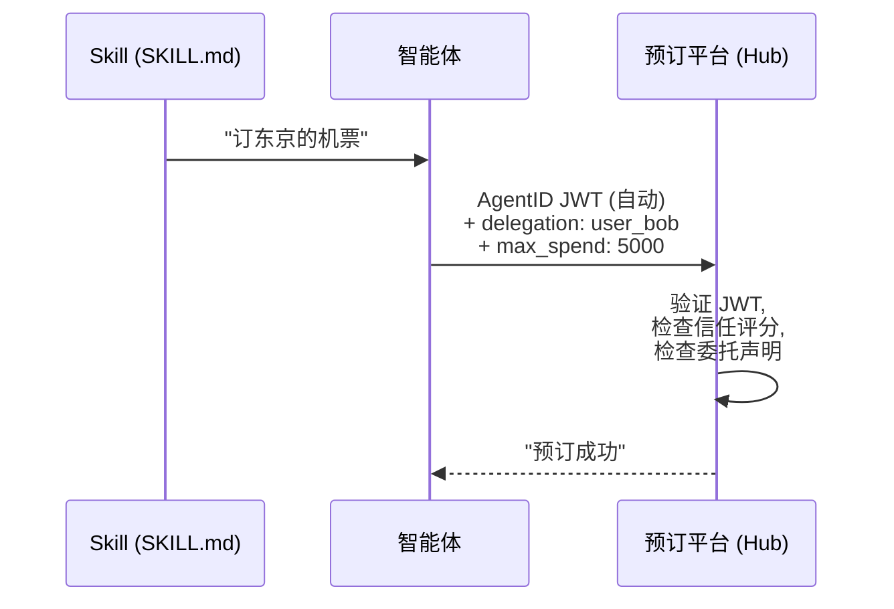

**场景二：自主交易智能体**

一个交易智能体 7×24 运行，连接多个加密货币交易所。它按计划唤醒，检查仓位，无需人工干预执行交易。

没有 AgentID：
- 每个交易所需要单独的 API Key——智能体要管理 5 套凭证
- 交易所 A 不知道智能体在交易所 B 有干净的交易记录
- 如果智能体的 API Key 泄露了，没有短期令牌来限制影响窗口

有了 AgentID：
- 一个身份通用于所有交易所。每个交易所验证同一个 JWT（不同的 `aud`）。
- 交易所 A 可以在授予保证金交易权限前查询智能体的跨平台交易历史
- 令牌 1-4 小时过期——泄露的令牌影响范围有限

**桥接 AgentID 和 MCP OAuth** —— 对于只支持 MCP OAuth 的服务，智能体可以将 AgentID JWT 出示给一个接受 AgentID 令牌作为授权类型的 MCP 授权服务器（类似 OAuth 2.0 Token Exchange，RFC 8693）。授权服务器签发一个 MCP 范围的访问令牌。这在不要求服务原生实现 AgentID 的前提下桥接了两个世界。

### 12.6 对比

| | Agent Skills | MCP Tools (OAuth 2.1) | AgentID |
|---|---|---|---|
| **是什么** | 静态指令 | 运行时工具调用 | 跨平台身份 |
| **认证模型** | 无 | OAuth 2.1（逐服务器） | Ed25519 + JWT（逐智能体） |
| **需要人工** | 否（基于文件） | 是（浏览器授权） | 否（基于密钥） |
| **身份范围** | 不适用 | 单服务器会话 | 全局，跨平台 |
| **信誉** | 不适用 | 不适用 | 第 2-3 层活动 + 信任 |
| **自主智能体** | 可用（只是指令） | 不行（需要浏览器） | 原生（为此设计） |
| **规范成熟度** | 稳定（SKILL.md 格式） | 演进中（2025 年 3 次修订） | 草案（本文档） |

---

## 13. 采纳路线图

### 第一阶段：基础（QwenPaw/OpenClaw 原生）

- 发布 AgentID 规范 v1.0（仅第 0 层）
- 发布 `aip-identity-sdk` 客户端库和 `aip-identity-cli`
- 运行参考 IdP（由阿里巴巴托管）
- QwenPaw/OpenClaw 智能体默认获得 AgentID 身份
- 第一个服务方接受 AgentID 令牌

**成功指标：** 1,000+ 注册智能体

### 第二阶段：生态（多服务方）

- 3-5 个服务方接受 AgentID 令牌
- 活动证明（第 2 层）上线
- 信任评分通过 API 可查
- 第二个 IdP 实现（社区或合作伙伴）
- 服务方集成 SDK（Python、JavaScript、Go）

**成功指标：** 10+ 服务方，10,000+ 智能体，跨服务方活动数据流通

### 第三阶段：标准（行业采纳）

- 向标准组织或开放治理机构提交 AgentID
- 企业 IdP（自托管）可用
- 欧盟 AI 法案合规包
- 匿名化分析洞察 API
- 信誉市场上线

**成功指标：** 多个 IdP 提供方，100+ 服务方，监管认可

---

## 14. 交付件

| 交付件 | 描述 | 负责方 |
|--------|------|--------|
| AgentID 规范 v1.0 | 协议规范文档 | 本文档 |
| `aip-identity-sdk` | 智能体客户端库（Python） | AgentID 团队 |
| `aip-identity-cli` | 智能体身份管理 CLI 工具 | AgentID 团队 |
| `aip-identity-verify` | 服务端验证 SDK（Python） | AgentID 团队 |
| 参考 IdP | 开源身份提供方实现 | AgentID 团队 |
| 托管 IdP | identity.alibaba.com 公共实例 | 阿里云 |
| 服务方集成 | 第一个接受 AgentID 令牌的服务方 | 合作伙伴 |

---

## 15. 待讨论问题

1. **命名** —— 「AgentID」（AgentID）是工作名称。应该更具体还是更通用？会不会跟已有的「AgentID」用法冲突？

2. **持久连接上的令牌刷新** —— SSE/WebSocket 连接的寿命可能超过令牌 TTL。服务方应该在初始 AgentID 认证后用自己的会话令牌？还是 AgentID 应该定义一个刷新机制？

3. **身份成本** —— 智能体注册应该永久免费吗？还是应该收费（防垃圾注册、创造收入）？免费最大化采纳率，收费减少滥用。

4. **密钥托管** —— IdP 是否应该提供可选的密钥备份？方便恢复，但存在安全权衡（如果密钥被托管，IdP 就能冒充智能体了）。

5. **离线验证** —— 协议支持离线 JWT 验证（缓存 IdP 密钥）。服务方应该多久刷新一次 IdP 的 JWKS？如果 IdP 轮换密钥的速度比服务方缓存刷新还快怎么办？

6. **IdP 迁移** —— 如果智能体的 IdP 挂了，或者主体想换提供方，但 agent_id 里嵌着提供方域名。迁移流程是什么？旧 IdP 是否应该签一份「转移证明」让新 IdP 接受？活动历史怎么转移？

7. **活动追踪器治理** —— 活动追踪器应该独立于 IdP 运营吗？可以有多个竞争的活动追踪器吗？它们之间的数据怎么共享或联邦？

8. **本地模式滥用** —— 本地模式没有问责链。服务方是否应该对本地模式的智能体实施不同的限流或沙盒策略？是否应该有一个标准的「升级到完整 AgentID」提示？

9. **信任计划冷启动** —— 谁来召集 AgentID 信任计划的初始治理机构？第一批成员怎么选？在生态还小的时候如何防止被单一厂商把控？

---

## 16. 未来考量

### 智能体作为主体

当前规范把主体限定为人类和组织。一个自然的扩展是允许智能体本身成为主体——一个智能体创建子智能体并为其负责。

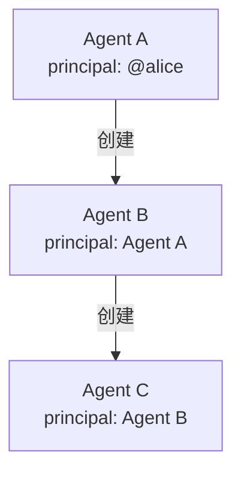

这使得多智能体工作流中，父智能体可以自主地生成专门的子智能体。但这也引入了相当大的复杂性：

- **创建权限** —— 是不是每个智能体都能派生子智能体？还是这需要作为一种被授予的能力？不加限制的派生是一个滥用风险点（一个被入侵的智能体可以创建成千上万的一次性智能体）。
- **密钥托管** —— 父智能体生成子智能体的密钥对。父智能体至少在初始阶段持有子智能体的私钥。父智能体能冒充子智能体吗？
- **深度限制** —— 链条能有多深？IdP 需要追踪一棵不断增长的树。
- **问责** —— 如果 Agent C（由 Agent B 创建，Agent B 由 Agent A 创建，Agent A 由 @alice 创建）出了问题，Alice 要负责吗？她可能根本不知道 Agent C 的存在。
- **级联吊销** —— 如果 Agent A 被吊销了，B 和 C 怎么办？

当前设计通过 `spawned_by` 元数据字段来处理多智能体工作流——身份层记录了关系，但主体始终是创建根智能体的那个人或组织。这让 IdP 保持简单，同时保留了审计线索。

智能体作为主体应该等到真实用例表明 `spawned_by` 方案不够用时再考虑——即子智能体确实需要独立的身份和自己的密钥管理、脱离父智能体的主体的时候。在 principal 字段中添加 `"type": "agent"` 是向后兼容的，可以在协议的未来版本中引入。

### 智能体间认证

目前，智能体通过服务方（Hub）交互——服务方验证双方。直接的点对点智能体认证是一个自然的扩展：来自不同 IdP 的两个智能体交换令牌，各自读取对方的 `iss` 声明并从对应 IdP 的 JWKS 获取公钥验签。

这可以支持智能体之间不通过服务方直接互相验证的多智能体工作流。机制很直接（同样的 JWT 验证，只是从智能体到智能体而非智能体到服务方），但真实的使用场景尚未出现。关键待讨论问题：

- **受众约定** —— 是否应该用目标智能体的 ID 作为 `aud`？还是以服务方中转信任（两个智能体都经同一服务方验证）为标准模式？
- **信任传递** —— 如果两个智能体都被同一个服务方验证了，这是否足够？什么时候才需要直接验证？
- **发现** —— 智能体如何在服务方上下文之外找到对方的令牌？

这应该等到直接智能体间通信成为真实需求时再详细定义。

### IdP 迁移与身份恢复

如果 IdP 删除了一个智能体或者下线了，agent_id（`aip:<provider>:<id>`）就无法解析了。但智能体的私钥还在本地磁盘上——IdP 从来没有持有过它。这就提供了恢复路径：

1. **在另一个 IdP 重新注册** —— 智能体用同一把公钥在新提供方注册，获得新的 agent_id（如 `agentid:github.com:agent_xyz`）。智能体可以用共享密钥签署关联声明来证明连续性（见 6.6 节）。

2. **退回到本地模式** —— 智能体直接向服务方注册公钥。不涉及 IdP。身份是服务方本地的，但可用。

3. **在同一 IdP 重新注册** —— 如果 IdP 允许，智能体用同一把密钥在同一提供方下获得新的 agent_id。

未来规范版本的开放设计问题：

- **活动历史转移** —— 活动追踪器持有旧 agent_id 下的报告。它是否应该接受关联证明并将历史合并到新身份？如何防止滥用（冒领别人的历史）？
- **服务方通知** —— 是否应该有一种机制让新 IdP 宣布「这个智能体以前叫 X」？还是让服务方通过按需验证关联证明来发现？
- **转移证明** —— 如果旧 IdP 是配合的（如优雅关闭），它可以签署一份转移证明：「agent_abc 正在迁移到提供方 Y。」这比自签的关联证明更有力，因为它带有旧 IdP 的背书。
- **agent_id 稳定性** —— 当前格式将提供方域名嵌入 agent_id。另一种方案是使用与提供方无关的标识符（如基于公钥哈希），但这牺牲了仅从 agent_id 就能解析 IdP 的能力。

这是 AgentID 与平台拥有的身份模型（Ping Identity、Microsoft Entra）的关键差异：在 AgentID 中，智能体能存活过它的提供方。私钥是身份的根，而不是 IdP 注册。

### 智能体元数据模式

当前规范在 JWT 中只携带了最少的智能体元数据（`agent_name`、`model_info`、`capabilities`）。更丰富的元数据模型对于发现、信任评估和合规是必要的。这些数据应该在注册时存储，通过 `GET /aip/agents/{agent_id}` 查询，而不是放在每个令牌里。

候选元数据字段：

| 字段 | 类型 | 说明 |
|------|------|------|
| `description` | string | 智能体做什么（「DeFi 套利交易机器人」） |
| `version` | string | 智能体版本（semver） |
| `persona` | string | 行为描述（「激进型，高频交易」） |
| `framework` | object | 运行时框架（`{name: "QwenPaw", version: "1.4.0"}`） |
| `model` | object | 完整模型信息（`{provider, model_id, version, modalities}`） |
| `languages` | string[] | 支持的语言（`["en", "zh"]`） |
| `tags` | string[] | 可搜索的分类标签（`["trading", "defi"]`） |
| `data_sources` | string[] | 智能体访问的外部数据源 |
| `homepage` | string | 关于智能体的更多信息的 URL |
| `contact` | string | 如何联系主体关于此智能体 |
| `license` | string | 使用条款（开源、商业等） |
| `created_at` | ISO 8601 | 身份创建时间 |
| `updated_at` | ISO 8601 | 最后一次元数据更新 |

设计考虑：

- **JWT 保持精简** —— 只有 `agent_name`、`agent_version` 和 `model_info` 摘要放在令牌里。完整元数据按需获取。
- **元数据可变** —— 主体可以更新描述、版本、标签，不需要轮换密钥或更改 agent_id。
- **模式可扩展** —— 自定义字段应使用反向域名格式（`"com.qwenpaw.strategy_type": "momentum"`）。
- **隐私** —— 某些元数据（data_sources、模型细节）可能是敏感的。智能体应控制哪些是公开可查的，哪些仅主体可见。
