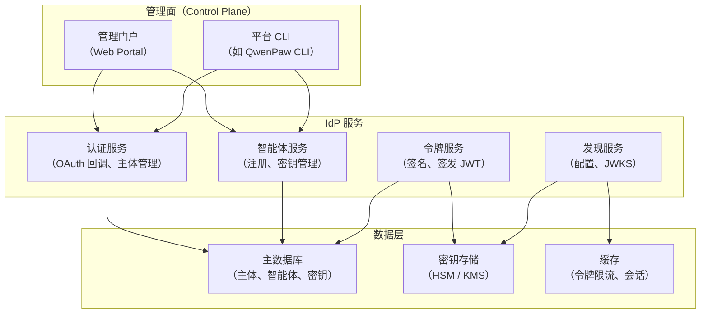
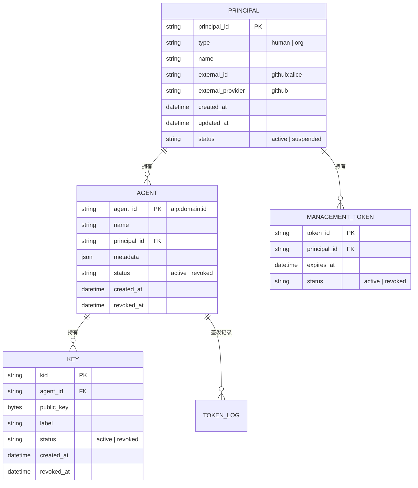
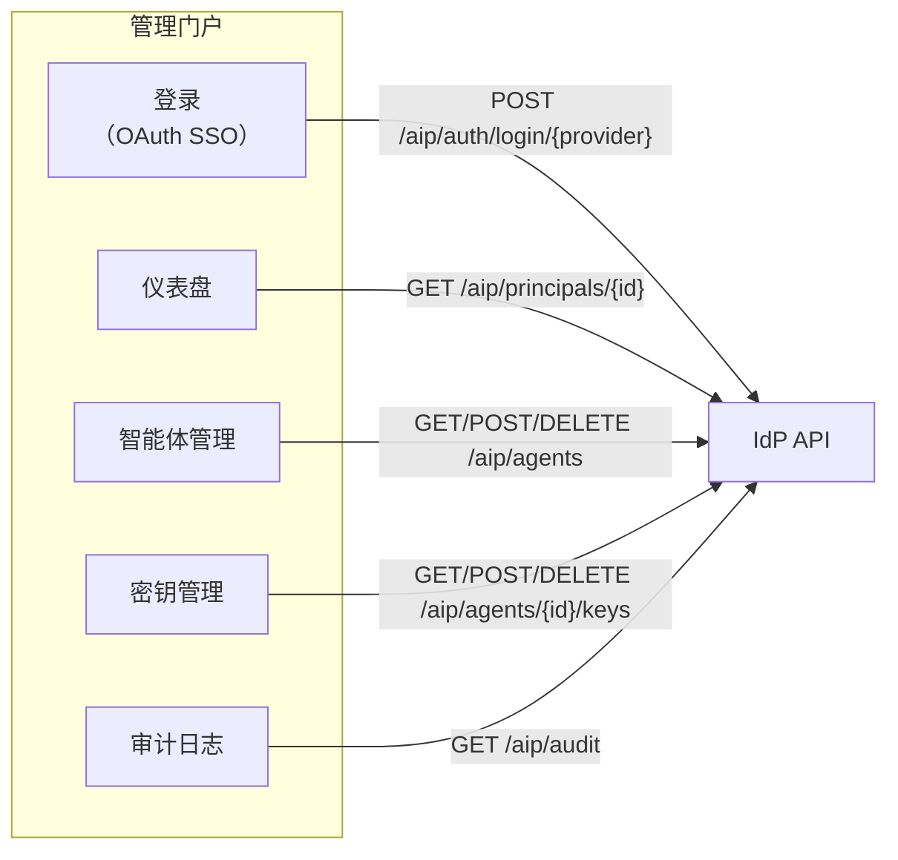
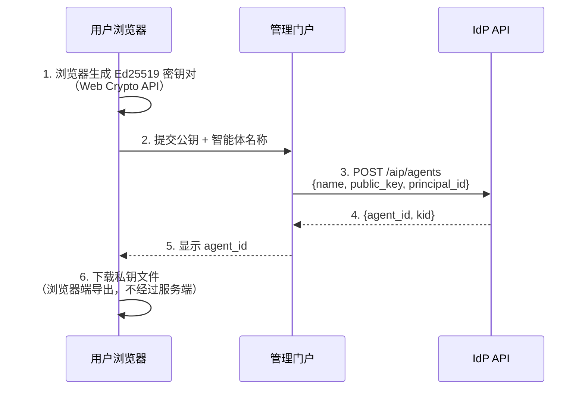
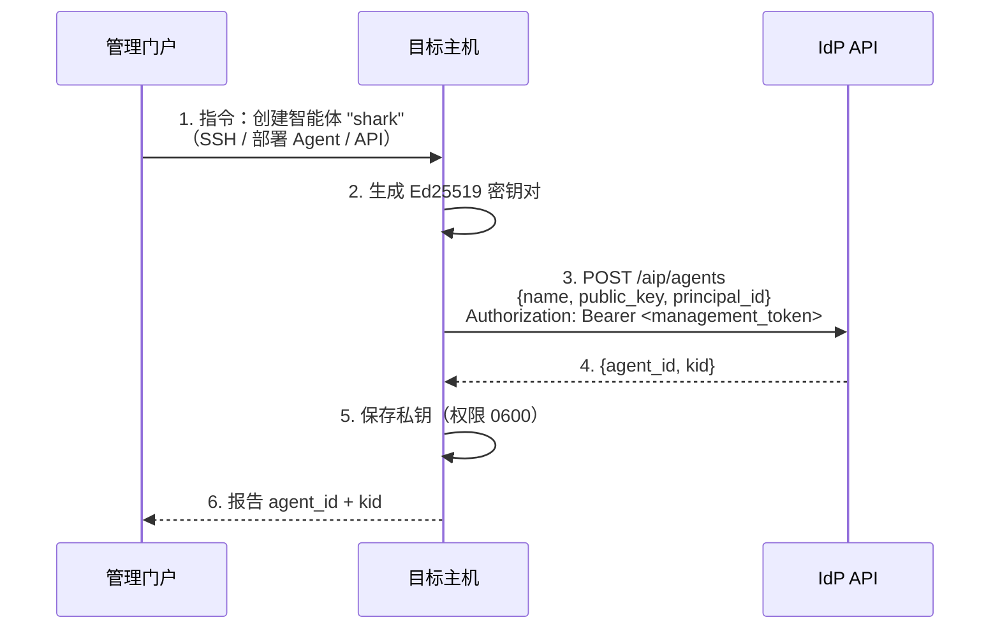
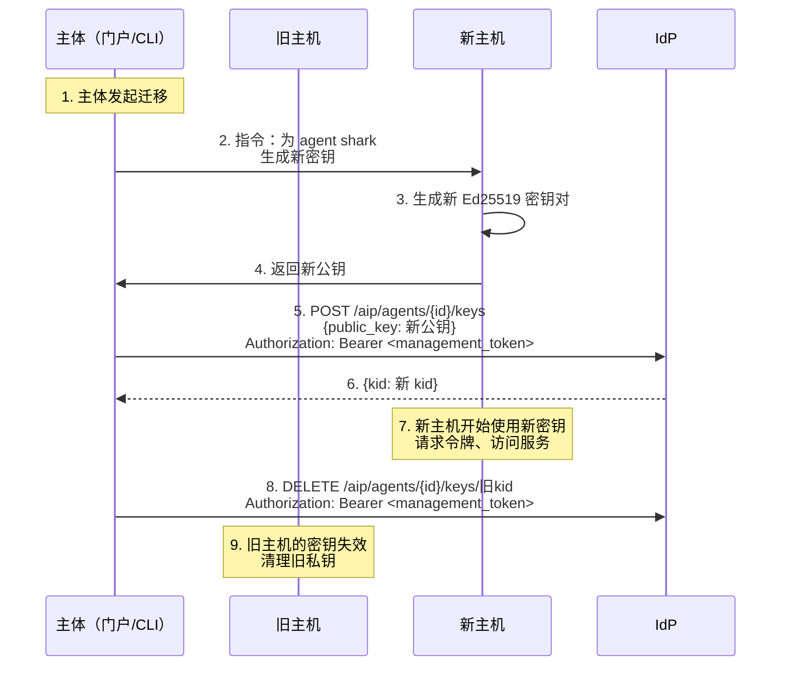

# AIP 身份提供方（IdP）实现指南

**日期：** 2026-03-31
**状态：** 草案
**关联：** [AIP 协议规范](./2026-03-25-agent-identity-protocol.zh.md)

---

## 1. 概述

本文档为希望构建生产级 AIP 身份提供方（IdP）的团队提供实现指南。AIP 协议只定义了 RESTful 接口规范——语言、框架、数据库的选择完全由实现方决定。

本文档覆盖：
- 完整的 API 规范（请求/响应格式）
- 数据模型设计
- 密钥管理架构
- 管理门户（Web Portal）集成模式
- 智能体迁移与密钥轮换
- 可扩展性考量

**不覆盖：** 具体技术选型（用什么数据库、什么框架）。这些是实现方的自由。

---

## 2. 架构概览



### 核心原则

1. **IdP 不持有智能体私钥** —— IdP 只存储公钥。私钥由智能体（或其管理工具）在本地生成并保管。
2. **管理操作需主体认证** —— 创建智能体、管理密钥等操作必须携带主体的管理令牌。
3. **令牌签发使用 IdP 自身的密钥** —— JWT 由 IdP 的签名密钥签发，不是智能体的密钥。
4. **无状态验证** —— 服务方（Hub）缓存 IdP 公钥后，验签在本地完成，不需要回调 IdP。

---

## 3. API 规范

### 3.1 发现端点

#### `GET /.well-known/aip-configuration`

返回 IdP 的服务发现信息。

**响应：**
```json
{
  "issuer": "https://identity.example.com",
  "token_endpoint": "https://identity.example.com/aip/token",
  "jwks_uri": "https://identity.example.com/.well-known/aip-jwks",
  "registration_endpoint": "https://identity.example.com/aip/agents",
  "activity_endpoint": "https://identity.example.com/aip/activity",
  "supported_algorithms": ["EdDSA"],
  "aip_version": "1.0"
}
```

**缓存策略：** 建议 `Cache-Control: max-age=86400`（24 小时）。内容变更频率低。

#### `GET /.well-known/aip-jwks`

返回 IdP 的公开签名密钥，JWKS 格式（RFC 7517）。

**响应：**
```json
{
  "keys": [
    {
      "kty": "OKP",
      "crv": "Ed25519",
      "x": "<base64url-encoded public key>",
      "kid": "idp-key-2026-03",
      "use": "sig",
      "alg": "EdDSA"
    }
  ]
}
```

**缓存策略：** 建议 `Cache-Control: max-age=3600`（1 小时），密钥轮换时需要较快刷新。

**密钥轮换：** 轮换时，新旧密钥同时出现在 JWKS 中，持续一段过渡期（建议 ≥ 2× 服务方缓存 TTL），然后移除旧密钥。

---

### 3.2 主体认证

主体（人或组织）通过 OAuth 或其他方式向 IdP 证明身份，获取管理令牌。

#### `POST /aip/auth/device` — 启动设备流程（CLI 场景）

用于终端工具。IdP 向外部 OAuth 提供方（GitHub、Google 等）发起设备流程。

**响应：**
```json
{
  "device_code": "xxxx-xxxx",
  "user_code": "ABCD-1234",
  "verification_uri": "https://github.com/login/device",
  "expires_in": 900,
  "interval": 5
}
```

#### `POST /aip/auth/device/token` — 轮询设备流程结果

**请求：**
```json
{
  "device_code": "xxxx-xxxx"
}
```

**成功响应：**
```json
{
  "principal_id": "principal_a1b2c3",
  "management_token": "<JWT>",
  "external_id": "github:alice",
  "name": "Alice"
}
```

**等待中响应：**
```json
{
  "error": "authorization_pending"
}
```

#### `POST /aip/auth/login/{provider}` — 启动授权码流程（Web 门户场景）

用于浏览器场景。IdP 生成 PKCE 挑战，返回外部 OAuth 提供方的授权 URL。

**请求：**
```json
{
  "redirect_uri": "https://portal.example.com/callback"
}
```

**响应：**
```json
{
  "authorize_url": "https://github.com/login/oauth/authorize?client_id=...&code_challenge=...&state=...",
  "state": "random-state-string"
}
```

#### `GET /aip/auth/callback/{provider}` — OAuth 回调

外部 OAuth 提供方重定向到此端点。IdP 用授权码换取访问令牌，验证用户身份，创建或查找主体，然后重定向回前端并附带凭证。

**重定向：**
```
302 {redirect_uri}?principal_id=xxx&management_token=xxx
```

#### 管理令牌格式

管理令牌是 IdP 签发的 JWT，用于管理操作（创建智能体、管理密钥等）。

```json
{
  "sub": "principal_a1b2c3",
  "iss": "https://identity.example.com",
  "type": "management",
  "exp": 1711414800,
  "scopes": ["agent:create", "agent:delete", "key:manage"]
}
```

**TTL 建议：** 管理令牌有效期较长（24 小时 - 30 天），因为管理操作频率低。可支持刷新令牌模式。

---

### 3.3 智能体管理

所有管理端点需要 `Authorization: Bearer <management_token>`。

#### `POST /aip/agents` — 注册新智能体

**请求：**
```json
{
  "name": "shark",
  "public_key": "<hex-encoded Ed25519 public key>",
  "principal_id": "principal_a1b2c3",
  "metadata": {
    "description": "Trading agent",
    "model_info": {
      "provider": "alibaba",
      "model_id": "qwen-max"
    }
  }
}
```

**响应：**
```json
{
  "agent_id": "aip:identity.example.com:agent_7x8k2m",
  "kid": "a1b2c3d4e5f6g7h8",
  "name": "shark",
  "created_at": "2026-03-31T10:00:00Z"
}
```

**agent_id 生成规则：**
- 格式：`aip:<IdP 域名>:<唯一标识>`
- 唯一标识由 IdP 生成，确保全局唯一
- 一旦分配，不可变更

#### `GET /aip/agents/{agent_id}` — 查询智能体公开信息

**响应：**
```json
{
  "agent_id": "aip:identity.example.com:agent_7x8k2m",
  "name": "shark",
  "principal": {
    "type": "human",
    "id": "principal_a1b2c3",
    "name": "Alice"
  },
  "keys": [
    {
      "kid": "a1b2c3d4e5f6g7h8",
      "public_key": "<hex>",
      "status": "active",
      "created_at": "2026-03-31T10:00:00Z"
    }
  ],
  "status": "active",
  "created_at": "2026-03-31T10:00:00Z"
}
```

**注意：** 此端点返回公钥，不返回私钥（IdP 根本没有私钥）。

#### `GET /aip/agents?principal_id={id}` — 列出主体下的所有智能体

**响应：**
```json
{
  "agents": [
    {
      "agent_id": "aip:identity.example.com:agent_7x8k2m",
      "name": "shark",
      "status": "active",
      "key_count": 2,
      "created_at": "2026-03-31T10:00:00Z"
    }
  ],
  "total": 1
}
```

#### `DELETE /aip/agents/{agent_id}` — 注销智能体

将智能体标记为已注销。所有关联密钥同时失效。已签发的 JWT 在过期前仍然有效（短 TTL 限制了窗口）。

**响应：**
```json
{
  "agent_id": "aip:identity.example.com:agent_7x8k2m",
  "status": "revoked",
  "revoked_at": "2026-03-31T12:00:00Z"
}
```

---

### 3.4 密钥管理

#### `POST /aip/agents/{agent_id}/keys` — 添加新密钥

用于密钥轮换和智能体迁移。主体认证后，为同一 agent_id 注册新的公钥。

**请求：**
```json
{
  "public_key": "<hex-encoded new Ed25519 public key>",
  "label": "prod-host-2"
}
```

**响应：**
```json
{
  "kid": "b2c3d4e5f6g7h8i9",
  "status": "active",
  "created_at": "2026-03-31T10:00:00Z"
}
```

#### `GET /aip/agents/{agent_id}/keys` — 列出智能体的所有密钥

**响应：**
```json
{
  "keys": [
    {
      "kid": "a1b2c3d4e5f6g7h8",
      "public_key": "<hex>",
      "label": "prod-host-1",
      "status": "active",
      "created_at": "2026-03-25T10:00:00Z"
    },
    {
      "kid": "b2c3d4e5f6g7h8i9",
      "public_key": "<hex>",
      "label": "prod-host-2",
      "status": "active",
      "created_at": "2026-03-31T10:00:00Z"
    }
  ]
}
```

#### `DELETE /aip/agents/{agent_id}/keys/{kid}` — 吊销密钥

吊销后，IdP 不再为该 kid 签发新令牌。已签发的令牌在过期前仍有效。

**响应：**
```json
{
  "kid": "a1b2c3d4e5f6g7h8",
  "status": "revoked",
  "revoked_at": "2026-03-31T12:00:00Z"
}
```

**约束：** 智能体至少需要保留一个活跃密钥。吊销最后一个密钥等同于注销智能体。

---

### 3.5 令牌签发

#### `POST /aip/token` — 用签名换取 JWT

**请求：**
```json
{
  "agent_id": "aip:identity.example.com:agent_7x8k2m",
  "kid": "a1b2c3d4e5f6g7h8",
  "audience": "https://hub.example.com",
  "timestamp": "2026-03-31T10:00:00Z",
  "signature": "<hex-encoded Ed25519 signature>"
}
```

**签名消息格式：** `{agent_id}|{kid}|{audience}|{timestamp}`

**验证流程：**
1. 查找 agent_id，确认状态为 active
2. 查找 kid，确认状态为 active 且属于该 agent_id
3. 验证 timestamp 在可接受范围内（建议 ±5 分钟）
4. 用注册的公钥验证签名
5. 签发 JWT

**成功响应：**
```json
{
  "token": "eyJhbGciOiJFZERTQSIs...",
  "expires_in": 3600
}
```

**错误响应：**
```json
{
  "error": "invalid_signature",
  "message": "Signature verification failed"
}
```

| 错误码 | HTTP 状态 | 含义 |
|--------|-----------|------|
| `agent_not_found` | 404 | agent_id 不存在 |
| `key_revoked` | 403 | kid 已被吊销 |
| `invalid_signature` | 401 | 签名验证失败 |
| `timestamp_expired` | 400 | timestamp 超出可接受范围 |
| `agent_revoked` | 403 | 智能体已被注销 |

---

### 3.6 主体管理

#### `GET /aip/principals/{principal_id}` — 查询主体信息

**响应：**
```json
{
  "principal_id": "principal_a1b2c3",
  "type": "human",
  "name": "Alice",
  "external_id": "github:alice",
  "agent_count": 3,
  "created_at": "2026-03-25T10:00:00Z"
}
```

#### `GET /aip/principals` — 列出所有主体（管理员）

供 IdP 管理员使用。支持分页和过滤。

**查询参数：** `?type=human&page=1&per_page=50`

#### 组织主体

组织主体可以有多个管理员。管理员可以创建和管理组织名下的智能体。

```json
{
  "principal_id": "principal_org_acme",
  "type": "org",
  "name": "Acme Corp",
  "admins": [
    { "external_id": "github:alice", "role": "owner" },
    { "external_id": "github:bob", "role": "admin" }
  ],
  "agent_count": 15,
  "created_at": "2026-03-20T10:00:00Z"
}
```

---

## 4. 数据模型

### 4.1 核心实体



### 4.2 索引建议

| 表 | 索引 | 用途 |
|---|---|---|
| `agents` | `(principal_id, status)` | 按主体列出活跃智能体 |
| `agents` | `(agent_id)` | 令牌请求时快速查找 |
| `keys` | `(agent_id, status)` | 按智能体列出活跃密钥 |
| `keys` | `(kid)` | 令牌请求时通过 kid 查找 |
| `principals` | `(external_id)` | OAuth 登录时按外部身份查找 |

### 4.3 设计要点

- **软删除：** 智能体和密钥使用 `status` + `revoked_at` 标记，不物理删除。审计需要完整历史。
- **agent_id 不可变：** 一旦分配，即使智能体被注销也不回收。
- **公钥存储：** 存储原始 32 字节（hex 或 base64 编码）。不需要存私钥——IdP 永远不持有私钥。

---

## 5. 密钥架构

### 5.1 IdP 签名密钥

IdP 用自己的 Ed25519 密钥对签发 JWT。这把密钥是整个 IdP 信任链的根。

**安全要求：**

| 级别 | 方案 | 适用场景 |
|------|------|----------|
| 基础 | 文件系统存储，权限 0600 | 开发/测试 |
| 生产 | 密钥管理服务（KMS） | 一般生产环境 |
| 高安全 | 硬件安全模块（HSM） | 金融、合规场景 |

**密钥轮换流程：**

```
时间线:
  T0         T1              T2              T3
  │          │               │               │
  ├──────────┤               │               │
  │  key-A   │               │               │
  │  (active)│               │               │
  │          ├───────────────┤               │
  │          │  key-A + key-B│               │
  │          │  (过渡期)      │               │
  │          │               ├───────────────┤
  │          │               │  key-B        │
  │          │               │  (active)     │
```

1. **T1：生成新密钥** —— key-B 加入 JWKS，key-A 继续签发
2. **T1→T2：过渡期** —— 切换到 key-B 签发，key-A 保留在 JWKS 中供验证已签发的令牌
3. **T2→T3：清理** —— 等待所有用 key-A 签发的令牌过期后，从 JWKS 移除 key-A

**过渡期 ≥ 2× 服务方 JWKS 缓存 TTL**，确保所有服务方已拉取到新密钥。

### 5.2 智能体密钥

IdP 存储智能体的公钥，用于验证令牌请求中的签名。

**每个智能体可以有多个活跃密钥：**
- 一个密钥对应一个部署环境（prod-host-1、prod-host-2）
- 密钥轮换时新旧密钥并存
- 迁移时新旧主机各有自己的密钥

---

## 6. 管理门户集成

对于提供 Web 管理门户的 IdP（如 QwenPaw 平台），门户通过与 CLI 相同的 API 操作。

### 6.1 典型门户功能



### 6.2 门户主导的智能体创建

门户用户在浏览器中创建智能体时，仍然不应在服务端生成私钥。推荐的模式：

**方案 A：浏览器端生成密钥（推荐）**



私钥在浏览器中生成，直接导出为文件下载。服务端（门户和 IdP）全程只接触公钥。

**方案 B：远程主机生成密钥（部署场景）**

适用于门户需要在远程主机上部署智能体的场景：



门户向目标主机发送「创建智能体」的指令，主机本地生成密钥并直接与 IdP 通信。私钥从不经过门户。

**管理令牌委托：** 门户需要将管理令牌传递给目标主机（或签发一个限定范围的短期管理令牌），以便主机能向 IdP 注册智能体。

---

## 7. 智能体迁移

将智能体从一台主机迁移到另一台主机。核心原则：**agent_id 不变，密钥轮换。**

### 7.1 标准迁移流程



### 7.2 安全考量

| 问题 | 处理方式 |
|------|----------|
| 旧主机上的私钥 | 迁移完成后清理。吊销旧 kid 确保即使未清理也无法签发新令牌 |
| 迁移窗口期 | 新旧密钥同时有效。窗口期应尽量短 |
| 未授权迁移 | 只有持有管理令牌的主体才能添加/吊销密钥 |
| 服务连续性 | 新旧主机可以重叠运行（多 kid），实现零停机迁移 |

### 7.3 批量迁移

门户主导的批量迁移（如整个集群迁移）：

1. 新集群所有节点并行生成密钥
2. 批量注册公钥到 IdP（批量 API 或并发调用）
3. 切换流量到新集群
4. 批量吊销旧密钥
5. 清理旧集群

建议 IdP 提供批量端点：

```
POST /aip/agents/{agent_id}/keys/batch
{
  "keys": [
    { "public_key": "<hex>", "label": "new-host-1" },
    { "public_key": "<hex>", "label": "new-host-2" }
  ]
}
```

---

## 8. 可扩展性考量

### 8.1 读写特征

| 操作 | 频率 | 类型 |
|------|------|------|
| `POST /aip/token` | 极高（每个智能体每 1-4 小时） | 读多写少（查密钥 + 签名） |
| `GET /.well-known/aip-jwks` | 高（每个服务方每小时） | 只读 |
| `POST /aip/agents` | 低（注册时一次） | 写 |
| `POST/DELETE /aip/agents/{id}/keys` | 极低（迁移/轮换时） | 写 |
| `POST /aip/auth/*` | 低（登录时） | 读写 |

**关键路径是 `/aip/token`** —— 这是流量最大的端点。优化策略：

### 8.2 令牌服务优化

```
                    ┌─────────────┐
                    │   负载均衡   │
                    └──────┬──────┘
              ┌────────────┼────────────┐
              ▼            ▼            ▼
        ┌──────────┐ ┌──────────┐ ┌──────────┐
        │ Token-1  │ │ Token-2  │ │ Token-3  │
        │          │ │          │ │          │
        │ 缓存:    │ │ 缓存:    │ │ 缓存:    │
        │ agent→key│ │ agent→key│ │ agent→key│
        └────┬─────┘ └────┬─────┘ └────┬─────┘
             │             │             │
             └─────────────┼─────────────┘
                           ▼
                    ┌─────────────┐
                    │   主数据库   │
                    └─────────────┘
```

- **本地缓存 agent→公钥映射** —— 令牌请求的热路径不需要每次查库。密钥变更时失效缓存（事件驱动或短 TTL）。
- **签名密钥在内存中** —— IdP 的 Ed25519 私钥加载到内存（或 HSM 调用），不是每次从磁盘读。
- **无状态令牌服务** —— 多实例水平扩展，共享同一签名密钥（从 KMS 加载）。

### 8.3 数据库选型考量

| 选型 | 适用场景 |
|------|----------|
| PostgreSQL / MySQL | 通用选择，支持事务和索引 |
| 内存数据库 + 持久化 | 极高性能令牌签发 |
| 分库分表 | 百万级智能体 |

**agent 表和 key 表是核心。** 数据量通常不大（百万级），关系型数据库完全胜任。瓶颈在签名计算（CPU 密集），不在存储。

### 8.4 高可用

- **令牌服务：** 多实例 + 负载均衡。任一实例故障不影响服务。
- **签名密钥：** 通过 KMS/HSM 管理，多实例共享。
- **数据库：** 主从复制。令牌服务可读从库（查公钥）。
- **JWKS 端点：** CDN 缓存。这是最不变的数据。
- **管理操作：** 低频，单点也可以接受。但建议至少两个实例。

---

## 9. 审计与合规

### 9.1 审计日志

所有管理操作应记录审计日志：

```json
{
  "timestamp": "2026-03-31T10:00:00Z",
  "action": "agent.key.add",
  "actor": {
    "principal_id": "principal_a1b2c3",
    "external_id": "github:alice"
  },
  "target": {
    "agent_id": "aip:identity.example.com:agent_7x8k2m",
    "kid": "b2c3d4e5f6g7h8i9"
  },
  "ip": "203.0.113.42",
  "user_agent": "QwenPaw-CLI/1.0"
}
```

**必须记录的事件：**
- 主体注册/登录
- 智能体创建/注销
- 密钥添加/吊销
- 管理令牌签发/吊销
- IdP 签名密钥轮换

### 9.2 限流

| 端点 | 建议限流 | 原因 |
|------|----------|------|
| `POST /aip/token` | 每智能体每分钟 60 次 | 防止滥用，令牌有 1 小时+ 有效期 |
| `POST /aip/agents` | 每主体每分钟 10 次 | 防止批量注册 |
| `POST /aip/auth/*` | 每 IP 每分钟 10 次 | 防止暴力登录 |

---

## 10. 参考实现与本文档的关系

本仓库的 `aip-idp` 是一个最小参考实现（FastAPI + SQLite），演示了核心端点的工作方式。**它不是生产级 IdP。**

生产级 IdP 应该参考本文档的规范来实现，重点关注：
- 密钥安全（HSM/KMS）
- 高可用与扩展性
- 审计与合规
- 管理门户集成

**不需要使用任何 AIP 库来构建 IdP。** IdP 只需要实现本文档定义的 RESTful 端点。`aip-sdk` 和 `aip-verify` 是给智能体端和服务方端用的，IdP 不依赖它们。
