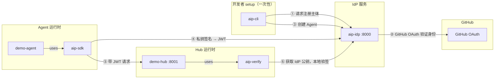

# AIP Reference Implementation — Demo

## Architecture



| 组件 | 包 | 端口 | 类型 | 作用 |
|------|-----|------|------|------|
| **IdP** | `aip-idp` | :8000 | 参考实现（可替换） | 注册主体/Agent，签发 JWT。生产中由 CoPaw、阿里云等正式 IdP 替代 |
| **CLI** | `aip-cli` | — | 可交付库 | 开发者工具：`aip init` + `aip agent create`，适配任何 AIP IdP |
| **Demo Agent** | `aip-sdk` | — | 可交付库 | 加载私钥，自动获取 JWT，发起认证请求，不绑定特定 IdP |
| **Demo Hub** | `aip-verify` | :8001 | 可交付库 | 验证 JWT，返回 Agent 身份，支持多 IdP |

`aip-cli`、`aip-sdk`、`aip-verify` 是协议的客户端库，可直接用于生产。`aip-idp` 和 `examples/` 是参考实现和演示。

---

## Quick Start (Local Dev Mode)

Local dev mode uses direct registration (no GitHub OAuth) so you can try the full flow without setting up a GitHub OAuth App.

### 1. Install packages (from repo root)

```
pip install -e aip-idp/
pip install -e aip-cli/
pip install -e aip-sdk/
pip install -e aip-verify/
```

### 2. Start the IdP

```
cd aip-idp
uvicorn aip_idp.main:app --port 8000
```

### 3. Start the demo hub

```
cd examples/demo-hub
uvicorn hub:app --port 8001
```

### 4. Create an identity (in a new terminal)

```
# Register as a principal (dev mode — no OAuth)
aip init --provider http://localhost:8000 --dev --name alice

# Create an agent
aip agent create --name demo-agent
```

### 5. Run the demo agent

```
cd examples/demo-agent
python agent.py
```

## What happens

1. `aip init` registers you as a principal with the IdP
2. `aip agent create` generates an Ed25519 keypair and registers the public key with the IdP
3. The demo agent loads the private key, signs a token request, gets a JWT from the IdP
4. The demo agent sends the JWT to the hub
5. The hub verifies the JWT against the IdP's public key (fetched and cached from `/.well-known/aip-jwks`)
6. The hub returns the agent's identity — proving the full auth loop works

---

## Principal Authentication with GitHub OAuth

In production, principals must prove their identity via GitHub OAuth before they can create agents. The IdP supports two OAuth flows for different clients:

### CLI: Device Flow

For terminal-based tools like `aip init`. The user gets a code to enter at github.com — no callback URL needed.

```
# 1. Set up the IdP with your GitHub OAuth App client ID
export AIP_GITHUB_CLIENT_ID="your_github_client_id"

cd aip-idp
uvicorn aip_idp.main:app --port 8000

# 2. Run aip init (without --dev flag)
aip init --provider http://localhost:8000

# Output:
#   Please visit: https://github.com/login/device
#   Enter code:   ABCD-1234
#   Open browser? [Y/n]
#   Waiting for authorization.....
#   ✓ Logged in as github:alice (Alice) on http://localhost:8000
```

Flow:

```
CLI                         IdP                         GitHub
 |  POST /aip/auth/device    |                            |
 |-------------------------->|  POST /login/device/code   |
 |                           |--------------------------->|
 |  user_code + URL          |                            |
 |<--------------------------|<---------------------------|
 |                           |                            |
 |  [user opens browser,     |                            |
 |   enters code]            |                            |
 |                           |                            |
 |  poll /device/token       |  POST /login/oauth/token   |
 |-------------------------->|--------------------------->|
 |                           |  GET /user                 |
 |                           |--------------------------->|
 |  principal_id +           |  github:alice confirmed    |
 |  management_token         |                            |
 |<--------------------------|                            |
```

### Web Portal: Authorization Code + PKCE

For browser-based IdP dashboards. Standard OAuth redirect flow with PKCE for security.

```
# 1. Set up the IdP with GitHub OAuth App credentials
export AIP_GITHUB_CLIENT_ID="your_github_client_id"
export AIP_GITHUB_CLIENT_SECRET="your_github_client_secret"

cd aip-idp
uvicorn aip_idp.main:app --port 8000
```

Flow:

```
Browser/Frontend            IdP                         GitHub
 |  POST /aip/auth/          |                            |
 |    login/github            |                            |
 |  {redirect_uri}           |                            |
 |-------------------------->|                            |
 |                           |  generate PKCE verifier    |
 |  {authorize_url, state}   |  + challenge               |
 |<--------------------------|                            |
 |                           |                            |
 |  redirect to GitHub ------>--------------------------->|
 |                           |                            |
 |  [user logs in, approves] |                            |
 |                           |                            |
 |<---------- GitHub redirects to /aip/auth/callback/github
 |                           |  code + state              |
 |                           |--------------------------->|
 |                           |  exchange code + verifier   |
 |                           |  for access_token          |
 |                           |<---------------------------|
 |                           |  GET /user                 |
 |                           |--------------------------->|
 |                           |  github:carol confirmed    |
 |                           |<---------------------------|
 |                           |                            |
 |  302 redirect to          |                            |
 |  redirect_uri?principal_id=...&management_token=...    |
 |<--------------------------|                            |
```

The frontend initiates the flow by calling `POST /aip/auth/login/github` with its `redirect_uri`. The IdP returns a GitHub authorization URL. After the user authorizes in GitHub, GitHub redirects to the IdP's callback, which exchanges the code, verifies the user, and redirects back to the frontend with credentials.

### Setting up a GitHub OAuth App

1. Go to [GitHub Developer Settings](https://github.com/settings/developers)
2. Create a new OAuth App:
   - **Homepage URL**: your IdP URL (e.g., `http://localhost:8000`)
   - **Authorization callback URL**: `http://localhost:8000/aip/auth/callback/github`
3. Note the **Client ID** and **Client Secret**
4. For device flow: enable "Device Authorization Flow" in the app settings
5. Configure the IdP:
   ```python
   # In aip-idp/aip_idp/config.py or via environment
   settings.github_client_id = "your_client_id"
   settings.github_client_secret = "your_client_secret"  # only needed for web flow
   ```
