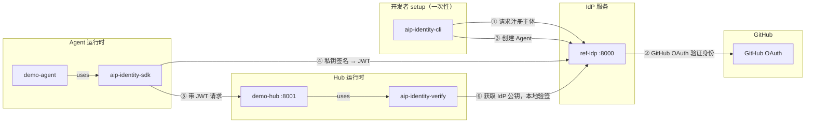

# AgentID Reference Implementation — Demo

## Architecture



| 组件 | 包 | 端口 | 类型 | 作用 |
|------|-----|------|------|------|
| **Demo Agent** | `aip-identity-sdk` | — | 可交付库 | Agent 端 SDK：加载私钥，自动获取 JWT，发起认证请求。也提供身份管理 API 供各类 CLI/平台复用 |
| **Demo Hub** | `aip-identity-verify` | :8001 | 可交付库 | Hub 端验证库：验证 JWT，返回 Agent 身份，支持多 IdP |
| **IdP** | `ref-idp` | :8000 | 参考实现（可替换） | 注册主体/Agent，签发 JWT。生产中由 QwenPaw、阿里云等正式 IdP 替代 |
| **CLI** | `aip-identity-cli` | — | 参考实现（可替换） | 基于 `aip-identity-sdk` 的参考 CLI。生产中由各平台自己的 CLI 替代（同样使用 `aip-identity-sdk`） |

`aip-identity-sdk` 和 `aip-identity-verify` 是协议的核心库，可直接用于生产。`aip-identity-cli`、`ref-idp` 和 `examples/` 是参考实现和演示。

---

## Quick Start (Local Dev Mode)

Local dev mode uses direct registration (no GitHub OAuth) so you can try the full flow without setting up a GitHub OAuth App.

> **Tip — `make` shortcut.** The repo root has a `Makefile` wrapping the
> hub/agent invocations below, with an `IDP=local|pre|prod` selector that
> keeps both ends paired:
>
> ```bash
> make hub                              # demo-hub against local IdP (default)
> make hub IDP=pre                      # demo-hub against pre.agent-id.live
>
> make agent whoami                     # quick auth check
> make agent demo                       # full scripted sequence
> make agent trade BTC/USD 1000 buy IDP=pre
> ```
>
> The full commands below remain valid (and are what `make` runs under the
> hood). To switch IdP without `make`, set `AGENTID_IDP=pre` on both the hub
> and agent commands.

### 1. Install packages (from repo root)

```
pip install -e ref-idp/
pip install -e aip-identity-sdk/
pip install -e aip-identity-verify/
pip install -e aip-identity-cli/
```

### 2. Start the IdP

```
cd ref-idp
uvicorn ref_idp.main:app --port 8000
```

### 3. Start the demo hub

```
cd examples/demo-hub
uvicorn hub:app --port 8001
```

### 4. Create an identity (in a new terminal)

```
# Register as a principal (dev mode — no OAuth)
aip init --provider http://localhost:8000 --dev --name alice

# Create an agent
aip agent create --name demo-agent
```

### 5. Run the demo agent

```
cd examples/demo-agent
python agent.py
```

## What happens

1. `aip init` registers you as a principal with the IdP
2. `aip agent create` generates an Ed25519 keypair and registers the public key with the IdP
3. The demo agent loads the private key, signs a token request, gets a JWT from the IdP
4. The demo agent sends the JWT to the hub
5. The hub verifies the JWT against the IdP's public key (fetched and cached from `/.well-known/aip-jwks`)
6. The hub returns the agent's identity — proving the full auth loop works

---

## Human-in-the-Loop Approval Workflow (spec §7.6)

The demo hub implements a reference version of the authorization grant flow. The agent makes two purchases:

1. **$49.99 "coffee"** — under the hub's `REQUIRES_APPROVAL_ABOVE = 500` threshold, proceeds autonomously.
2. **$1299.00 "flight to NYC"** — over the threshold, hub returns `202 Accepted` with an `approval_id`. The agent polls `/agentid/approvals/{id}` until the principal approves or denies, then retries with `X-AgentID-Approval: <grant_id>`.

### Run the approval flow

Start the IdP and hub as in the quick start, then in one terminal:

```
cd examples/demo-agent
python agent.py
```

The agent will print an `approval_id` and begin polling. In a second terminal, act as the principal. `approve.py` lives next to the hub because approvals are hub-local (spec §7.6.3) — it calls the hub's `/agentid/approvals/*` endpoints, not the IdP:

```
cd examples/demo-hub
python approve.py list                          # see pending approvals
python approve.py approve apr_xxxxxxxxxx        # approve (grant scoped to requested amount)
python approve.py approve apr_xxx --max-amount 1000   # or cap it
python approve.py deny apr_xxxxxxxxxx "too much"      # or deny
```

The agent detects the approval, retries the purchase with the grant, and completes.

### Spec mapping

| Spec § | Implemented by |
|--------|----------------|
| 7.6.2 Grant request flow (202 + poll + retry) | `hub.py: /api/purchase`, `agent.py: purchase_with_approval` |
| 7.6.3 Grant properties (time-limited, action-scoped, agent-bound, single-use) | `hub.py: Grant`, consumed in Path A |
| 7.6.4 `notification_endpoint` on principal | `ref-idp` / `aip-idp` principal model + token claim; hub prints to console if endpoint is absent |
| 7.6.6 Endpoints (`GET /agentid/approvals/{id}`, `POST /approve`, `POST /deny`, `GET /agentid/approvals`) | `hub.py` |

### Demo simplifications (not for production)

- `/agentid/approvals/{id}/approve|deny` and `GET /agentid/approvals` are unauthenticated. A real hub would gate these behind a portal session tied to the principal.
- All grant state is in-memory; restart clears it.
- The threshold is hardcoded on the hub. Per spec §7.4, a production hub would read `requires_confirmation_above` from the token's `delegation` claim.

---

## IdP-delegated Approval (spec §7.6 Model 3)

The hub above owns approval state locally (Model 1). Enterprises often want approvals to live alongside identity — one pane of glass, one audit trail. The reference implementation supports both modes: **the hub auto-detects which one to use based on whether the IdP's discovery doc advertises an `approval_endpoint`.**

`aip-idp` advertises it. `ref-idp` does not. So against `aip-idp`, the hub automatically delegates decisions to the IdP's portal; against `ref-idp`, the hub owns approvals locally and `approve.py` is used.

### Flow (delegated)

```
Agent → Hub                   over-threshold purchase
Hub  → IdP:/agentid/approvals forward request
Hub  → Agent                  202 + approval_id
IdP portal                    principal clicks "Approve" (auto-refreshed list)
IdP                           signs JWT decision (kid from JWKS)
Agent → Hub                   poll /agentid/approvals/{id}
Hub  → IdP:/agentid/approvals/{}  poll lazily
IdP  → Hub                    {status: approved, decision_jwt: ...}
Hub verifies JWT vs JWKS, materializes local grant with constraints
Hub  → Agent                  grant returned on next poll
Agent → Hub                   retry with X-AgentID-Approval → completed
```

### Try it against aip-idp

The backend + frontend are what you already have running (`make dev` + `make frontend`). Just:

```
# Terminal 1 — demo-hub (as before)
cd examples/demo-hub && uvicorn hub:app --port 8001

# Terminal 2 — demo agent (as before)
cd examples/demo-agent && python agent.py
```

When the agent hits the $1299 purchase, the hub's console will show:

```
[discovery] approval mode: delegated (Model 3)
[discovery] IdP approval endpoint: http://localhost:8000/agentid/approvals
[delegate] IdP stored approval apr_xxxxxxxx (local id apr_yy)
[notify → portal] IdP will surface apr_xxxxxxxx to <principal_id>
```

Open **http://localhost:5173/portal/approvals** — the request will appear within ~3 seconds (auto-polling). Click **Approve**. The hub's next poll picks up the signed decision JWT, verifies it against the IdP's JWKS, and issues a local grant. The agent completes.

### Spec mapping (additions)

| Spec § | Implemented by |
|---|---|
| Discovery advertises `approval_endpoint` | `aip-idp: /.well-known/agentid-configuration` |
| Hub forwards decisions to IdP | `hub.py: _delegate_to_idp` |
| IdP signs decision JWT | `aip-idp: create_approval_decision_token` |
| Hub verifies decision JWT against JWKS | `hub.py: _verify_decision_jwt` |
| Portal shows pending requests, auto-refreshing | `frontend: routes/portal/approvals.tsx` (react-query `refetchInterval`) |

### Delegated-mode simplifications

- No principal auth on the hub's `POST /agentid/approvals` to the IdP (the IdP accepts any hub's request and looks up the agent's principal). A production IdP would verify the hub itself (hub cert, mutual TLS, registered hub_id).
- The agent's polling of the hub triggers the hub's polling of the IdP (lazy fan-out). A production hub might use SSE or webhook callbacks instead.
- In delegated mode, `approve.py` returns 409 if you try to use it — the demo refuses to mix modes per approval.

---

## Principal Authentication with GitHub OAuth

In production, principals must prove their identity via GitHub OAuth before they can create agents. The IdP supports two OAuth flows for different clients:

### CLI: Device Flow

For terminal-based tools like `aip init`. The user gets a code to enter at github.com — no callback URL needed.

```
# 1. Set up the IdP with your GitHub OAuth App client ID
export AGENTID_GITHUB_CLIENT_ID="your_github_client_id"

cd ref-idp
uvicorn ref_idp.main:app --port 8000

# 2. Run aip init (without --dev flag)
aip init --provider http://localhost:8000

# Output:
#   Please visit: https://github.com/login/device
#   Enter code:   ABCD-1234
#   Open browser? [Y/n]
#   Waiting for authorization.....
#   ✓ Logged in as github:alice (Alice) on http://localhost:8000
```

Flow:

```
CLI                         IdP                         GitHub
 |  POST /aip/auth/device    |                            |
 |-------------------------->|  POST /login/device/code   |
 |                           |--------------------------->|
 |  user_code + URL          |                            |
 |<--------------------------|<---------------------------|
 |                           |                            |
 |  [user opens browser,     |                            |
 |   enters code]            |                            |
 |                           |                            |
 |  poll /device/token       |  POST /login/oauth/token   |
 |-------------------------->|--------------------------->|
 |                           |  GET /user                 |
 |                           |--------------------------->|
 |  principal_id +           |  github:alice confirmed    |
 |  management_token         |                            |
 |<--------------------------|                            |
```

### Web Portal: Authorization Code + PKCE

For browser-based IdP dashboards. Standard OAuth redirect flow with PKCE for security.

```
# 1. Set up the IdP with GitHub OAuth App credentials
export AGENTID_GITHUB_CLIENT_ID="your_github_client_id"
export AGENTID_GITHUB_CLIENT_SECRET="your_github_client_secret"

cd ref-idp
uvicorn ref_idp.main:app --port 8000
```

Flow:

```
Browser/Frontend            IdP                         GitHub
 |  POST /aip/auth/          |                            |
 |    login/github            |                            |
 |  {redirect_uri}           |                            |
 |-------------------------->|                            |
 |                           |  generate PKCE verifier    |
 |  {authorize_url, state}   |  + challenge               |
 |<--------------------------|                            |
 |                           |                            |
 |  redirect to GitHub ------>--------------------------->|
 |                           |                            |
 |  [user logs in, approves] |                            |
 |                           |                            |
 |<---------- GitHub redirects to /aip/auth/callback/github
 |                           |  code + state              |
 |                           |--------------------------->|
 |                           |  exchange code + verifier   |
 |                           |  for access_token          |
 |                           |<---------------------------|
 |                           |  GET /user                 |
 |                           |--------------------------->|
 |                           |  github:carol confirmed    |
 |                           |<---------------------------|
 |                           |                            |
 |  302 redirect to          |                            |
 |  redirect_uri?principal_id=...&management_token=...    |
 |<--------------------------|                            |
```

The frontend initiates the flow by calling `POST /aip/auth/login/github` with its `redirect_uri`. The IdP returns a GitHub authorization URL. After the user authorizes in GitHub, GitHub redirects to the IdP's callback, which exchanges the code, verifies the user, and redirects back to the frontend with credentials.

### Setting up a GitHub OAuth App

1. Go to [GitHub Developer Settings](https://github.com/settings/developers)
2. Create a new OAuth App:
   - **Homepage URL**: your IdP URL (e.g., `http://localhost:8000`)
   - **Authorization callback URL**: `http://localhost:8000/aip/auth/callback/github`
3. Note the **Client ID** and **Client Secret**
4. For device flow: enable "Device Authorization Flow" in the app settings
5. Configure the IdP:
   ```python
   # In ref-idp/ref_idp/config.py or via environment
   settings.github_client_id = "your_client_id"
   settings.github_client_secret = "your_client_secret"  # only needed for web flow
   ```
